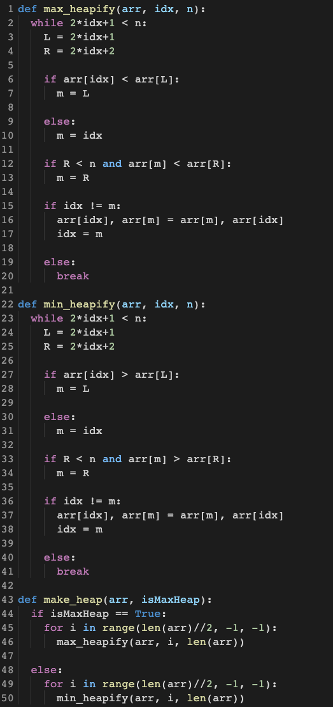
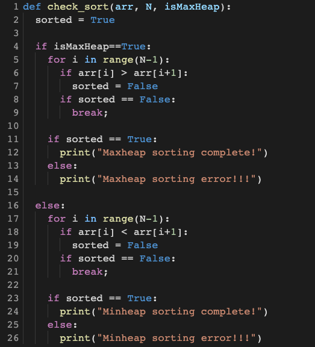
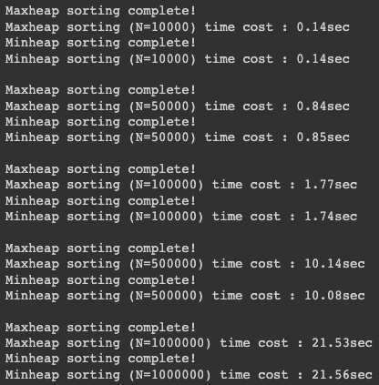

# Heap Sort

## 1. 개요

- MaxHeap, MinHeap 정렬 알고리즘을 구현하고 아래의 요구사항을 수행하시오.
  - 입력 1 
    - Array = [6, 2, 8, 1, 3, 9, 4, 5, 10, 7] 
  - 출력 1 
    - MaxHeap과 MinHeap을 구분하여 정렬 결과를 출력 
  - 입력 2 
    - N의 크기를 “10,000”, “50,000”, “100,000”, “500,000”, “1,000,000”으로 바꿔가면서 난수 생성 
  - 출력 2
    - `checkSort()` 함수를 통해 정렬이 잘 되었는지 결과 출력
    - MinHeap, MaxHeap 동작 시간 출력

## 2. 상세 설계 내용

### heapify

`make_heap` 함수는 주어진 `arr`이라는 배열을 `isMaxHeap`이 `True`일 때는 MaxHeap으로, `isMaxHeap`이 `False`일 때는 MinHeap으로 만들어주는 함수이다.

`max_heapify`와 `min_heapify`는 maxheap과 minheap의 특성에 따라 heap으로 만들어주는 함수이다. 작동 원리는 동일하므로 `max_heapify` 함수를 기준으로 설명하겠다.

MaxHeap에서 parents node의 키 값은 두 children nodes의 키 값보다 커야 한다. `make_heap` 함수는 이러한 성질을 만족하도록 `heapify` 함수를 계속 반복한다. 하나의 데이터에 대해 `heapify`의 시간복잡도는 최악의 경우를 따져봤을 때 root node에서 leaf node까지 값을 모두 비교하는 것으로 트리의 높이인 **O(logN)** 이 된다.

### heap sort

1. `heap_sort` 알고리즘은 먼저 주어진 배열 `arr`을 `isMaxHeap`이 `True`일 때는 MaxHeap으로, `isMaxHeap`이 `False`일 때는 MinHeap으로 만들어준다. (작동원리는 동일하므로 MaxHeap을 기준으로 설명하겠다.)
2. 그 다음, MaxHeap의 root node(=현재 배열의 첫번째 요소=최댓값)와 leaf node(=현재 배열의 마지막 요소)를 교환해준다.
3. 이렇게 교환된 새로운 root node에 대해 MaxHeap 조건을 만족하도록 만들어준다.
4. 앞서 설명한 root node와 leaf node를 교환하는 과정과 MaxHeap으로 만들어주는 과정을 data의 개수만큼 반복 수행한다.

### check sort

## 3. 실행 화면

### Array = [6, 2, 8, 1, 3, 9, 4, 5, 10, 7]

### N의 크기를 “10,000”, “50,000”, “100,000”, “500,000”, “1,000,000”으로 바꿔가면서 난수 생성

## 4. 결론

주어진 배열을 Heap의 특성을 만족하도록 만들어주는 과정은 **O(N)** 을 만족한다.

leaf node가 root node에 올라오기까지 트리의 높이(데이터 수가 n개일 때 h=log_2⁡n)만큼 자리 이동을 해야 한다. 이렇게 heapify를 해야 하는 노드들이 𝑛개가 있으므로 B의 시간복잡도은 **O(NlogN)**이 된다.

따라서 heap sort의 시간복잡도은 A와 B를 합친 **O(N)+O(NlogN)** 이며 결과적으로 **O(NlogN)** 이 된다.

## 5. 참고자료
- [Sorting(5) Heap Sort(힙 정렬 - min Heap)](https://jwprogramming.tistory.com/222)
- [Sorting(6) Heap Sort(힙 정렬 - max Heap)](https://jwprogramming.tistory.com/223)
- [힙과 힙 정렬 (Heap & Heap Sort) 요약 및 관련 자료](https://cjh5414.github.io/heap-sort/)
- [ratsgo's blog for textmining - 힙 정렬(Heap Sort)](https://ratsgo.github.io/data%20structure&algorithm/2017/09/27/heapsort/)
- [Heap Sort 정렬 알고리즘 ( 개념 / 시간복잡도 -O(nlogn) )](https://zeddios.tistory.com/56)
- [ Heap - Max Heap과 Min Heap](https://velog.io/@kjh107704/Heap)
- [[자료구조] 힙(Heap)이란? 최대힙(Max Heap)과 최소힙(Min Heap)](https://juhee-maeng.tistory.com/94)
- [Min-max heap - Wikipedia](https://en.wikipedia.org/wiki/Min-max_heap)
