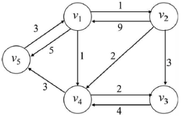
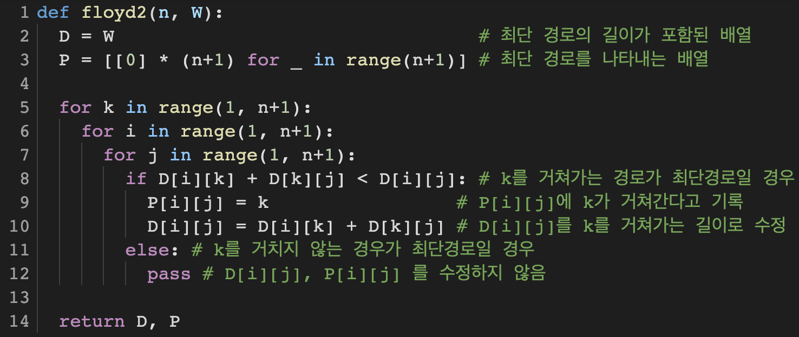
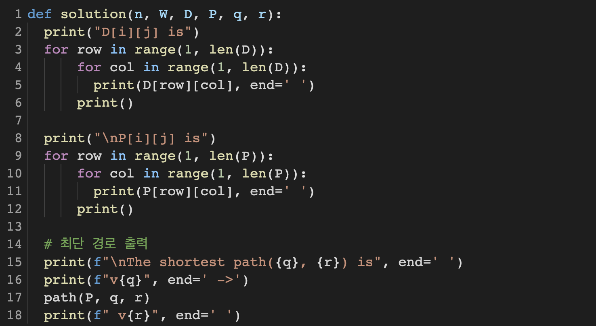
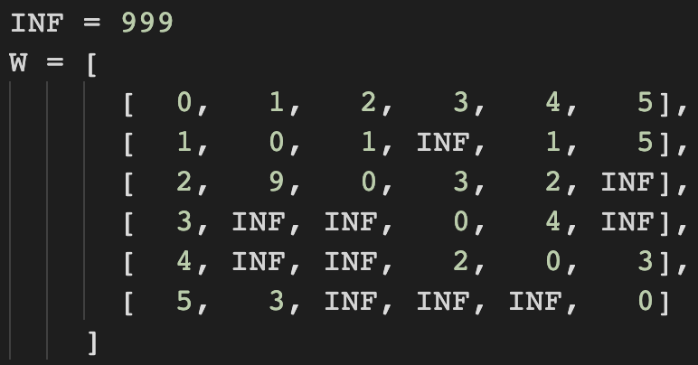

# Floyd's Algorithm

## 1. 개요

- 아래의 그래프의 각 정점에서 다른 모든 정점까지의 최단거리를 계산하고, 각각의 최단경로를 구하시오.
- 사용한 Weight 행렬을 캡처하여 제시할 것.
- path(5, 3), path(1, 3), path(2, 5)에 대해서 Floyd 알고리즘 출력 결과를 제시할 것.

## 2. 상세 설계 내용

### Floyd 알고리즘 II

`floyd2` 함수는 최단경로를 구하는 과정을 기록하는 함수로서, `n`과 배열 `W`를 입력으로 받고, 배열 `D`, `P`를 출력으로 반환한다. `n`은 그래프에서의 정점의 수이고, 배열 `W`는 가중치를 포함한 방향성 그래프를 뜻한다. 또한, 배열 `D`는 최단 경로의 길이가 포함된 배열을 의미하고, 배열 `P`는 아래를 만족하는 배열이다. 

5~7번 줄에서 삼중 for문을 돌면서 어느 경로가 최단경로인지를 찾는데, 만약 `k`를 거쳐가는 경로가 최단경로일 경우라면(8번 줄) `P[i][j]`에 `k`가 거쳐간다고 기록하고(9번 줄) `D[i][j]`를 `k`를 거쳐가는 길이로 수정한다. (10번 줄)  
만약 `k`를 거치지 않는 경우가 최단경로라면, `D[i][j]`와 `P[i][j]` 를 수정하지 않는다.

### path 알고리즘

`path` 함수는 배열 `P`를 기반으로 출발 정점인 `q`에서 도착 정점인 `r`까지의 최단경로를 찾는 함수이다. 만약 주어진 경로의 칸의 값이 0인 경우(2번 줄), `q`에서 `r`까지 한번에 바로 이동하는 경우가 가장 좋은 경우이므로 `pass` 한다.

만약 주어진 경로의 칸의 값이 0이 아니라면(4번 줄), 해당 칸을 기준으로 전후를 나누어 "시작 지점에서 해당 지점까지"의 최단경로를 재귀함수로 호출하고(5번 줄), "해당 지점에서 끝 지점까지"의 최단경로를 재귀함수로 호출한다. (7번 줄)

### solution

`solution` 함수는 출발 정점인 `q`에서 도착 정점인 `r`까지의 최단경로를 출력해주는 함수이다. 본 설계에서 가중치를 포함한 방향성 그래프를 나타내는 배열 `W`는 아래와 같이 구성하여 사용하였다. 

한 정점에서 정점까지 이어져 있지 않아 갈 수 없는 경우에 사용하는 ∞ (Infinity)를 대체하기 위해, 가중치를 나타내는 데에 있어 충분히 큰 수인 `999`라는 수를 사용하였다. 또한 정점의 표기가 1부터 시작하는 주어진 그래프의 표기 방식을 그대로 사용하기 위해, 행과 열을 각각 하나씩 추가해주었다.

## 3. 실행 화면

### path(5, 3) : v5 -> v3인 경우

### path(1, 3) : v1 -> v3인 경우

### path(2, 5) : v2 -> v5인 경우

## 4. 결론

본 설계에서는 한 번의 실행만으로 모든 정점 간 최단 경로를 구할 수 있는 Floyd 알고리즘을 사용하여 각 정점에서 다른 모든 정점까지의 최단경로를 구하였다.

정점 v5에서 정점 v3으로 이동하는 path(5, 3)의 경우에는 “v5 -> v1 -> v4 -> v3”,  
정점 v1에서 정점 v3으로 이동하는 path(1, 3)의 경우에는 “v1 -> v4 -> v3”,  
정점 v2에서 정점 v5으로 이동하는 path(2, 5)의 경우에는 “v2 -> v4 -> v5”를 거치면서 이동하는 것이 최단 거리로 이동할 수 있다는 것을 알 수 있었다. 또한, 실행결과를 주어진 예시와 비교해보았을 때, 동일한 결과를 얻을 수 있었다.

`floyd2` 함수의 5번 줄부터 7번 줄까지를 참고할 때, 3개의 for문을 사용한 것으로 미루어보아, Floyd 알고리즘의 시간복잡도는 O(n^3)임을 알 수 있다.

## 5. 참고자료

- https://github.com/hongzzi-zzi/algostudy/blob/main/3.2.FloydAlgo.py
- https://chanhuiseok.github.io/posts/algo-50/
