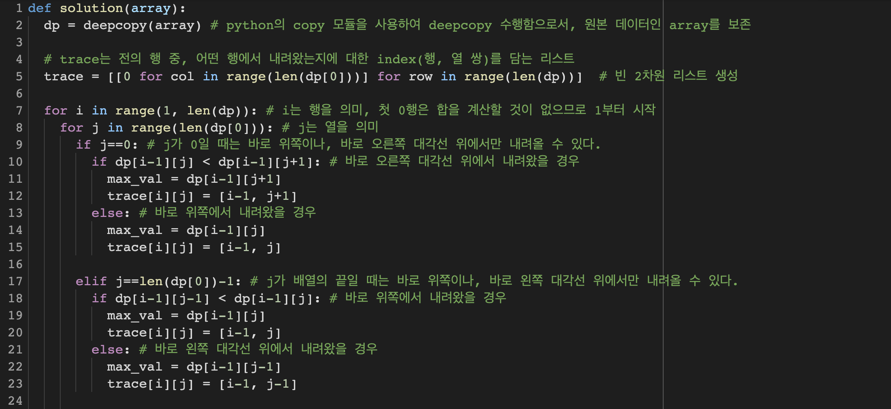
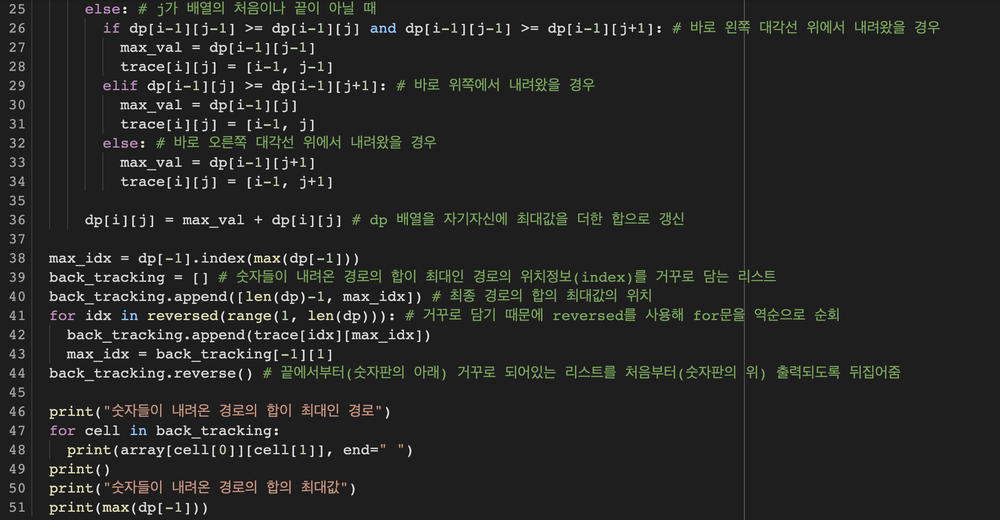

# 숫자판 놀이

## 1. 개요

- 숫자판 놀이
  - 숫자들이 2차원 배열에 있다. 가장 윗 행에서 가장 아래 행까지 내려올 때 걸쳐지는 길에 있는 숫자의 합이 가장 높은 값을 찾아보자. 이 때, 어느 한 cell에서 다음 cell로 내려올 경우에는 바로 아래, 왼쪽 대각선 아래, 오른쪽 대각선 아래로만 이동이 가능하다.
  - 아래의 숫자판 배열을 사용하여 위의 조건을 만족하는 최댓값을 구하시오.
    - 보고서에 어떤 방법으로 최댓값을 구하였는지 자세히 기술할 것
    - 각 행에서 출력한 값을 모두 출력하여 제시할 것 (경로)

```c
int array[8][9] = {
    {3, 4, 9, -2, 2, 51, -23, 2, -1},
    {223, 7, 8, -11, 5, -99, 2, 3, -4},
    {2, 51, -23, -23, 6, 3, 2, 4, 5},
    {5, -99, 2, -1, 32, 2, 5, -99, 2},
    {6, 3, 3, -4, 2, -1, 6, 3, 3},
    {32, 2, 4, 5, 3, -4, 2, -1, 4},
    {4, 4, 23, 6, 2, -1, 3, -4, 34},
    {78, 32, 1, 7, 3, -4, -23, -23, 6},
};
```

## 2. 상세 설계 내용

<br>

본 설계의 목적은 주어진 숫자판 배열을 사용하여 제한 조건을 만족하면서 숫자들이 내려온 경로의 합이 최대인 경로의 최댓값을 구하는 것이다. 어떠한 위치까지의 경로의 합의 최대값은 그 전단계에서 내려올 수 있는 것들 중 최대값에 그 위치를 더한 값과 같다는 아이디어를 동적 계획법(dynamic programming)으로 풀어볼 때, 코드로 나타내면 `array[i, j] = max(array[i-1, j-1], array[i-1, j], array[i-1, j+1]) + array[i, j] `이다. (`i`와 `j`는 각각 “행”과 “열”의 인덱스를 의미한다.)

다만, `j`가 배열의 처음이거나 `j`가 배열의 끝이라면, 내려올 수 있는 경우는 각각 바로 위에서 내려왔을 때와 바로 오른쪽 대각선 위, 그리고 바로 위에서 내려왔을 때와 바로 왼쪽 대각선 위로 한정된다. 이것을 본 설계에서는 if문으로 구분하여 코드로 구현하였다. (각각 9번 줄과 17번 줄) 각각의 if문 안에서는 내려올 수 있는 셀의 경우들 중 가장 큰 값을 if문을 통해 찾고, 그 값과 위치 정보(index)를 각각 `max_val` 변수와 2차원 리스트 `trace`에 대입한다. 이렇게 최대값을 구했다면, 어떠한 위치까지의 경로의 합의 최대값은 그 전단계에서 내려올 수 있는 것들 중 최대값에 그 위치를 더한 값과 같다는 아이디어를 그대로 사용하여 자기자신에 최대값을 더한 합으로 갱신한다. (36번 줄) 그리고 `max(dp[-1])`을 출력한다면, 숫자들이 내려온 경로의 합이 최대값을 구할 수 있다. (51번 줄)

다음으로, 숫자들이 내려온 경로를 출력하기 위해 경로의 위치정보(index)를 거꾸로 담는 리스트인 `back_tracking`을 사용하였다. 먼저, 최종 경로의 합의 최대값의 위치를 리스트에 `append` 시켜준 후 (40번 줄), for문을 역순으로 돌면서 `trace` 리스트를 (숫자판 기준) 아래에서 위로 역추적(backtracking)하고, 그 위치를 `back_tracking` 리스트에 `append`한다. (42번 줄)

최종적으로, 거꾸로 되어있는 `back_tracking` 리스트를 숫자판의 위인 처음부터 출력되도록 뒤집어준 후, `back_tracking`이 담고 있는 인덱스 정보를 이용해 `array`에 순서대로 대입하면 경로를 확인할 수 있다.

## 3. 실행 화면


## 4. 결론

주어진 숫자판 배열에서 바로 아래, 왼쪽 대각선 아래, 오른쪽 대각선 아래로만 이동이 가능할 때, 어떠한 위치까지의 경로의 합의 최대값은 그 전단계에서 내려올 수 있는 것들 중 최대값에 그 위치를 더한 값과 같다. 이를 복잡한 문제를 간단한 여러 개의 문제로 나누어 푸는 방법인 동적 계획법(dynamic programming)으로 풀어볼 때, 코드로 나타내면 `array[i, j] = max(array[i-1, j-1], array[i-1, j], array[i-1, j+1]) + array[i, j]`이다.

최종적으로 숫자들이 내려온 경로의 합이 최대인 경로는 `4 223 51 5 6 32 4 78`이며, 경로의 합의 최대값은 `403`이다.

## 5. 참고 자료

1. [PAPICO's DEVELOG - [BOJ] 1932 - 정수 삼각형](https://pa-pico.tistory.com/76)
2. [깨지고 부서져라 - [백준] 1932번(python 파이썬)](https://pacific-ocean.tistory.com/148)
