# CAR_DEALER 데이터베이스 설계 및 차량 판매 시스템 구축

## 1. 프로젝트 개요

- Car_Dealer에 대한 EER 다이어그램을 바탕으로 차량 판매시스템을 설계하라.

### 요구 기능

- 아래 두개의 페이지를 구성한다.
  - 차량 등록 및 판매를 관리하는 관리자 페이지
  - 구매 예약, 예약조회 및 예약, 예약확인을 위한 사용자 페이지
- 위 두 기능을 위한 요구사항을 재량껏 추가한 후 ERD를 완성하여 제시하라.
- 차량 데이터는 임의로 10만건 이상 만들어 DB에 입력한 상태로 시작
- 관리자 페이지
  - 차량 정보 입력/수정/삭제
  - 차량 구매 예약 조회/수정/완료 (판매완료, 판매실패)
    - 구매 예약 후 차량 판매가 될 때 까지는 다른 사용자에게 그 차량은 검색되어서는 안 됨
  - 위 기능을 구현하기 위한 제약조건을 제시하라.
- 사용자 페이지
  - 차량 구매 예약하기, 예약조회, 예약취소 기능
  - 위 기능을 구현하기 위한 제약조건, 색인, 트랜잭션 등을 제시하라.

## 2. 상세 설계 내용

### (1) `Car_Dealer` 데이터베이스 모델의 개념적 설계

먼저, 차량 판매 시스템에 사용되는 `Car_Dealer` 데이터베이스 모델을 개념적으로 설계하였다. `Car_Dealer` 데이터베이스에는 등록된 차량의 정보들을 나타내는 `VEHICLE` 테이블, 차량을 관리하고 판매하는 판매자 계정의 정보를 담고 있는 `SALESPERSON` 테이블이 있다. 또한, `SALESPERSON_manages_VEHICLE` 테이블은 판매자가 어떤 차량을 관리하고 있는지에 대한 정보를 담고 있다. 마지막으로, `CUSTOMER` 테이블은 시스템에 가입한 고객의 정보를 담고 있으며, `SALESPERSON_manages_VEHICLE` 테이블의 키 값을 참조하고 있다.

본 설계에서는 테이블 간의 참조 관계를 아래와 같이 가정하고 정의하였다.

1. '판매자'는 '차량'을 관리(manage)한다. 이때, `SALESPERSON`과 `VEHICLE`은 M:N의 식별 관계를 가진다.
   - 한 명의 '판매자'는 여러 대의 '차량'들을 관리할 수 있다.
   - 한 대의 '차량'은 여러 명의 '판매자'들로부터 관리 받을 수 있다.
   - M:N 관계를 실제로 구현하기 위해, 두 테이블의 PK를 FK로 참조하고 있는 연결 테이블인 `SALESPERSON_manages_VEHICLE`를 사용하였다.
2. `SALESPERSON_manages_VEHICLE`과 `CUSTOMER`는 1:1의 비식별 관계를 가진다.
   - 한 명의 '고객'은 '판매자가 관리 중인 차량'을 예약/구매하지 않거나 최대 한 대까지만 예약/구매한다고 가정한다.
   - 한 대의 '판매자가 관리 중인 차량'은 '고객'으로부터 선택받지 못하거나, 최대 한 명의 '고객'으로부터 선택받을 수 있다고 가정한다.

### (2) MySQL Workbench를 통한 ERD 설계

MySQL Workbench 프로그램에서 개념적으로 설계한 `Car_Dealer` 데이터베이스 모델을 ERD 다이어그램으로 나타내었다. 그림 1은 `Car_Dealer`의 ERD 다이어그램이며, 테이블 간의 관계뿐만 아니라, 각 테이블의 고유키, 외래키, 컬럼 등을 함께 확인할 수 있다.

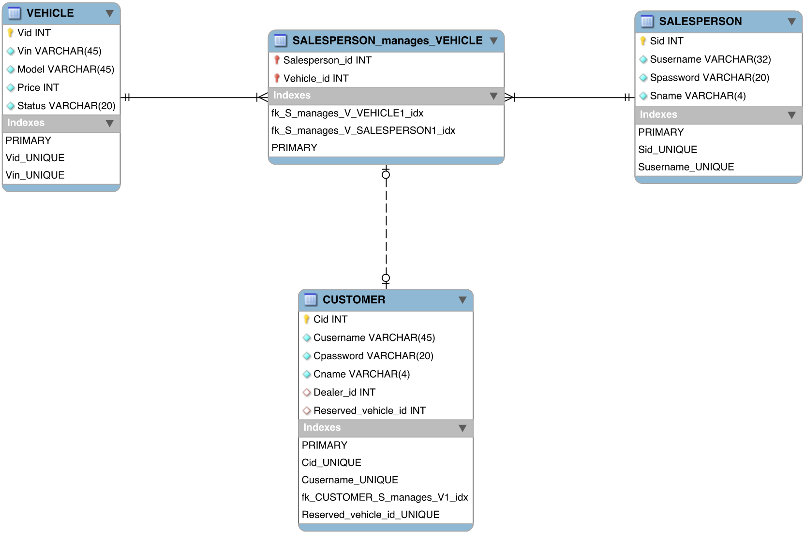 
[그림 1 - `Car_Dealer` 데이터베이스의 EER 다이어그램]

이후, 프로그램의 Forward Engineer to Database 기능을 활용하여 Schema Diagram을 SQL문으로 변환하였다. 생성된 스크립트는 그림 2에 나타내었고, 이것을 `Car_Dealer` 데이터베이스 상에 반영시켜 DB의 테이블을 MySQL에서 확인한 것은 그림 3과 같다. 

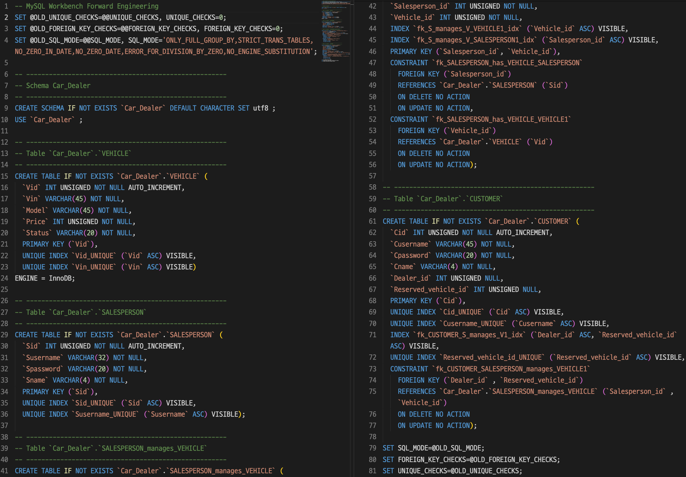 
[그림 2 - `Car_Dealer` 데이터베이스 생성 스크립트]

 
[그림 3 - 설계한 테이블들이 성공적으로 반영된 `Car_Dealer` 데이터베이스]

### (3) 성능 최적화를 위한 인덱스 설정 및 뷰 생성

본 설계에서는 '차량'이 10만 대가 있다고 가정하였다. 따라서 `VEHICLE` 테이블에는 10만 건의 데이터가 존재하게 된다. 이처럼 데이터가 방대한 테이블에 성능 최적화를 위해 `CREATE INDEX Vehicle_Status ON VEHICLE (Status) USING BTREE;` 명령어로 인덱스를 추가로 설정해주었다. 각 테이블 별 인덱스는 그림 4와 같다.

 
[그림 4 - 테이블 별 인덱스]

또한, 성능 최적화를 위해 Reservation_table라는 뷰를 생성하였다. 인덱스 설정과 뷰 생성을 위해 작성한 스크립트는 그림 5에 나타내었다.

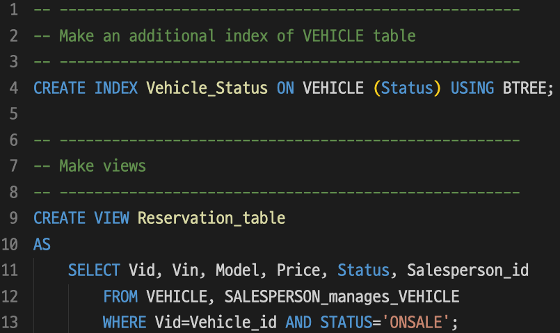 
[그림 5 - 성능 최적화를 위해 작성한 인덱스 설정 및 뷰 생성 스크립트]

### (4) 테이블의 컬럼 별 제약조건

 
[그림 6 - 테이블의 컬럼 별 제약조건]

위 그림 6에서는 `DESC` 명령어를 이용하여 모든 테이블의 컬럼 별 제약조건을 나타내었다.

### (5) INSERT문을 통한 데이터 삽입

MySQL 상에 반영한 `Car_Dealer` 데이터베이스에 테이블 별로 기본 데이터들을 삽입하였다. 이때 '차량'이 10만 대가 있다고 가정하여, `VEHICLE` 테이블에는 10만 건의 데이터를 삽입하였고, `SALESPERSON_manages_VEHICLE`에도 마찬가지로 10만 건의 데이터를 삽입하였다. 데이터들을 삽입할 때는 테이블들의 참조 관계를 고려하여 `SALESPERSON`, `CUSTOMER`, `VEHICLE`, `SALESPERSON_manages_VEHICLE` 테이블 순으로 INSERT 문을 실행하였다. 아래 그림 7은 10만 건의 데이터를 제외한 나머지 데이터를 삽입하는 스크립트이다.

 
[그림 7 - `SALESPERSON`, `CUSTOMER` 테이블에 데이터를 삽입하는 스크립트]

### (6) `Car_Dealer` 데이터베이스와 Express 간의 연동 및 설정

Express는 Node.js의 핵심 모듈인 http와 Connect 컴포넌트 기반의 빠르고 간편한 웹 프레임워크이다. Express는 Node.js를 통해 다양한 자바스크립트 애플리케이션을 실행하며, 웹서버와 같이 확장성 있는 네트워크 프로그램을 제작하기 위해 만들어졌다. 본 설계에서는 `Car_Dealer` 데이터베이스 기반의 차량 판매 시스템을 웹에 구현하기 위해 Express를 사용하였다.

Node.js 기반의 Express를 사용하기 위해, 프로젝트 폴더 경로에서 `npm init` 명령을 실행하고, `npm install` 명령어를 통해 express, mysql2, body-parser, babel, nodemon, cookie-parser, express-session, livereload, connect-livereload 등 필요한 패키지들을 설치하였다. 또한 babel.config.json 파일과 package.json 파일을 수정해주었다. 그리고 프로젝트 폴더에서 아래 그림 8과 같이 폴더 및 파일들을 생성하여 전체적인 프로젝트 구조를 구성하였다.

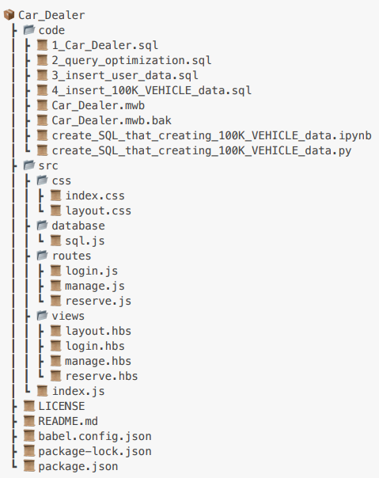 
[그림 8 - 프로젝트 구조]

### (7) 기능별 웹 페이지 구상 및 라우터 선언

웹 상에서 로그인 기능과 관리, 예약 기능을 구현하기 위해 다음과 같이 페이지를 구상하였다.

- `localhost:3000/`
  - `/` : 로그인 기능이 구현되어 있는 메인 페이지이다.
  - `/manage` : '판매자'를 위한 차량 관리 기능이 구현된 페이지로, 본인이 담당하는 차량들 중 10 대의 정보만을 확인 및 수정, 삭제 할 수 있다. 또한, 본인이 담당하는 새로운 차량을 등록할 수 있으며, 메인 페이지에서 `SALESPERSON`의 계정으로 로그인을 하면 리다이렉트 된다.
    - `/manage/all` : 본인이 담당하는 모든 차량들의 정보를 확인, 수정, 삭제할 수 있으며, 본인이 담당하는 새로운 차량을 등록할 수 있다.
    - `/manage/ONSALE` : 본인이 담당하는 모든 차량들 중 현재 판매중인 차량들의 정보를 확인, 수정, 삭제할 수 있으며, 본인이 담당하는 새로운 차량을 등록할 수 있다.
    - `/manage/RESERVED` : 본인이 담당하는 모든 차량들 중 예약 상태인 차량들의 정보를 확인, 수정, 삭제할 수 있으며, 본인이 담당하는 새로운 차량을 등록할 수 있다.
    - `/manage/SOLDOUT` : 본인이 담당하는 모든 차량들 중 판매가 완료된 차량들의 정보를 확인, 수정, 삭제할 수 있으며, 본인이 담당하는 새로운 차량을 등록할 수 있다.
  - `/reserve` : '고객'을 위한 차량 예약 기능이 구현된 페이지로, 예약 가능한 10 대의 차량들을 조회하고 예약할 수 있다. 메인 페이지에서 `CUSTOMER`의 계정으로 로그인을 하면 리다이렉트 된다.
    - `/reserve/all` : 예약 가능한 모든 차량들을 조회하고 예약할 수 있다.
  - `/logout` : 로그인이 되어 있는 상태에서 로그아웃을 하고, 메인 페이지인 `/`으로 리다이렉트 된다.

src/index.js 파일에서는 서버 실행 코드를 작성하고, 구상한 페이지들을 바탕으로 loginRouter, manageRouter, reserveRouter 등 필요한 라우터들을 선언하였다. 또한, 새로고침이나 페이지 간의 이동에 로그아웃되지 않도록 세션을 유지하는 코드를 작성하였다.

### (8) 데이터베이스 연동 및 트랜잭션 설계

src/database/sql.js 파일에서는 mysql2 패키지를 이용하여 데이터베이스에 연동하기 위한 코드를 작성하였다. 그리고 웹 페이지에서 데이터베이스를 이용하는데에 필요한 트랜잭션을 크게 3종류로 나누었다. 페이지별로 구분하여 loginSql, reserveSql, manageSql으로 나누었는데, 페이지별로 구분한 이유는 '판매자' 계정과 '고객' 계정이 접근 가능한 페이지가 다르기 때문에, 보안적인 측면을 고려한 것이다. 각각의 트랜잭션의 시작과 끝에는 `START TRANSACTION`과 `COMMIT` 명령어를 수행하였다.

로그인 작업은 입력한 아이디와 비밀번호를 DB의 계정 데이터와 비교하는 방식으로 이루어진다. 이때 `SALESPERSON` 테이블과 `CUSTOMER` 테이블을 조회하는데, loginSql에 이러한 트랜잭션들을 테이블 별로 구분하여 구현하였다.

reserveSql에는 `/reserve` 페이지에서 이루어지는 작업들에 필요한 트랜잭션들을 모았다. getAvailableVehicles과 get10AvailableVehicles은 '차량'들 중에서 예약되거나 판매되지 않고, '고객'이 구매 가능한 차량들을 조회하는 트랜잭션이다. 이 트랜잭션은 성능 최적화를 위해 생성한 Reservation_table 뷰를 SELECT문으로 조회하였다. 
setUserReservation은 '고객'이 구매 가능한 차량을 예약하는데에 사용되는 트랜잭션이다. 이 트랜잭션은 `CUSTOMER` 테이블만을 업데이트하지 않고, `VEHICLE`도 함께 업데이트한다. 또한, getUserReservation은 '고객'이 예약한 '차량'의 정보를 조회하는 트랜잭션이다. 마지막으로 removeUserReservation은 '고객'의 예약 정보를 삭제하는 트랜잭션이다. setUserReservation과 마찬가지로 `CUSTOMER` 테이블만을 업데이트하지 않고, `VEHICLE`도 함께 업데이트한다.

manageSql에는 `/manage` 페이지에서 이루어지는 작업들에 필요한 트랜잭션들을 모았다. getAllVehicles과 get10Vehicles은 본인이 관리하는 '차량'들의 정보를 조회하는 트랜잭션이다. getOnSaleVehicles, getReservedVehicles, getSoldVehicles은 '판매원'이 관리하는 '차량'들 중에서 각각 판매중, 예약중, 판매완료된 '차량'들의 정보를 조회하는 트랜잭션이다. 
createVehicle, updateVehicle, deleteVehicle은 '판매원'이 관리하는 '차량'을 각각 추가, 갱신, 삭제하는 트랜잭션이다.

### (9) 웹 페이지 구현 - 로그인 페이지

차량 판매 시스템의 페이지 구현을 위해, src/routes/ 폴더 내에 login.js, manage.js, reserve.js 파일을 구성하였다.

src/routes/login.js 파일은 메인 페이지인 `localhost:3000/`에서 사용되는 로그인 기능을 구현한 파일로, 로그인을 하지 않은 기본 상태에서는 로그인 폼이 있는 `src/views/login.hbs`과 연동된다. 아이디와 비밀번호는 `CUSTOMER` 테이블의 `Cusername`과 `Cpassword` 속성, 혹은 `SALESPERSON` 테이블의 `Susername`과 `Spassword` 속성으로 로그인 가능하도록 하였다.

 
[그림 9 - login.js]

src/routes/login.js 파일에서는 쿠키 및 세션을 설정하는 코드를 사용하였는데, 로그인에 성공하면 사용자의 계정명을 의미하는 "username"와 사용자의 이름을 의미하는 "name", 사용자가 '판매자'인지 '고객'인지를 나타내는 "whoAmI"라는 쿠키를 저장하였다. (그림 4, 71번 줄 ~ 82번 줄) 
만약 쿠키값이 저장되어 있다면 기존에 이미 로그인에 성공한 것이므로 "whoAmI" 쿠키값을 참고하여 계정에 맞는 페이지로 리다이렉트하고, 쿠키값이 저장되어 있지 않다면 login.hbs를 렌더링한다. (그림 4, 16번 줄 ~ 26번 줄) 
또한, `/logout` 페이지로 접속한다면 저장한 쿠키값을 초기화함으로서 로그아웃을 수행한다. (그림 4, 28번 줄 ~ 38번 줄)

### (10) 웹 페이지 구현 - '고객' 예약 페이지

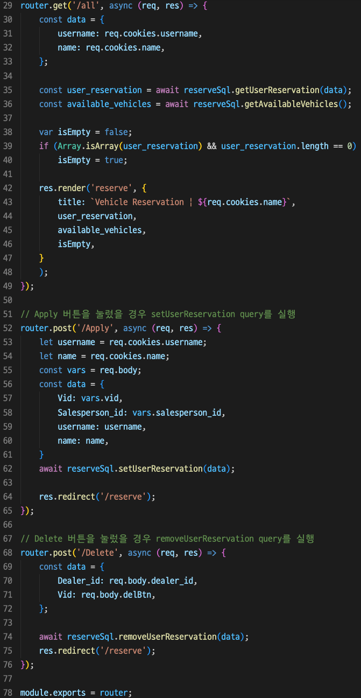 
[그림 10 - reserve.js]

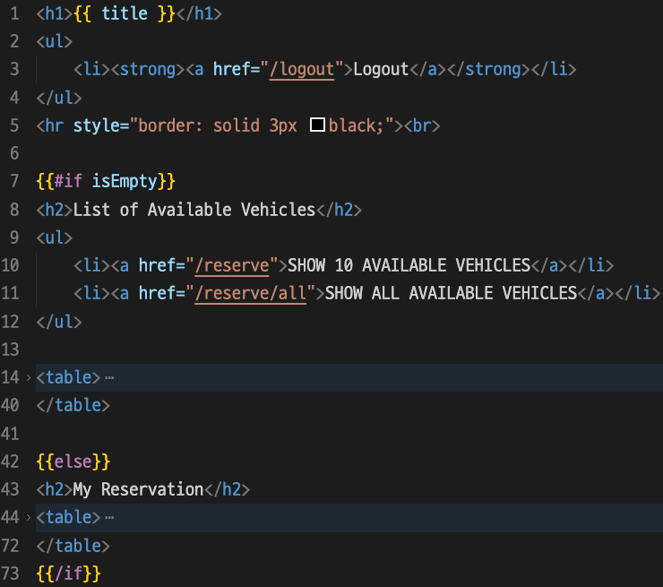 
[그림 11 - reserve.hbs]

그림 10의 src/routes/reserve.js 파일은 사용자 예약 페이지를 구현한 파일이다. src/database/sql.js의 reserveSql를 불러와 그림 11의 src/views/reserve.hbs와 연동을 통해 구매 예약, 예약 확인 등의 기능을 제공한다.

먼저, getUserReservation 트랜잭션을 수행하여 '고객'의 예약 정보를 받아온다. 이 때, 예약 정보가 비어있다면, isEmpty 변수가 `true` 값을 갖게 된다. (그림 10, 36번 줄 ~ 40번 줄) 
reserve.hbs는 reserve.js로부터 넘겨 받은 변수들을 나타내는데, isEmpty가 `true` 값을 가지면 '고객'이 예약을 하지 않은 상태이므로 구매 예약을 위한 테이블을 보여준다. 반대로, isEmpty가 `false` 값을 가지면 '고객'이 예약을 이미 완료한 상태이므로 고객의 예약 정보를 보여준다.

구매 예약을 위해 getAvailableVehicles 트랜잭션을 사용하여 테이블을 구성하고, reserve.hbs의 테이블에 행 별로 Apply 버튼을 추가하였다. Apply 버튼을 눌렀을 경우 setUserReservation 트랜잭션을 실행하여, DB에 데이터가 업데이트 된다. (그림 10, 52번 줄 ~ 65번 줄)

예약 확인을 위해서는 getUserReservation 트랜잭션을 사용하여 테이블을 구성하고, reserve.hbs에서 테이블의 행에 Delete 버튼을 추가하였다. Delete 버튼을 눌렀을 경우 removeUserReservation 트랜잭션을 실행하여, DB에 데이터가 반영된다. (그림 10, 68번 줄 ~ 76번 줄)

### (11) 웹 페이지 구현 - '판매자' 관리 페이지

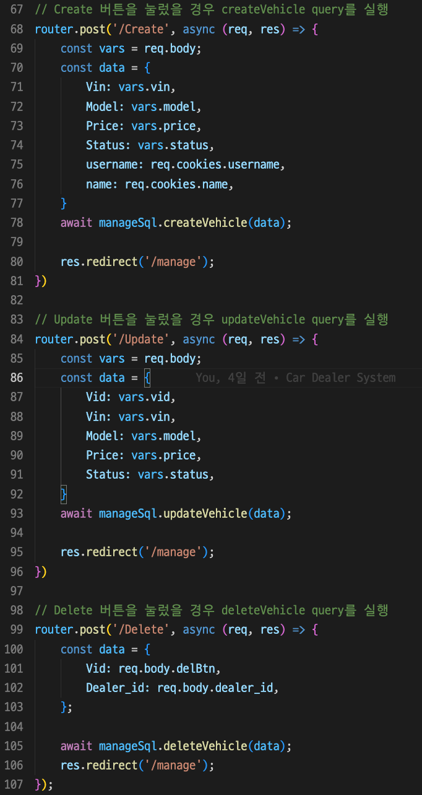 
[그림 12 - manage.js]

 
[그림 13 - manage.hbs]

그림 12의 src/routes/manage.js 파일은 '판매자' 관리 페이지를 구현한 파일이다. src/database/sql.js의 manageSql를 불러와 그림 13의 src/views/manage.hbs와 연동을 통해 차량 정보 입력/수정/삭제 기능과 차량 구매 예약 조회/수정/완료 등의 기능을 제공한다.

차량 정보 수정/삭제를 위해 getAllVehicles 트랜잭션을 사용하여 테이블을 구성하고, manage.hbs의 테이블에 행 별로 Update 버튼과 Delete 버튼을 추가하였다. Update 버튼을 눌렀을 경우 updateVehicle 트랜잭션을 실행하고, Delete 버튼을 눌렀을 경우 deleteVehicle 트랜잭션을 실행함으로서 DB에 데이터가 업데이트 된다. (그림 12, 84번 줄 ~ 107번 줄)

차량의 예약 정보와 기타 정보의 입력을 위해서는 manage.hbs에서 테이블의 행에 Create 버튼을 추가하였다. Create 버튼을 눌렀을 경우 createVehicle 트랜잭션을 실행하여, DB에 데이터가 반영된다. (그림 12, 68번 줄 ~ 81번 줄)

## 3. 실행 화면

`npm run start` 명령어를 통해 서버를 실행시키고, 메인 페이지인 `localhost:3000/`에 접속하면 아래와 같은 화면을 확인할 수 있다.

 
[그림 14 - 로그인 화면]

먼저, 로그인 폼에 '고객'의 아이디/비밀번호인 "user1"/"1111"을 입력하면 성공적으로 로그인이 되며, '고객'의 예약을 담당하는 `/reserve` 페이지로 이동한다. '고객'이 처음으로 로그인하면, 어떤 '차량'도 예약하지 않은 상태이므로, 예약 가능한 '차량'이 보여진다.

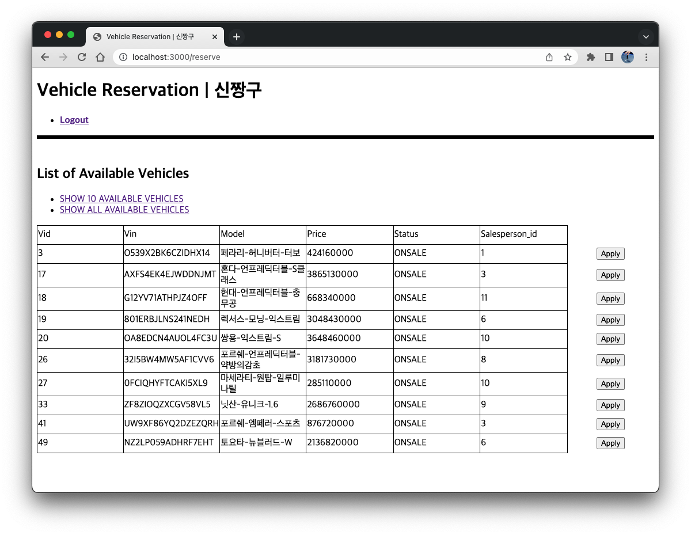 
[그림 15 - 로그인 직후 화면]

 
[그림 16 - 저장된 쿠키값]

"SHOW ALL AVAILABLE VEHICLES"를 누르면 아래 그림 17처럼 예약가능한 전체 '차량'을 확인할 수 있다. 이 중 맨 마지막에 있는 Vid 99997 차량을 예약하면, 아래 그림 18과 같은 화면을 확인할 수 있다. 다시 Delete 버튼을 누르면 Status가 “ONSALE”로 바뀌면서 다른 고객들이 확인 가능하다.

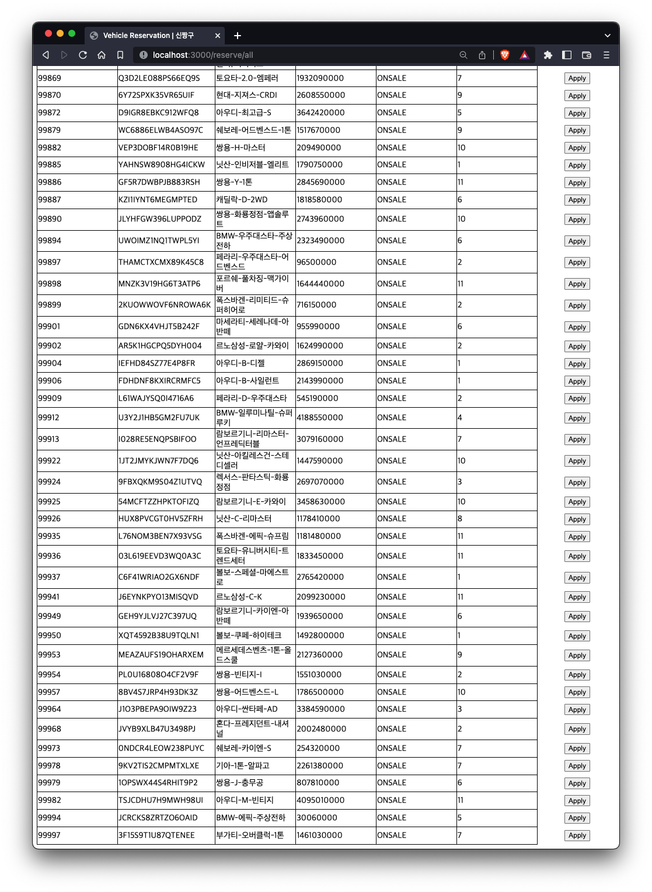 
[그림 17 - 예약가능한 차량 전체 조회]

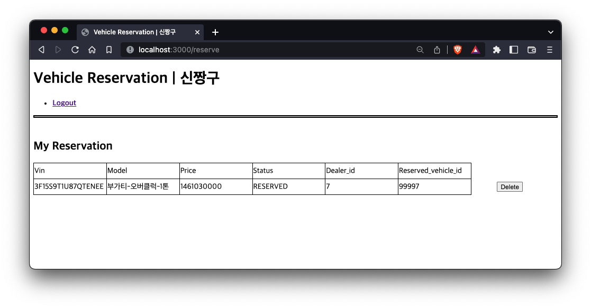 
[그림 18 - 예약 현황 조회]

이번에는 다시 Vid가 3인 차량을 예약해보았다.

 
[그림 19 - 예약 현황 조회]

그리고 다른 계정으로 들어가 확인해보면, 그림 20에서 Vid가 3인 차량을 예약할 수 없다는 것을 확인할 수 있다.

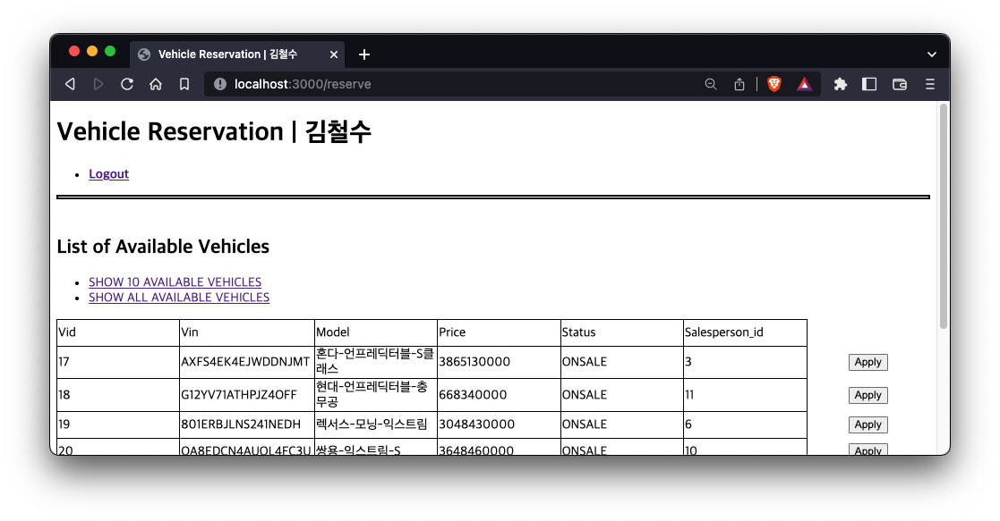 
[그림 20 - 예약가능한 차량 전체 조회]

이번에는 판매자 계정으로 로그인해보았다. 그림 22와 같이 삽입이 가능하다. 또한, 판매 완료된 Vid 35인 차량을 삭제하기 위해 Delete 버튼을 누르면 그림 23처럼 삭제가 정상적으로 작동한다.

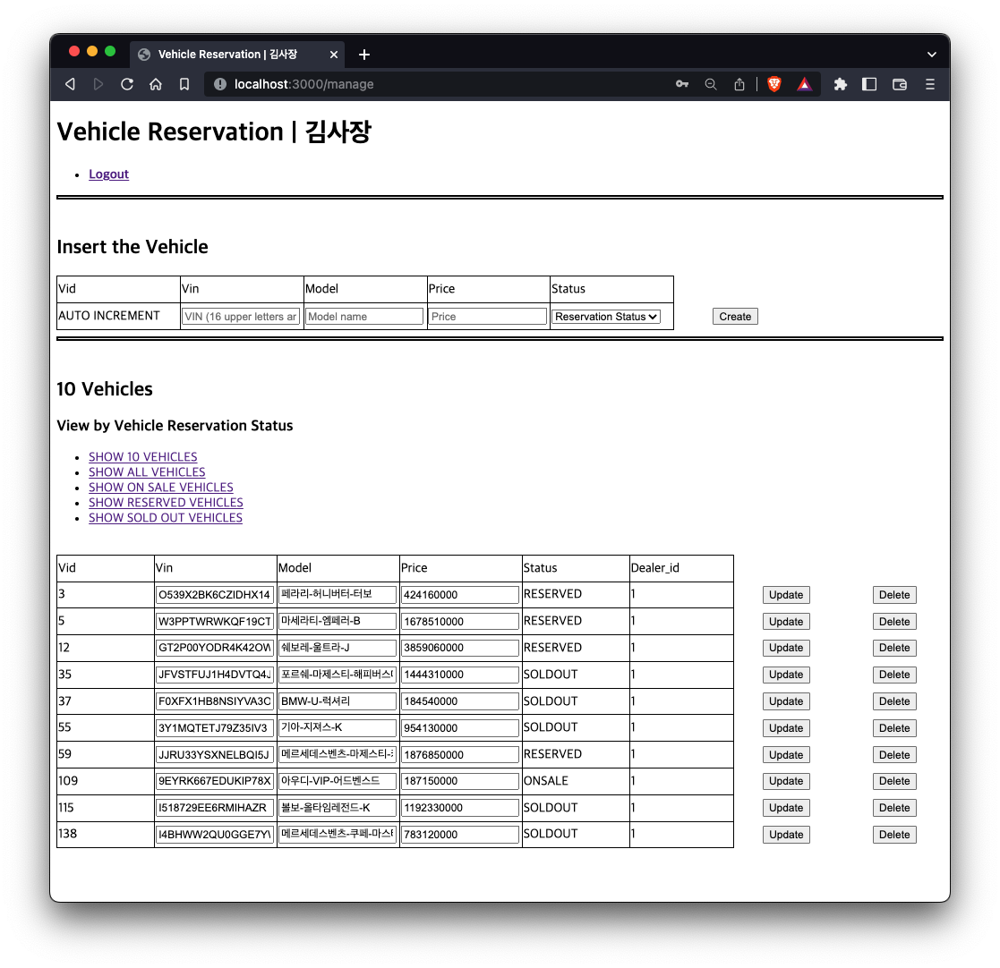 
[그림 21 - 로그인 직후 화면]

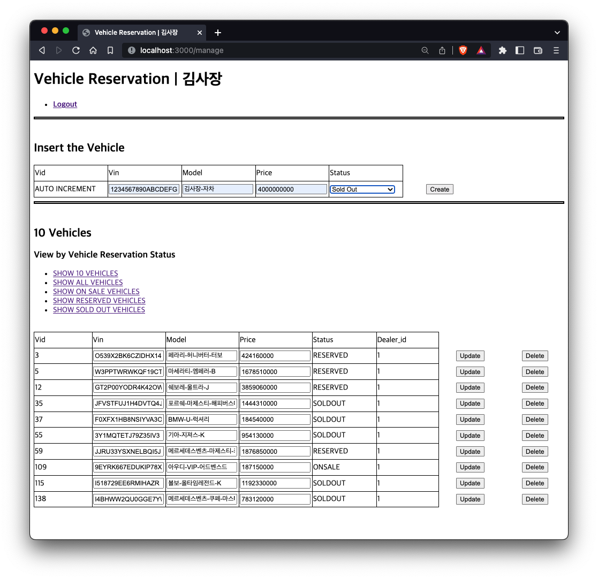 
[그림 22 - 차량 생성]

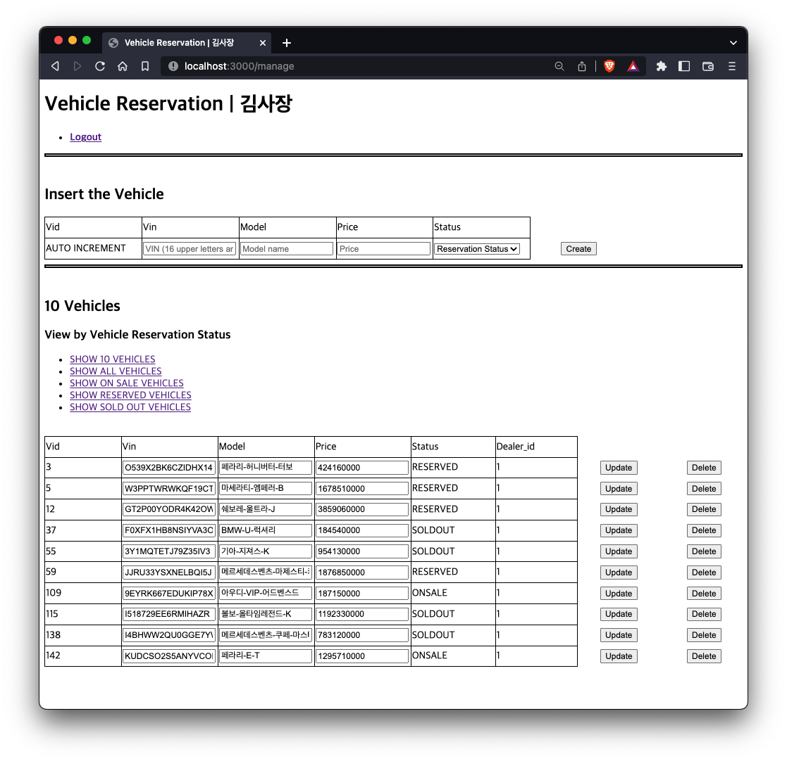 
[그림 23 - 차량 생성]

## 4. 결론

본 설계에서는 차량 판매 시스템을 구축하기 위해 Car_Dealer 데이터베이스를 설계하고, 데이터베이스의 데이터를 JavaScript 기반 Express 프레임워크를 사용하여 웹에 나타내었다. 이 웹에는 로그인 기능과 예약 및 관리기능이 포함되었다. 로그인, 예약, 관리 등 3가지 기능으로 라우터를 구분하여 구성하였으며, src/routes 폴더 내부의 `.js` 파일과 src/views 폴더 내부의 `.hbs` 파일을 연동시켜, 웹 페이지에 기능을 구현하였다. 또한, 쿠키를 관리하는 코드로 "name”와 "username", “whoAmI”라는 쿠키를 사용하였다.

메인 홈페이지인 `localhost:3000/`에 로그인이 되어있지 않은 채로 접속하면, 로그인 폼에서 로그인이 가능하다. 로그인 기능은 `src/routes/login.js` 내에서 `getUsers`의 쿼리를 불러온 후, 입력한 아이디/비밀번호를 데이터베이스의 아이디/비밀번호와 비교하는 방식으로 구현하였다.

사용자가 웹에 로그인하면 이름을 확인할 수 있으며, 각 계정에 맞는 페이지에서 차량 예약과 관리가 가능한 것을 확인하였다.
