# Inha 데이터베이스 설계 v3

Express를 사용한 InhaDBv3의 Web 상 Select, Update, Insert 및 Index 사용

## 1. 개요

- STEP 1 : 실습 내용을 바탕으로 InhaDB에 적용할 것.
  - 모든 테이블을 select로 조회하여 화면 캡처
  - Student 테이블의 모든 attribute를 update할 수 있도록 할 것
  - 1가지 이상의 테이블에 insert하는 기능을 구현할 것
- STEP 2 : 임의로 학생을 10만명 만들어서 index 미적용/적용 결과를 제시할 것
  - 특정 수업을 듣는 학생을 검색하는 조건으로 query 작성
  - Explain을 사용하여 index가 적용되었는지 결과 캡처

## 2. 상세 설계 내용

### STEP 1 : 기존의 [InhaDBv2](../InhaDBv2/)를 확장하여 Web에서 Select, Update, Insert 기능 구현

기존의 InhaDB의 Schema Diagram은 아래와 같다. 

웹 상에서 MySQL의 InhaDB와 Select, Update, Insert 명령어를 사용하기 위해 다음과 같이 라우터를 구상하였다.

- `localhost:3000/`
  - `/` (홈 화면) : Insert (Employee 테이블에 데이터 삽입)
  - `/select` : Select (모든 테이블 조회)
  - `/update/student` : Update (Student 테이블 수정)

프로젝트 폴더에서 아래 사진과 같이 폴더 및 파일들을 생성하여 전체적인 프로젝트 구조를 구성하였다. 
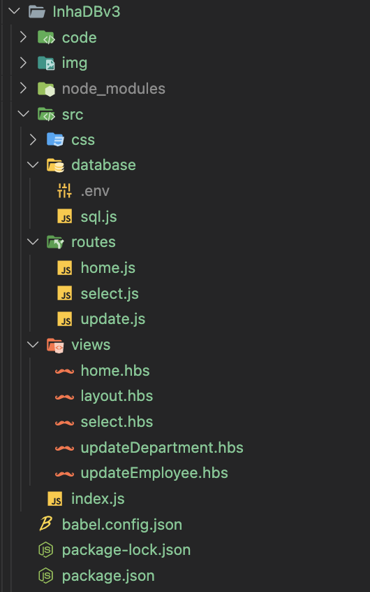

`src/index.js` 파일에서는 서버 실행 코드를 작성하고, 구상한 라우터를 바탕으로 필요한 라우터를 선언하였다. 

`src/database/sql.js` 파일에서는 Insert, Update, Select를 수행하기 위한 쿼리를 작성하였다. 아래는 `src/database/sql.js`의 일부이다.

`src/database/sql.js` :
 

서버 및 웹 페이지를 구현하기 위해, `src/routes` 폴더 내에 `home.js`, `select.js`, `update.js` 파일을 구성하였다.

`src/routes/home.js` 파일은 홈 화면 역할을 하는 Insert 기능을 구현한 파일로, Employee 테이블에 데이터를 삽입하는 기능을 구현하였으며, `src/views/home.hbs` 파일과 연동함으로서 `<form>`을 구현하였다.

`src/routes/home.js` :  
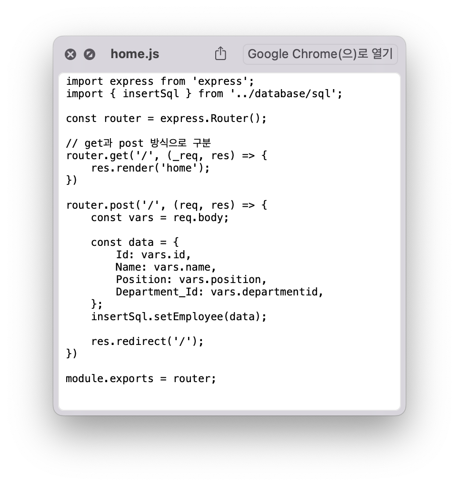

`src/views/home.hbs` :  
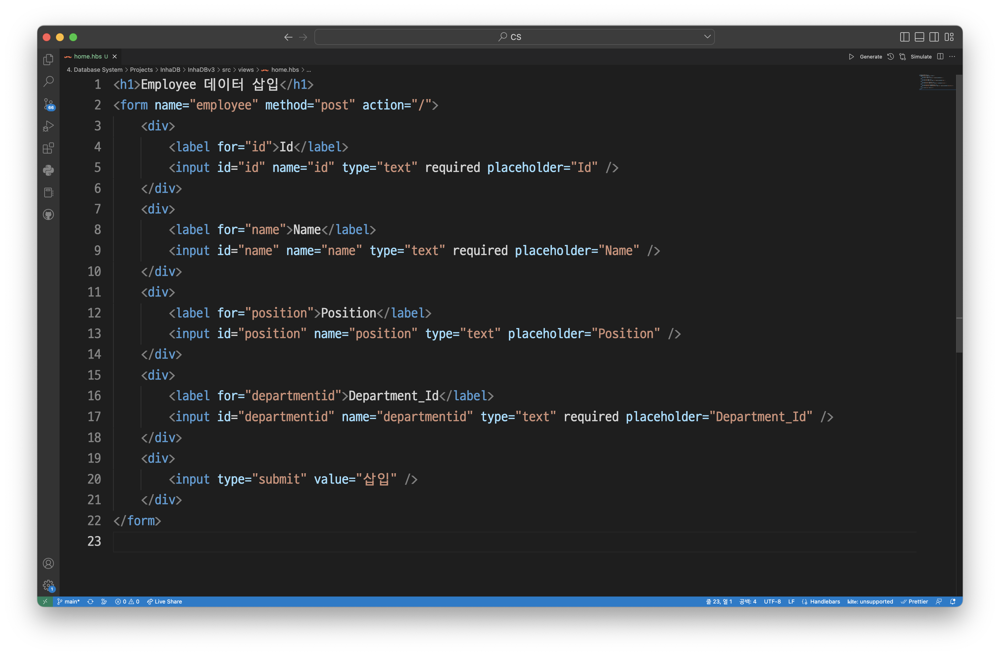

`src/routes/select.js` 파일은 조회 역할을 하는 Select 기능을 구현한 파일로, InhaDB 내의 모든 테이블을 조회하는 기능을 구현하였다. 또한, `src/views/select.hbs` 파일과 연동시켜 테이블에 데이터 값을 나타내었다.

`src/routes/select.js` :  

`src/views/select.hbs` :  
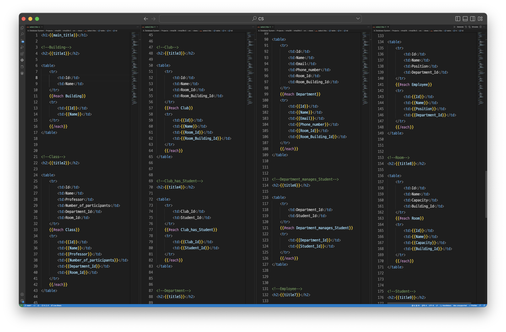

`src/routes/update.js` 파일은 Student 테이블의 모든 attribute를 수정할 수 있도록 구현한 파일로, `src/views/updateStudent.hbs` 파일과 연동시켜 웹 상에서 데이터 수정이 가능하도록 구현하였다.

`src/routes/update.js` :  
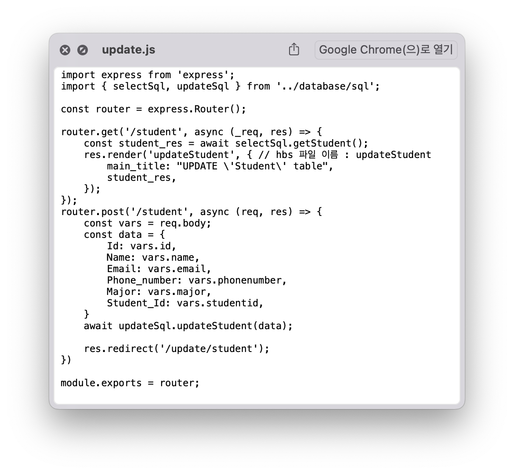

`src/views/updateStudent.hbs` :  
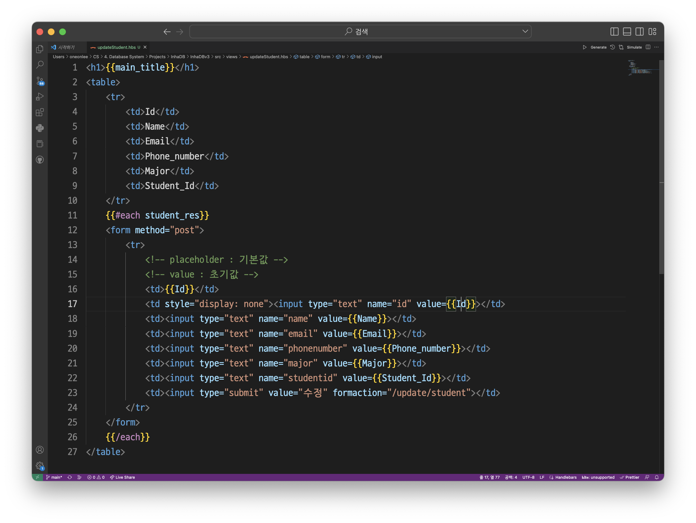 
`src/views/updateStudent.hbs`에서 `<input>` 태그로 테이블을 구성할 때, 수정 버튼을 클릭하여 전달하는 데이터를 모두 전달하기 위해 기본값을 나타내는 `placeholder` 옵션을 사용하지 않고, `value` 옵션을 사용하여 초기값을 지정해주었다. 
`src/database/sql.js`에서 구현한 Update query를 수행하기 위한 WHERE 조건으로서 Id를 사용하므로, Id의 기본값을 데이터에 넘겨주기 위해 `<input type="text" name="id" value={{Id}}>`를 사용하였고, `style="display: none"` 속성을 가지는 `<td>` 태그로 감싸 수정을 방지하였다.

## 3. 실행 화면

### STEP 1 : 기존의 [InhaDBv2](../InhaDBv2/)를 확장하여 Web에서 Select, Update, Insert 기능 구현

#### (1) Select 페이지 구현

먼저, `localhost:3000/select`로 이동하여 InhaDB 내 모든 테이블의 데이터를 조회하였다. 
 
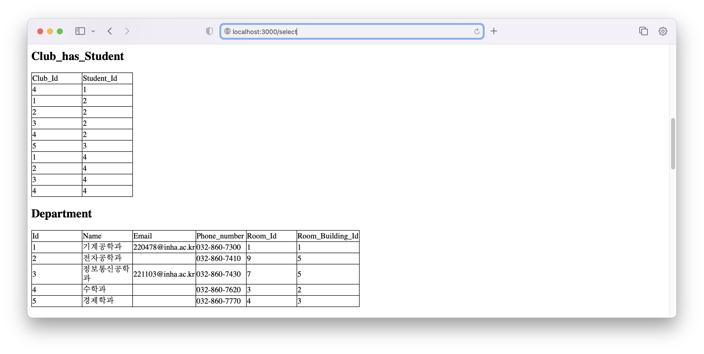 
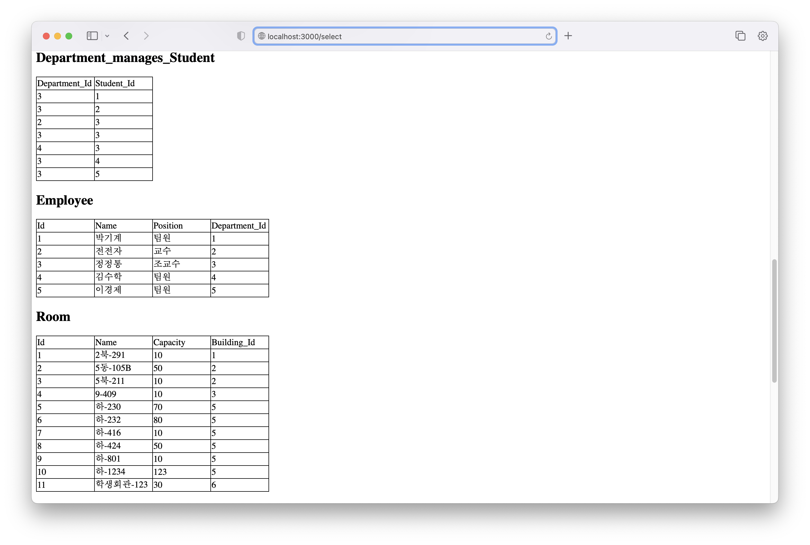 
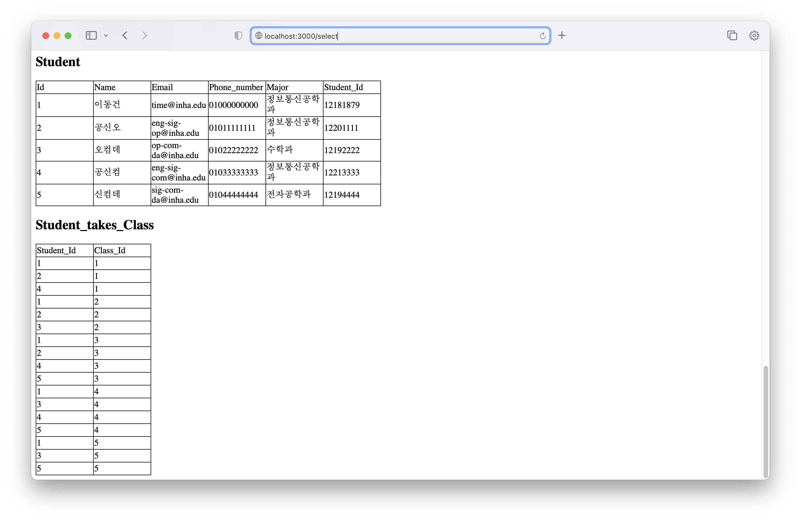 

#### (2) Insert 페이지 구현

Insert 기능을 하는 홈 페이지 `localhost:3000/`로 이동하여 Employee 테이블에 아래와 같이 데이터를 삽입하였다.

삽입 버튼을 눌러 Insert한 후의 결과는 다음과 같다.

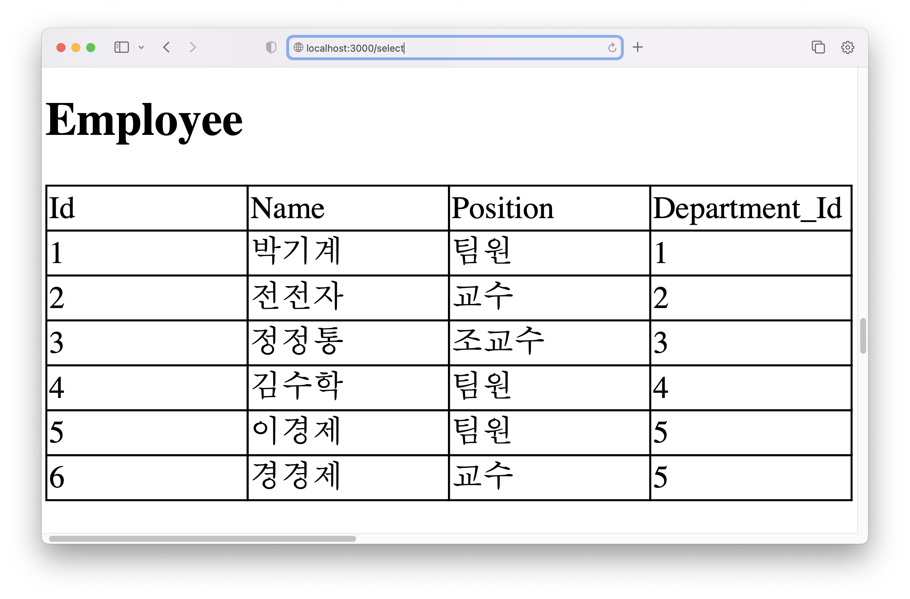

#### (3) Update 페이지 구현

Update 기능을 하는 홈 페이지 `localhost:3000/update/student`로 이동하여 Student 테이블의 일부 데이터를 수정하였다.

Id가 4이고, 이름이 '공신컴'인 학생의 Phone_number를 '01033333333'에서 '01012343333'으로 수정하였다.

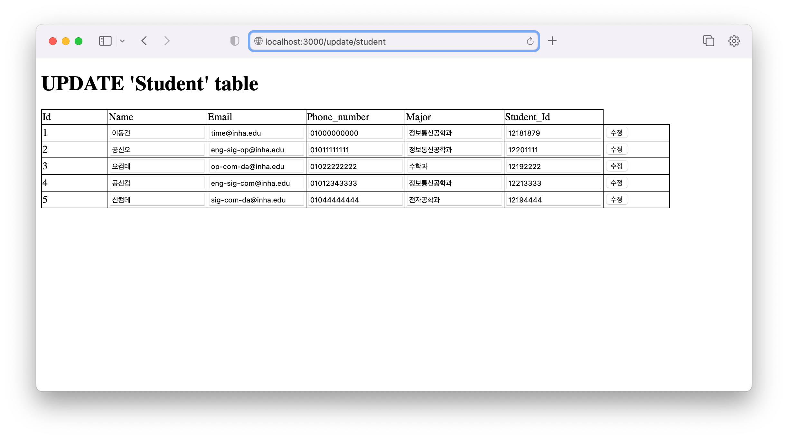

수정 버튼을 누르고나서, 정상적으로 수정된 것을 확인할 수 있다.

### STEP 2 : 임의로 학생을 10만명 만들어서 index 미적용/적용 결과 제시

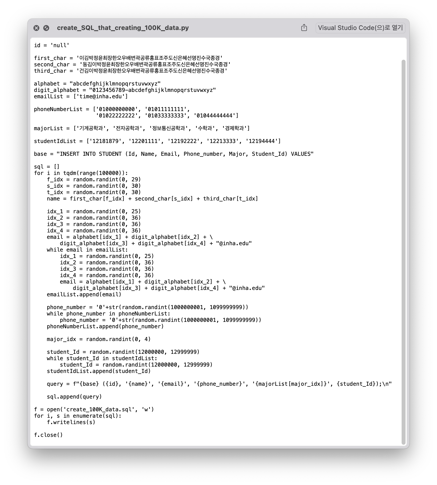

위와 같은 python 코드로 Student 테이블에 임의의 데이터를 10만 건을 Insert하는 SQL문을 작성하였다.

특정 수업을 듣는 학생을 검색하는 조건으로 query를 `SELECT COUNT(*) FROM Student AS S, Student_takes_Class AS C WHERE S.Id=C.Student_Id and C.Class_Id="3";`로 작성했다.

인덱스를 사용하기 전, 실행 결과는 다음과 같다. 

인덱스를 `CREATE INDEX Student_on_Id_and_Name_StudentId on Student (Id, Name, Student_Id) USING BTREE;` 코드로 사용 후, 실행 결과는 다음과 같다. 
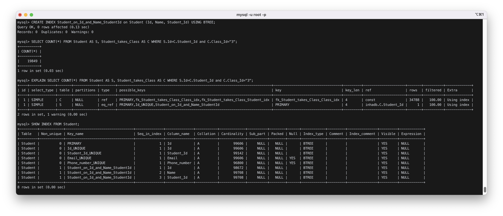

## 4. 결론

본 설계에서는 JavaScript 기반 Express 프레임워크를 사용하여, 설계한 InhaDB의 데이터를 웹 상에서 Select, Update 및 Insert하는 기능을 구현하였다. 기능 별로 라우터를 구분하여 구성하였으며, routes 폴더 내부의 `.js` 파일과 `.hbs` 파일을 연동시켜, 웹 페이지에 기능을 구현하였다.

이외에도 MySQL 데이터베이스에서 인덱스를 사용하여 약 십만 건의 데이터를 검색한 결과를 제시하였다. `CREATE INDEX Student_on_Id_and_Name_StudentId on Student (Id, Name, Student_Id) USING BTREE;` 코드로 Id, Name, Student_ID를 기준으로 하는 인덱스를 생성하였다. 또한, 특정 수업을 듣는 학생을 검색하는 조건으로 query를 `SELECT COUNT(*) FROM Student AS S, Student_takes_Class AS C WHERE S.Id=C.Student_Id and C.Class_Id="3";`로 작성하였다. 인덱스를 사용하기 전과 후에 해당 쿼리를 실행했을 때의 소요 시간은 모두 0.03sec임을 확인할 수 있었다.

인덱스를 사용한 후 query를 실행하였을 때 소요 시간이 더 짧을 것으로 기대하였지만 동일한 결과가 나온 이유로는, 데이터 십만 건이 컴퓨터의 성능에 비해 유의미하게 큰 데이터가 아니라서 큰 차이를 확인할 수 없었던 것으로 예상된다.
