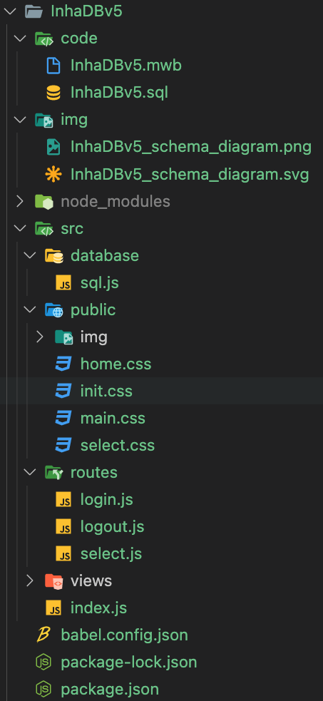
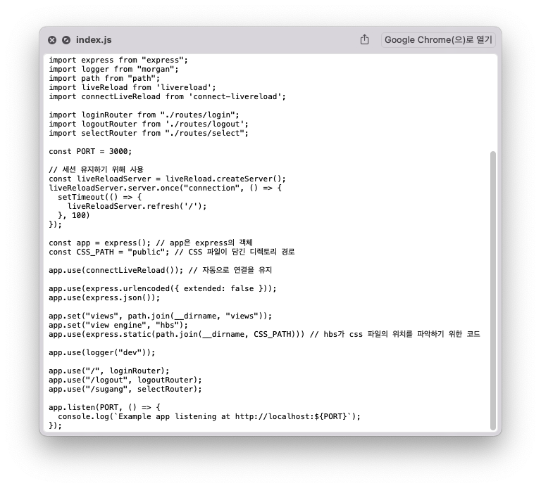
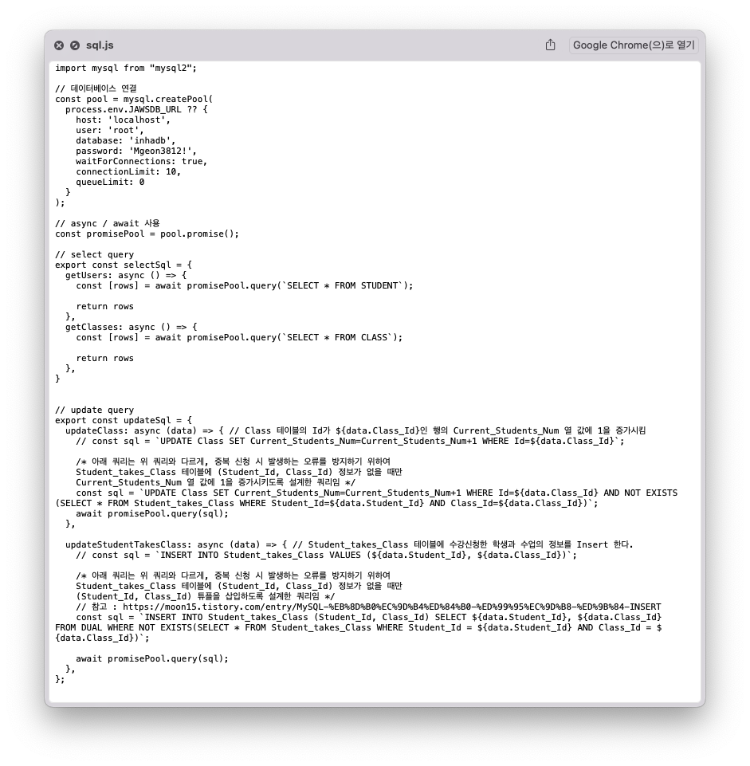
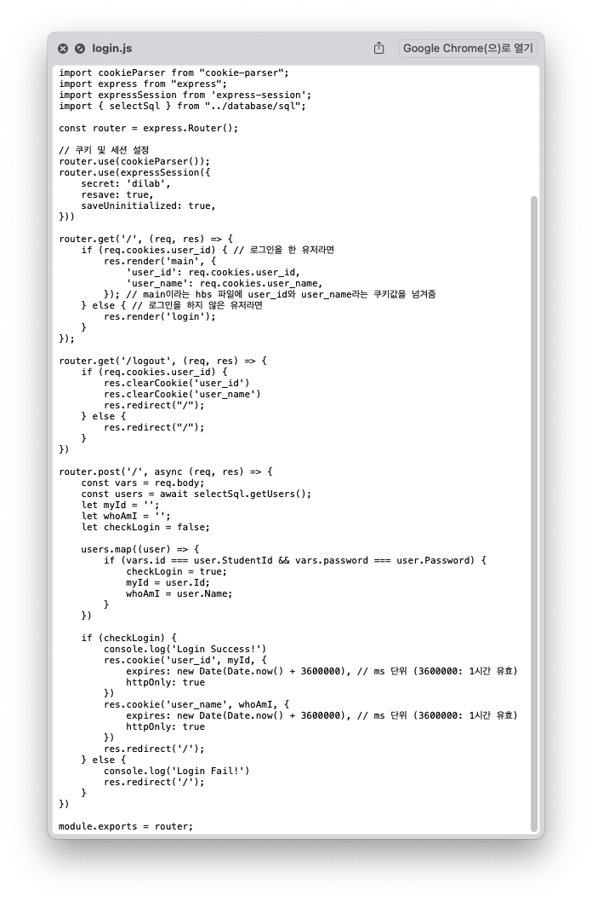
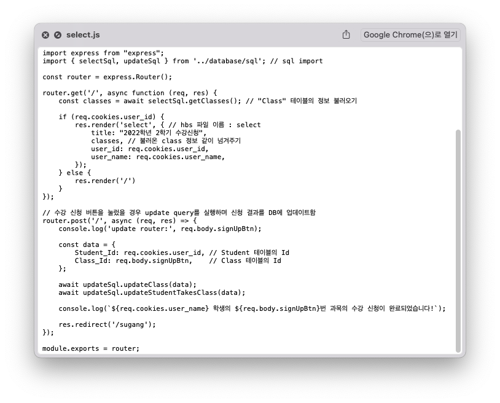
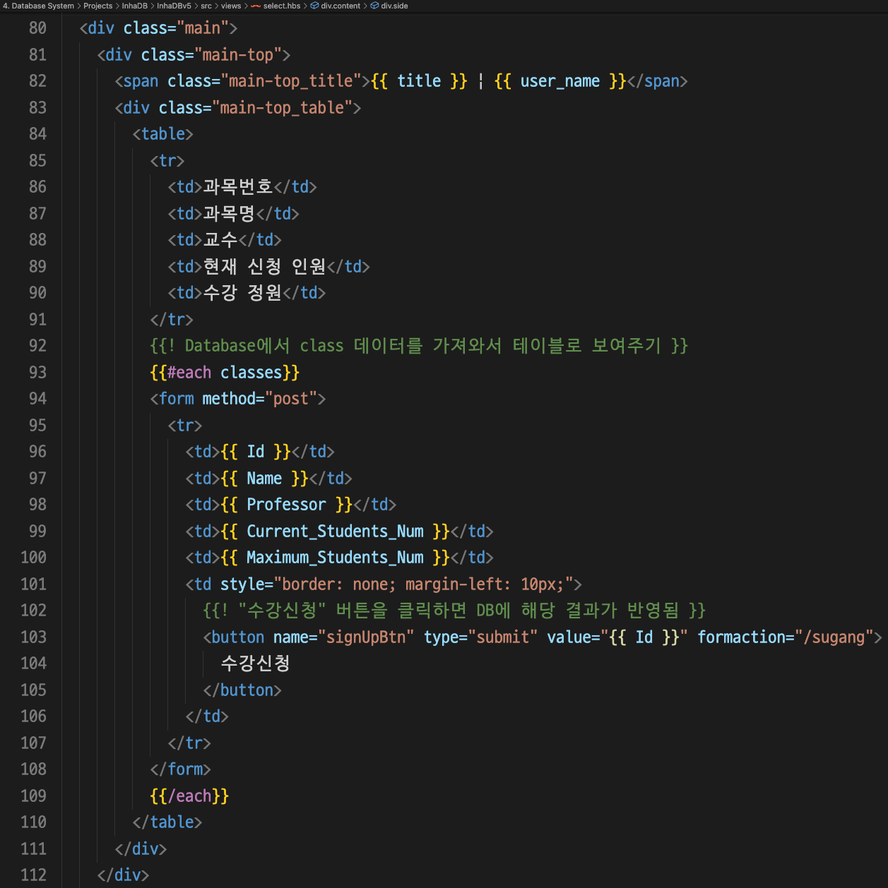
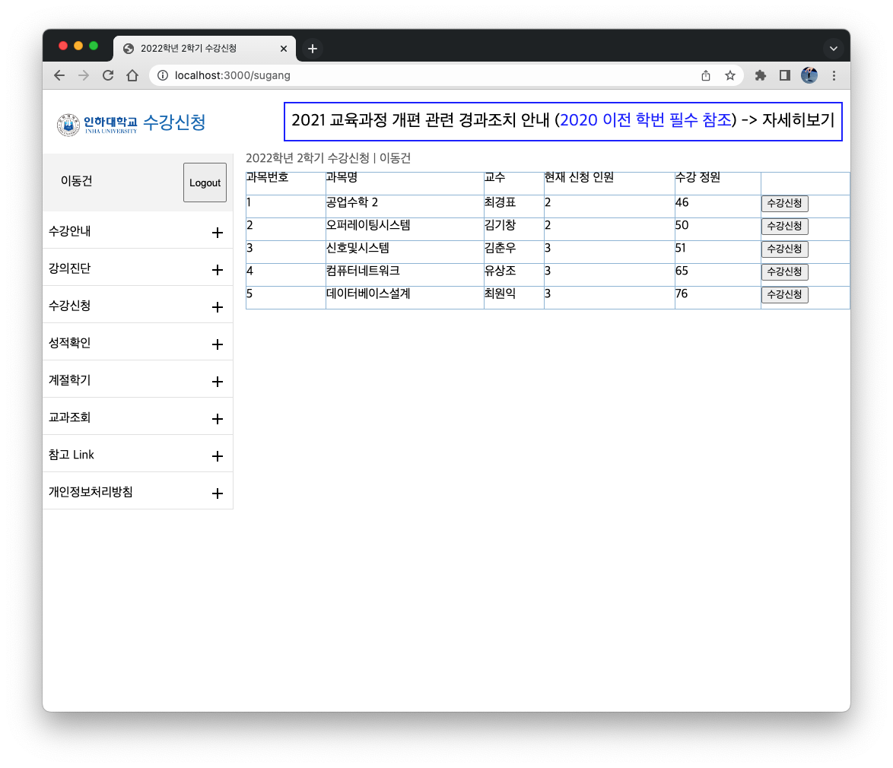
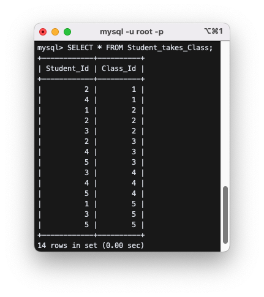
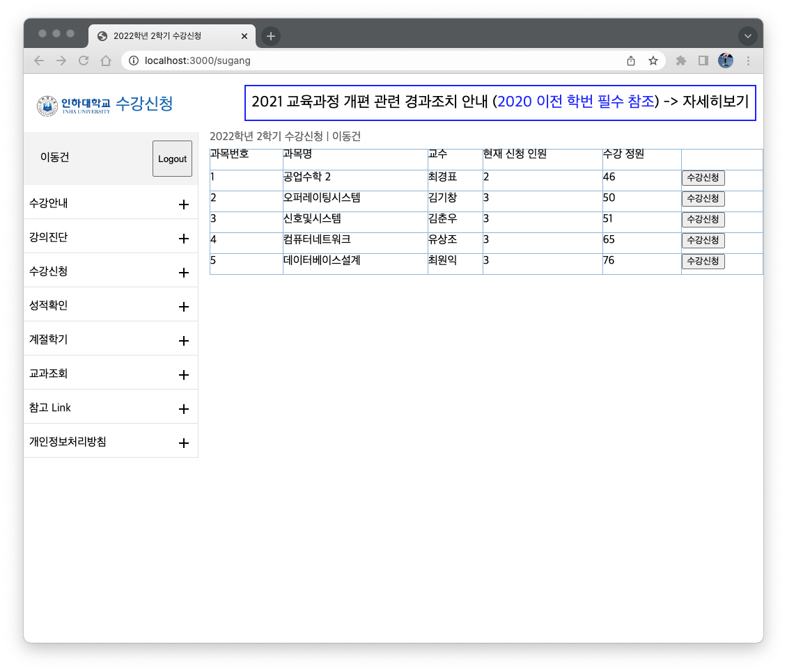

# Inha 데이터베이스 설계 v5

## 1. 개요

### 인하대학교 수강신청 페이지를 Shallow Copy한 웹에서 학생 아이디로 로그인 했을 경우에 Class 테이블에 입력된 값 조회 및 수강신청 가능한 table이 만들어져야 함

- Table의 크기(행x열)는 Class 테이블의 모든 필드를 포함하도록 만들 것
- Table의 마지막 열에는 “수강신청” 버튼을 추가
- 버튼을 눌렀을 경우 DB에 학생이 수강신청한 내용이 반영되도록 업데이트 할 것

## 2. 상세 설계 내용

기존 InhaDB의 Student 테이블에 Password라는 열을 추가해주었고, Class 테이블에는 현재 수강중인 인원을 의미하는 Current_Students_Num 열과, 수업의 최대 수강가능한 인원을 의미하는 Maximum_Students_Num 열을 추가해주었다.

새롭게 설계한 InhaDB의 Schema Diagram은 아래와 같다. 

또한, 웹 상에서 로그인 기능과 수강신청 기능을 구현하기 위해 다음과 같이 라우터를 구상하였다.

- `localhost:3000/`
  - `/` : 메인 페이지
  - `/sugang` : 수강신청 기능이 구현된 페이지로, 로그인이 완료된 상태에서만 이동 가능하다.
  - `/logout` : 로그인이 되어 있는 상태에서 로그아웃을 하고, 메인 페이지인 `/`으로 리다이렉트 된다.

프로젝트 폴더에서 아래 사진과 같이 폴더 및 파일들을 생성하여 전체적인 프로젝트 구조를 구성하였다. 

`src/index.js` 파일에서는 서버 실행 코드를 작성하고, 구상한 라우터를 바탕으로 필요한 라우터들을 선언하였다. 또한, 새로고침이나 페이지 간의 이동에 로그아웃되지 않도록 세션을 유지하는 코드를 작성하였다. 아래는 `src/index.js` 코드이다.  

`src/database/sql.js` 파일에서는 로그인에 필요한 학생 정보와 수강신청 가능한 수업의 정보를 불러오는 질의문을 작성하였다. 또한, 수강신청 시에 수업의 현재 수강인원을 1만큼 증가시키는 질의문과 Student_takes_Class 테이블에 정보를 삽입하는 질의문을 작성하였다.

메인 페이지인 `localhost:3000/`에서 사용자가 입력한 아이디, 비밀번호가 Student 테이블의 Id, Password와 일치하는지 확인하기 위한 용도로 `getUsers`를 사용하였다.

수강신청 페이지인 `localhost:3000/sugang`에서 신청 가능한 과목 정보를 불러오기 위해 `getClasses`를 사용하였다. 그리고 해당 페이지에서 사용자가 '수강신청' 버튼을 눌렀을 때, 신청 정보를 데이터베이스에 반영하기 위하여 `updateClass`, `updateStudentTakesClass`를 사용하였다.

`updateClass`에서 단순히 `UPDATE Class SET Current_Students_Num=Current_Students_Num+1 WHERE Id=${data.Class_Id}`으로 질의문을 설계한다면, 학생이 이미 해당 과목을 신청 했음에도 불구하고, 중복으로 신청되어 Class 테이블의 `Current_Students_Num` 값이 증가하게 된다. 이러한 문제를 방지하기 위해 NOT EXISTS 문을 사용하여 사용자의 Id, 그리고 신청과목의 Id (Student_Id, Class_Id) 정보가 Student_takes_Class 테이블에 없을 때만 Current_Students_Num 값에 1을 증가시키도록 설계하였다. 해당 쿼리는 `UPDATE Class SET Current_Students_Num=Current_Students_Num+1 WHERE Id=${data.Class_Id} AND NOT EXISTS (SELECT * FROM Student_takes_Class WHERE Student_Id=${data.Student_Id} AND Class_Id=${data.Class_Id})`이다.

`updateStudentTakesClass`에도 `updateClass`와 비슷한 문제가 발생한다. `INSERT INTO Student_takes_Class VALUES (${data.Student_Id}, ${data.Class_Id})`으로 단순하게 쿼리를 설계하고, 사용자가 중복으로 신청한다면 Duplicate entry 에러가 발생한다. 이 문제의 해결을 위해 Student_takes_Class 테이블에 `(${data.Student_Id}, ${data.Class_Id})` 쌍의 정보가 없을 때만 해당 레코드를 삽입하도록 설계하였다. 해당 쿼리는 `INSERT INTO Student_takes_Class (Student_Id, Class_Id) SELECT ${data.Student_Id}, ${data.Class_Id} FROM DUAL WHERE NOT EXISTS(SELECT * FROM Student_takes_Class WHERE Student_Id = ${data.Student_Id} AND Class_Id = ${data.Class_Id})`이다.

`src/database/sql.js`의 전체 코드는 아래와 같다.

`src/database/sql.js` : 

수강신청 페이지의 구현을 위해, `src/routes` 폴더 내에 `login.js`, `logout.js`, `select.js` 파일을 구성하였다.

`src/routes/login.js` 파일은 메인 페이지(`localhost:3000/`)의 로그인 기능을 구현한 파일로 `src/views/main.hbs`, `src/views/login.hbs` 파일과 연동하였으며, 로그인을 하지 않은 기본 상태에서는 로그인 폼이 있는 `src/views/login.hbs`과 연동된다.

아이디와 비밀번호는 Class 테이블의 StudentId와 Password 속성으로 로그인 가능하도록 하였다. `src/routes/login.js` 파일에서는 쿠키 및 세션을 설정하는 코드를 사용하였는데, 로그인에 성공하면 사용자의 아이디(StudentId)를 의미하는 "user_id"와 사용자의 이름(Name)을 의미하는 "user_name"이라는 쿠키를 저장하였다. 실제 로그인하였을 때의 쿠키값을 확인한 사진은 "3. 실행 화면" 섹션에서 확인할 수 있다.

만약 쿠키값이 저장되어 있다면, 로그인에 성공한 것이므로 `src/views/main.hbs`과 연동하여 메인 페이지를 제공한다. 저장되어 있지 않다면, 로그인이 되어있지 않은 상태이거나 로그인에 실패한 경우이므로 `src/views/login.hbs`와 연동한다.

`src/routes/login.js` 코드는 아래와 같다.

`src/routes/login.js` :  

`src/routes/logout.js` 파일은 메인 페이지에서 로그인 후 로그아웃 기능을 구현한 파일이다. 로그인 이후의 메인 페이지를 나타내는 `src/views/login.hbs` 파일과 연동되었으며, "Logout" 버튼을 누르면 "user_id" 쿠키와 "user_name" 쿠키를 초기화하면서 로그인이 풀리게 된다. 다만, 로그인을 하지 않은 상태 즉, 쿠키가 존재하지 않을 경우에서 `localhost:3000/logout` 페이지로 들어온 경우에는 로그아웃을 거부하고, 메인 페이지로 돌려보낸다.

`src/routes/logout.js` 코드는 아래와 같다.

`src/routes/logout.js` :  

`src/routes/select.js` 파일은 수강신청 기능을 구현한 파일로, `src/database/sql.js`의 `getClasses`를 불러와 `src/views/select.hbs`와 연동하여 통해 수강 가능한 과목의 기본 정보 표시한다. 테이블의 마지막 열에는 "수강신청" 버튼이 있는데, 이 버튼을 누르면, 사용자가 신청한 과목의 정보를 데이터베이스에 업데이트한다. 이 과정에는 `src/database/sql.js`에서 불러온 `updateClass`와 `updateStudentTakesClass`가 사용된다.

아래 사진은 `src/routes/select.js` 코드와 `src/views/select.hbs` 중 Class 테이블을 나타낸 부분의 코드이다.

`src/routes/select.js` :  

`src/views/select.hbs` :  

## 3. 실행 화면

`npm run start` 명령어를 통해 서버를 실행시키고, 메인 페이지인 `localhost:3000/`에 접속하면 아래와 같은 화면을 확인할 수 있다. 

좌측 상단에 있는 로그인 폼에 아이디/비밀번호인 "12181879"/"0000"을 입력하면 성공적으로 로그인이 되며, 로그인 폼이 있던 자리에 사용자의 이름과 "Logout" 버튼을 확인할 수 있다. 

아래 사진은 Id가 1, Name이 '이동건', StudentId가 12181879인 계정으로 로그인했을 때 확인한 쿠키의 정보이다. 

수강신청 페이지인 `localhost:3000/sugang`에 접속하면 수강 가능한 과목들의 정보들을 확인할 수 있다. 

아래 사진은 현재 시점에서 InhaDB의 Student_takes_Class 테이블을 SELECT하여 값을 확인한 것이다. 
 
이를 통해 학생-과목 간의 관계을 바탕으로 현재 신청 인원(Current_Students_Num)이 올바르게 나타내져 있는 것을 확인할 수 있다. 또한, Id가 1이고, Name이 '이동건'인 사용자가 수강중인 과목은 5번 과목인 "데이터베이스설계" 과목 밖에 없다는 것 역시 확인 가능하다.

아래는 2번 과목인 "오퍼레이팅시스템" 과목을 수강 신청한 후, Student_takes_Class 테이블의 조회 결과와 웹페이지의 변화를 보인 것이다. 
 
(Student_Id, Class_Id)가 (1, 2)인 레코드가 새로 추가된 것을 확인할 수 있다.
 
2번 과목인 "오퍼레이팅시스템" 과목의 현재 신청 인원이 2명에서 3명으로 1 증가된 것을 확인할 수 있다.

다음으로, 기존에 수강중이었던 5번 과목("데이터베이스설계")를 중복하여 신청하려고 시도하였다. 
 
 
중복하여 수강신청했음에도 불구하고, 에러가 없이 Student_takes_Class 테이블의 조회 결과와 웹페이지에 변화가 없음을 확인할 수 있다.

수강신청이 완료된 후에 로그아웃하는 상황을 가정하고, 좌측 상단 "Logout" 버튼을 누르면 아래와 같이 로그인이 풀린 상태의 메인 페이지로 이동하게 된다. 

## 4. 결론

본 설계에서는 기존에 설계한 InhaDB를 변형하고, 데이터베이스의 데이터를 JavaScript 기반 Express 프레임워크를 사용하여 웹에 나타내었다. 이 웹에는 로그인 기능과 수강신청 기능이 포함되었다. 로그인, 로그아웃, 수강신청 등 3가지 기능으로 라우터를 구분하여 구성하였으며, src/routes 폴더 내부의 `.js` 파일과 src/views 폴더 내부의 `.hbs` 파일을 연동시켜, 웹 페이지에 기능을 구현하였다. 또한, 쿠키를 관리하는 코드로 "user_id"와 "user_name"이라는 쿠키를 사용하였다.

메인 홈페이지인 `localhost:3000/`에 로그인이 되어있지 않은 채로 접속하면, 좌측 상단에 로그인 폼에서 로그인이 가능하다. 로그인 기능은 `src/routes/login.js` 내에서 `getUsers`의 쿼리를 불러온 후, 입력한 아이디/비밀번호를 데이터베이스의 아이디/비밀번호와 비교하는 방식으로 구현하였다.

사용자가 웹에 로그인하면 이름을 확인할 수 있으며, 수강신청 페이지인 `localhost:3000/sugang`으로 이동하면 `getClasses`의 쿼리를 통해 수강 가능한 과목과 "수강신청" 버튼을 확인할 수 있다. "수강신청" 버튼을 클릭했을 때는 `updateSql` 속 `updateClass`의 쿼리와 `updateStudentTakesClass` 쿼리가 실행되며, 학생의 수강 정보가 중복 신청 여부와 관계 없이 데이터베이스에 문제 없이 반영되는 것을 확인하였다.

"Logout" 버튼을 클릭하면 쿠키가 삭제되면서 로그인이 풀리고, 메인 페이지로 돌아가게 된다.

위와 같이 구현한 페이지에서, 로그아웃 할 때나 잘못된 로그인 정보를 입력했을 때, 수강신청의 성공/실패 여부 등을 사용자에게 알려주기 위해, javascript의 `alert` 함수로 브라우저 내 알림창을 띄우려고 시도하였다. 그러나 `alert` 함수는 Web의 내장함수이므로, 서버 사이드에서는 사용할 수 없기 때문에 에러가 발생하여 구현하지 못한 것은 한계점으로 볼 수 있다.
