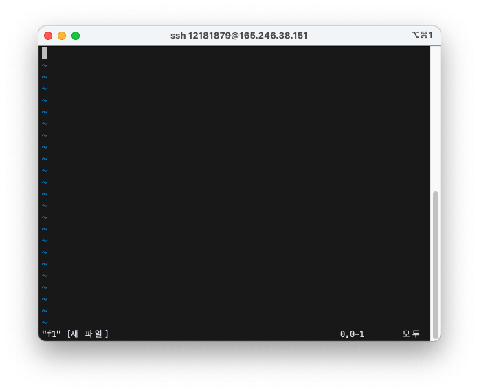
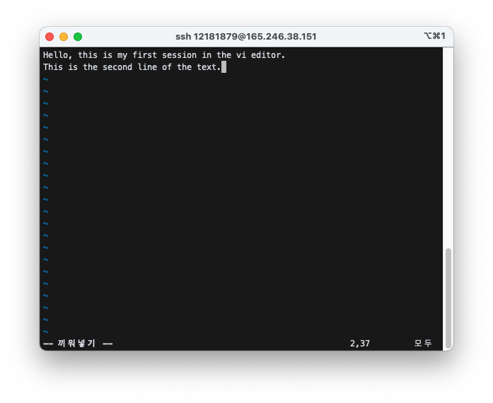
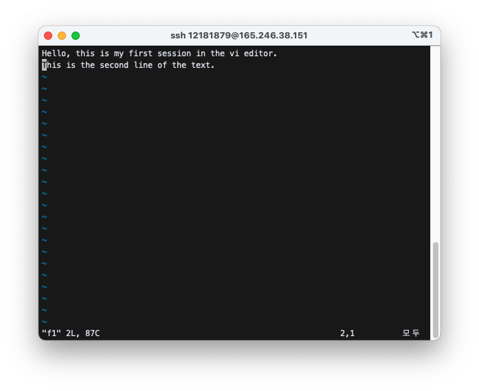
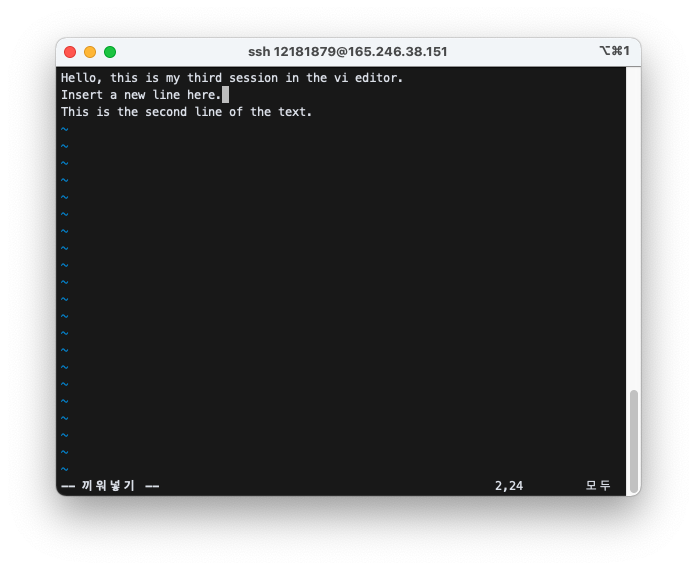
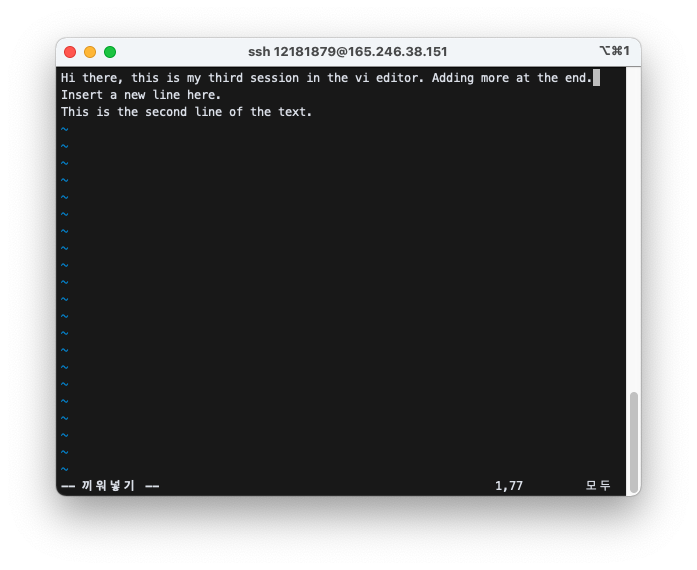
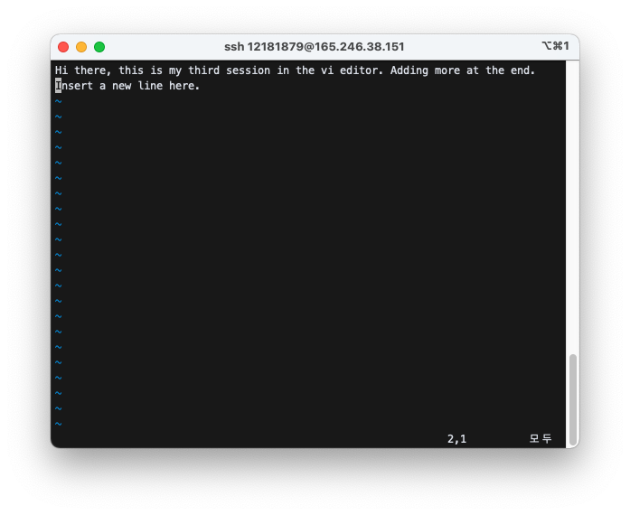
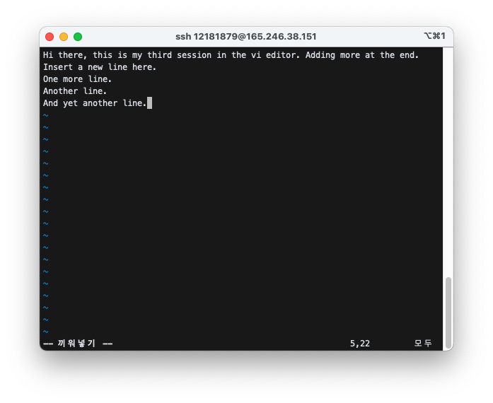
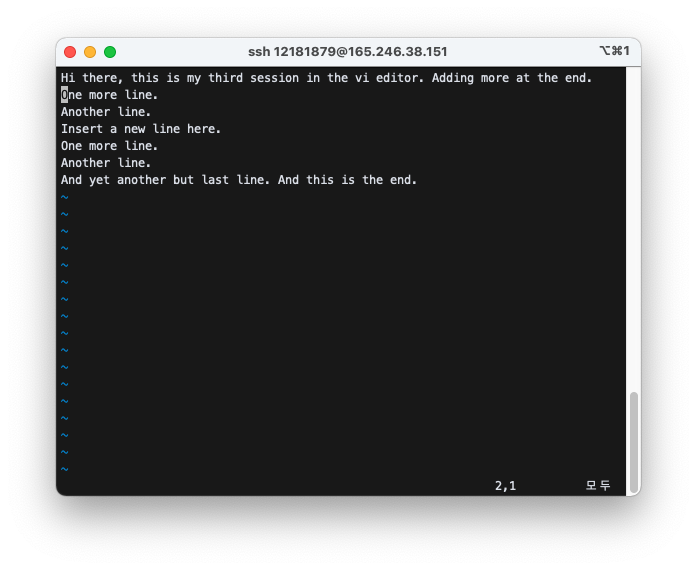
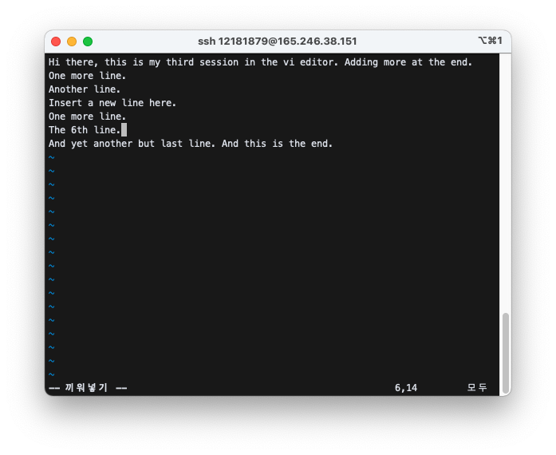
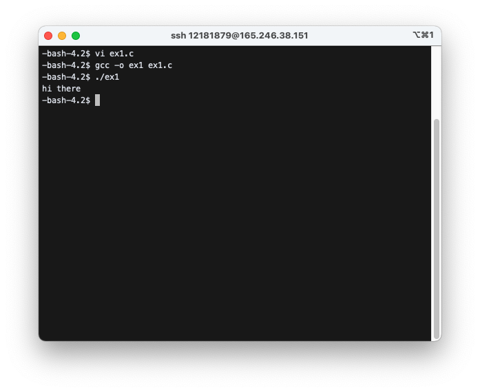

# Using `vi`
## VI

`vi x.c` : edit file "x.c"

### 1) mode

- `vi`는 3가지의 모드가 있다.
  - command mode
    - 커서 이동 (cursor moving), 삭제 (deleting), 복사 (copying)
  - input mode
    - 삽입 (insertion)
  - status-line mode
    - other tasks

### 2) In the beginning we are at command mode.

처음 `vi`를 실행하면 command mode로 진행된다.

### command mode:

- 커서 이동 (cursor moving) : `j`(down), `k`(up), `h`(left), `l`(right)
- 삭제 (deletion) : `x`(delete one character), `dd`(delete a line)
- copy and paste:
  - `3yy` : 현재 줄부터 시작해서 "3"줄을 복사한다. (Copy 3 lines starting from the current line.)
  - `p` : paste them after the current line recover
  - `u` : recover what you have just deleted

#### command mode -> insertion mode : `i`, `a`, `o`

- `i`: 현재 커서 앞에 (before) 삽입 
- `a`: 현재 커서 뒤에 (after) 삽입 
- `o`: 새로운 줄 (new line) 삽입

#### command mode -> status-line mode: `/` or `:`

### insertion mode
now you can type

#### insertion mode -> command mode: `ESC key`


### status-line mode:

- `:q!` : 저장하지 않고 나가기 (quit without saving)
- `:w` : 쓰기 (write)
- `:wq` : 저장하고 나가기 (save and exit)
- `/pat` : "pat"이라는 패턴 찾기 (search the pattern in "pat")
- `:set number` : 줄번호 나타내기 (display line numbers)
- `:40` : "40"번 줄로 이동하기 (go to line "40")

## Excersise

### 1) Make a file with `vi`.

`vi f1`



(when you open a file with `vi`, sometimes you see Open, Edit, ... etc. at the bottom of the screen, in that case just type "e" in order to start editing)

### 2) Start insertion with `i` key and type following.

> Hello, this is my first session in the vi editor.

> This is the second line of text.



### 3) Return to command mode with `esc` key which is located at the top left position of your keyboard. Save and exit with `:wq`

`esc`
`:wq`


### 4) Reopen the file

`vi f1`



### 5) Use `j`, `k`, `h`, `l` to move the cursor around. Move the cursor to the word “first”. Use `x` key to delete the word “first”. The result should be as follows.

> Hello, this is my session in the vi editor.

> This is the second line of text.


### 6) Insert “third” as follows.


### 7) Add a new line as follows. Use `o` key.

> Hello, this is my third session in the vi editor.

> Insert a new line here.

> This is the second line of text.



### 8) Change the beginning as follows. Use `x` and `i` key.

> Hi there, this is my third session in the vi editor.

> Insert a new line here.

> This is the second line of text.


### 9) Add more at the end. Use `a` key.

> Hi there, this is my third session in the vi editor. Adding more at the end.

> Insert a new line here.

> This is the second line of text.



### 10) Delete the last line. Use `dd`.

> Hi there, this is my third session in the vi editor. Adding more at the end.

> Insert a new line here.



### 11) Add few more lines. Use `o`.

> Hi there, this is my third session in the vi editor. Adding more at the end.

> Insert a new line here.

> One more line.

> Another line.

> And yet another line.



### 12) Change the last line.

> Hi there, this is my third session in the vi editor. Adding more at the end.

> Insert a new line here.

> One more line.

> Another line.

> And yet another but last line. And this is the end.


### 13) Copy and paste as follows. Use `2yy` to copy two lines at the current cursor; move the cursor to another location and use `p` to paste them at that location.

> Hi there, this is my third session in the vi editor. Adding more at the end.

> One more line.

> Another line.

> Insert a new line here.

> One more line.

> Another line.

> And yet another but last line. And this is the end.



### 14) Go to line 6 with `:6` and make change as follows.

> Hi there, this is my third session in the vi editor. Adding more at the end.

> One more line.

> Another line.

> Insert a new line here.

> One more line.

> The 6th line.

> And yet another but last line. And this is the end.



### 15) Write a simple c program and compile and run.

Write a program:

`$ vi ex1.c`

```c
#include <stdio.h>
void main(){
   printf("hi there\n");
}
```


Compile:
`$ gcc –o ex1 ex1.c`

Run:

`$ ./ex1`

`hi there`


