# 5. Review on String

- string definition, char constant, string constant, int vs string,
- string functions: strlen, strcpy, strcmp, strtok, sprintf, atoi
- string header file: string.h

## 1. basics

- 1. A string is a character array ending with 0. Remember there is a hidden 0 at the end of a string. Thus "hello" occupies 6 bytes not 5 bytes.

- 2. char constant is replaced by the corresponding ascii number during compile time.<br>
     `x = 'a';`<br>
     The compiler changes above to<br>
     `x = 97;` // 97 is the ascii number of 'a'

- 3. string constant is replaced by the address where it is stored. (All string constant used in a program are stored in "string area" in the memory by the compiler.)<br>
     `char * x= "hello";`<br>
     The compiler changes above to (if "hello" is stored at 0x400640)<br>
     `char * x = 0x400640; `

- 4. Use `strcpy` to copy or store a string, `strlen` to compute string length, `strcmp` to compare two strings, and `strtok` to extract words from a sentence.

- 5. Understand the difference below:<br>

  - a) `char x[10];` // x is 10 bytes where we can store char's<br>
    `strcpy(x, "hello");` // we store 6 bytes ('h','e','l','l','o',0) into x array
  - b) `char *y;` // y is 4 bytes where we can store an address<br>
    y = "hello"; // we store address 0x400640 in x (assuming this is the address of "hello")
  - In a), we have two copies of "hello", one in string area and the other in x.
  - In b) we have only one copy of "hello" (in the string area of the memory).

- 6. Use `malloc` (in C) or `new` (in C++) to allocate space to a string pointer. Remember you can't store data in pointer variable until you allocate memory space.<br>
     `char *x;`<br>
     `strcpy(x, "hello");` // this is an error. we need data space to copy "hello", but x has no space for data. x has space only for address.<br>
     <br>
     `x=(char *)malloc(10);` // allocate space first and store the address of it in x
     `strcpy(x, "hello");` // and then store data. "hello" is stored in the location pointed by x

## 2. A string is a character array ending with 0.

```c
char a[5];
for(i=0;i<5;i++){
   a[i]='q';
}
```

In above, "a" is not a string. It is a regular character array with 5 rooms all filled with 'q'.
<br>

```c
char b[5];
for(i=0;i<3;i++){
   b[i]='q';
}
b[3]=0;
```

In above, "b" is a string with length 3 (three characters in this string).

A string can be displayed with `printf`.

`printf("%s", b);`

`%s` means "b" is an address of a string, go to that address, and print all characters starting at that address until a zero is seen.

A regular character array needs a loop to display.

```c
for(i=0;i<5;i++)
   printf("%c",a[i]);
```

If we use `printf("%s", a);` the computer will think "a" is an address of a string, go to that address and print all characters starting at that address until a zero is seen. If we don't have a zero in the memory after "a", the computer will never stop.

## 3. int, char, string: define, store data, read data, print, compare

### 1) int, char, string

```c
int  x;            // x is a room for an integer
x = 10;           // we can store an integer in x
scanf("%d", &x);  // or we can read an integer into x
printf("%d", x);   // print an integer
if (x==10){       // check the value of x
   ......
}

char y;          // y is a room for a character
y = ‘t';          // we can store a character in y
scanf("%c", &y); // or we can read a character into y
printf("%c", y);  // print a character
if (y=='t'){      // check the value of y
   ......
}

char z[50];         // z is a 50-room space for a string
strcpy(z, "korea");  // we have to use strcpy() to store a string in z
scanf("%s", z);      // or we can read a string into z
printf("%s", z);      // print a string
int k;
k=strcmp(z, "korea");  // if equal, strcmp returns 0; otherwise strcmp returns non-zero
if (k==0){             // check the value of z
   ........
}
```

A string is actually a character array ending with zero.

```c
for(i=0;;i++){
   printf("%d-th:char %c ascii %d\n", i, z[i], z[i]);
   if (z[i]==0){
      break;
   }
}
```

We can print the length of a string using `strlen()`.

```c
printf("the length of this string is %d\n", strlen(z));
```

## 4. strtok

`strtok` can split a sentence into a list of words.

`strtok(buf, " ");` will find the first word in buf and insert 0 after it.

`strtok(NULL, " ");` will find the next word in buf and insert 0 after it.

```c
char buf[50];
strcpy(buf, "ab c def gh"); //buf contains (a, b, space, c, space, d, e, f, space, g, h, 0)
char *temp;
temp=strtok(buf, " ");  // buf is now (a, b, 0, c, space, d, e, f, space, g, h, 0)
                      // and temp has the address of buf[0].
temp=strtok(NULL, " "); // buf is now (a, b, 0, c, 0, d, e, f, space, g, h, 0)
                       // temp has the address of buf[3]
temp=strtok(NULL, " "); // buf is now (a, b, 0, c, 0, d, e, f, 0, g, h, 0)
                        // temp has the address of buf[5]

example code:
char buf[256];
char *token;
printf("enter a sentence\n");
fgets(buf, 255, stdin);   // read a line (maximum size 255)
buf[strlen(buf)-1]=0;    // remove enter key
token = strtok(buf, " "); // get the first token
for(;;){
   printf("%s\n", token);
   token = strtok(NULL, " "); // get the next token
   if (token==NULL) break;
}
```

## 5. char pointer array

```c
char * x[10];
x[0]="hi"; // store address of "hi" in x[0]
strcpy(x[1],"bye"); // this is an error
x[1]=(char *)malloc(10); // allocate space first
strcpy(x[1], "bye");     // then store data
```

## 6. Practice

### 1) [A char constant is an ascii number. A string constant is an address where it is stored in the string area.] Explain the result for following code.

```c
#include <stdio.h>
#include <string.h>  // you need this header file for string functions
void main(){
   char x, y;
   x='a'; y=97;
   printf("%d %c %d %c\n", x, x, y, y);
   char * x1 = "hello";
   printf("%s %p %s %p\n", x1, x1, "hello", "hello"); // use %p for address
}
```


Result is

```
97 a 97 a
hello 0x10879ff97 hello 0x10879ff97
```

In the first line of result, since `%d` was used to print as decimal numbers, so `97` was output, and `%c` was to print as one character, so `a` was output.

In the second line, since `%s` was used to print as strings, so `hello` was output, and `%p` was to print as the address of pointer, so `0x10879ff97` was output.

### 2) [A char constant is an ascii number] Try following code and explain the result.

```c
char x[10];    // x is a character array with 10 rooms
x[0]='a'; x[1]='b'; x[2]='c'; x[3]='d'; x[4]='e';
x[5]='f'; x[6]='g'; x[7]='h'; x[8]='i'; x[9]='j';
int i;
for(i=0;i<10;i++){
   printf("%d %c \n", x[i], x[i]);  // print each character with its ascii number
}
```

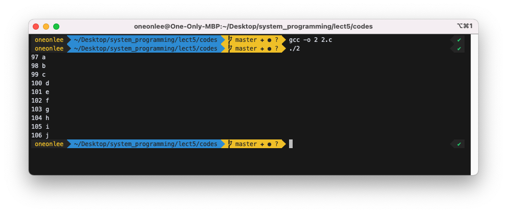

Result is

```
97 a
98 b
99 c
100 d
101 e
102 f
103 g
104 h
105 i
106 j
```

It means the ASCII number corresponding to each alphabet.

### 3) Try below. Compare the result with that of Problem 2).

```c
char x[10];    // x is a character array with 10 rooms
int i;
for(i=0;i<10;i++){
    x[i]=i+97;
}
for(i=0;i<10;i++){
    printf("%d %c \n", x[i], x[i]);  // print each character with its ascii number
}
```


Result is

```
97 a
98 b
99 c
100 d
101 e
102 f
103 g
104 h
105 i
106 j
```

Since the result is the same compared to Problem 2, it can be seen that each ASCII number (e.g., 97) and each alphabet (e.g., a) are exactly the same.

### 4) Declare a character array with 128 rooms. Store 0 to 127 in this array and print the corresponding character for each ascii code in the array. Find ASCII table in the Internet and confirm the results.

```c
   char x[128];
   for(int i=0;i<128;i++){
      x[i]=i;
   }
   for(int i=0;i<128;i++){
      printf("%d%c%d\n", x[i], x[i], x[i]);
   }
```

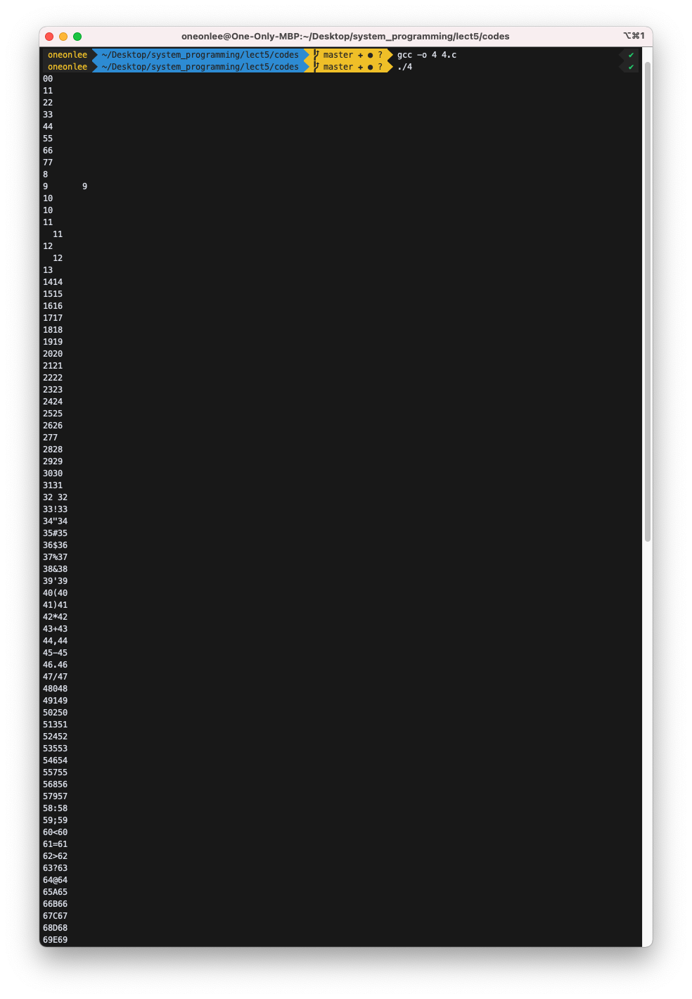
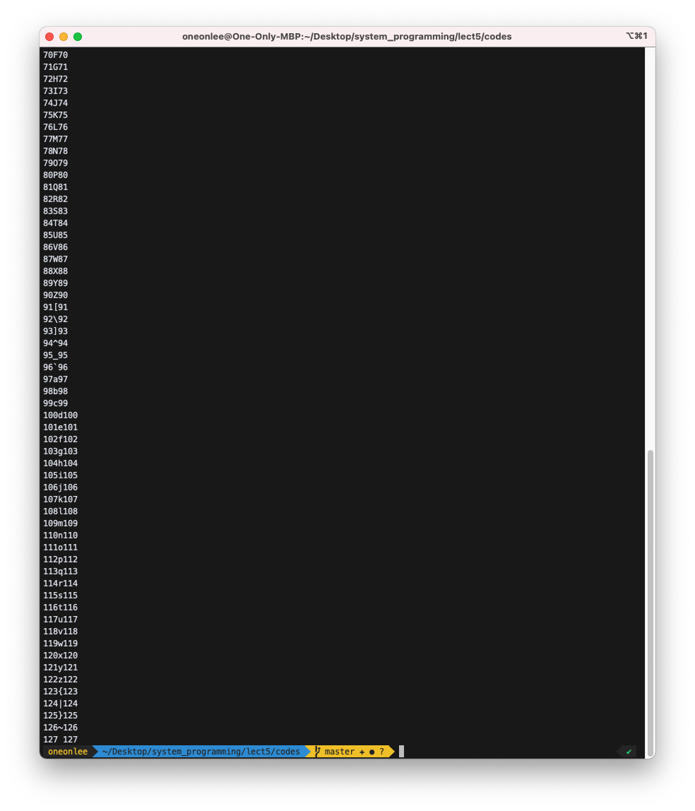
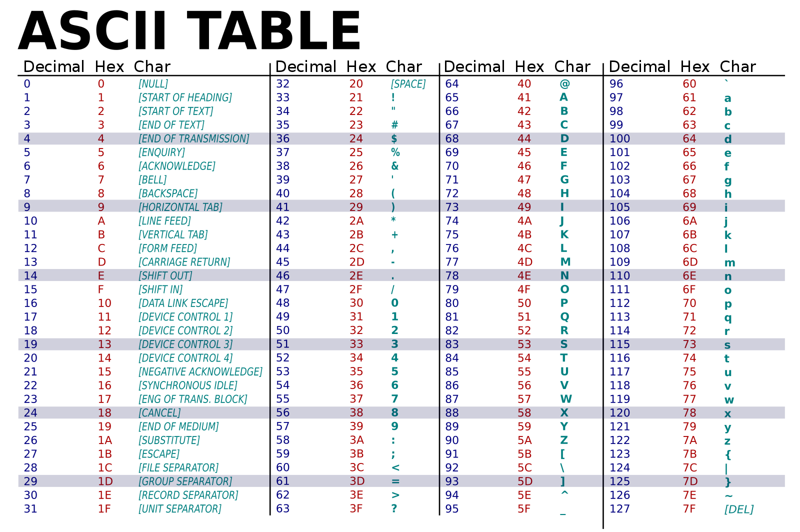

### 5. [`strlen`] Read a string and display its length.

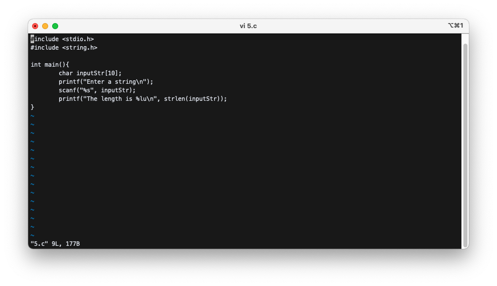

```
Enter a string
hello
The length is 5
```

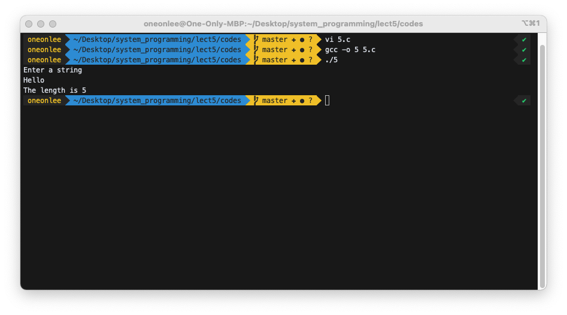

### 6. [A string is a char array ending with 0] Read a string and display each character in different lines.

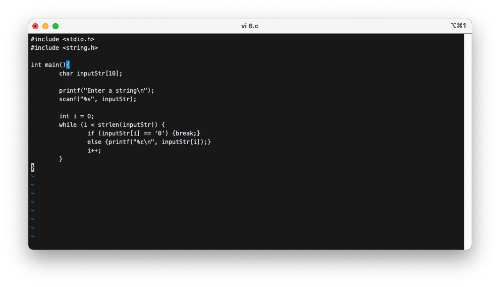

```
Enter a string
hello
h
e
l
l
o
```

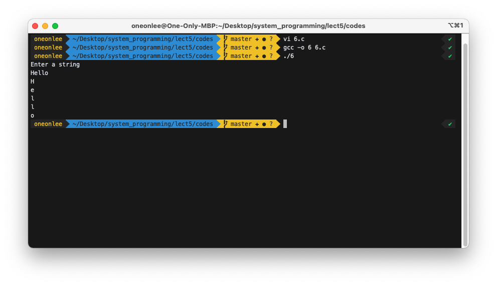

#### 6-1) [A string is a char array ending with 0] Try below and explain the result. Use g++ to compile.

```c
char x[10];
strcpy(x, "hello");
strcpy(x, "hi");
for(int i=0;i<10;i++){
   printf("%d ", x[i]);
}
```


- 출력값은 다음과 같다.
  - `104 105 0 108 111 0 -2 127 0 0`
- `char x[10];`를 통해 길이가 10인 x라는 배열을 선언하므로서 각각의 배열에는 의미가 없는 값인 쓰레기값이 들어가게 된다.
  - `-12 15 32 124 -14 129 -2 127 0 0`
- `strcpy(x, "hello");`를 통해 배열의 0번 index부터 5번 index까지 각각 "hello\0"에 해당하는 ASCII 코드 값인 `104 101 108 108 111 0`이 채워진다.
  - `104 101 108 108 111 0 -2 127 0 0`
- `strcpy(x, "hi");`를 통해 배열의 0번 index부터 2번 index까지 각각 "hi\0"에 해당하는 ASCII 코드 값인 `104 105 0`이 채워진다.
  - `104 105 0 108 111 0 -2 127 0 0`

### 7. [`strlen`, `strcmp`] Write a program that keeps reading a string, displaying its length, and checking whether it is "hello". If the input string is "hello", the program stops.


```
Enter a string
hi
You entered hi. length=2

No it is not hello
Enter a string
hello
You entered hello. length=5
Yes it is hello. Bye.
```

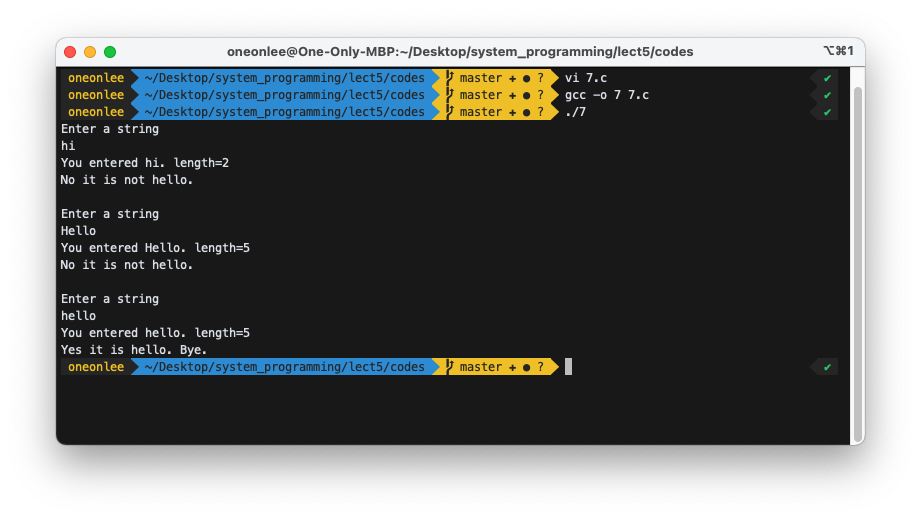

### 8. [`strcpy`] Read a string and copy it to three other string variables and change the first letter of them to 'a', 'b', and 'c', respectively, and display them.

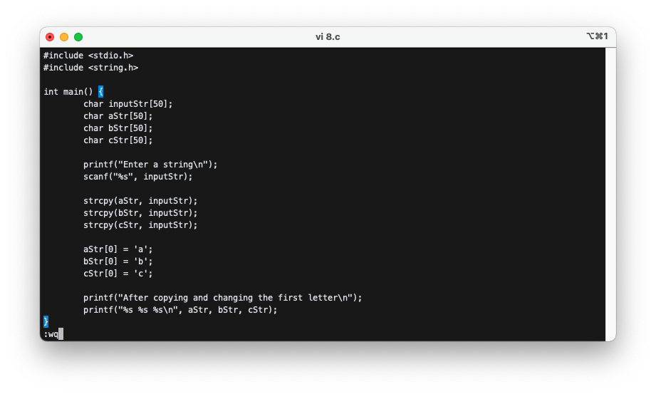

```
Enter a string
hello
After copying and changing the first letter
aello bello cello
```

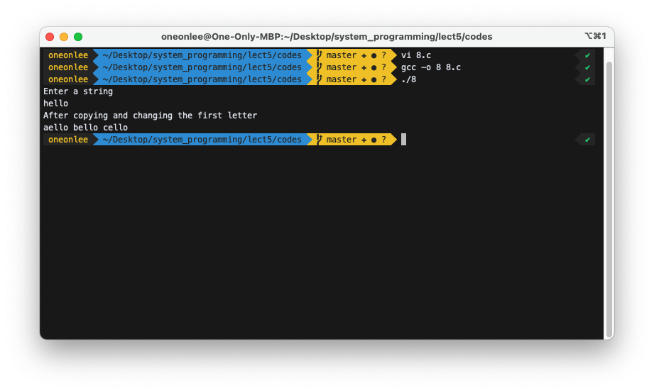

### 9. [string constant] A string constant such as "hello" is an address. Explain the result of following code.

```c
char *x, *y, *z;
x="hello"; y="hi"; z="bye";
printf("%s %s %s\n", x, y, z);
printf("%p %p %p\n", x, y, z);
```

- `printf("%s %s %s\n", x, y, z);`에서 `%s`를 사용하여 문자열을 출력하라고 하였으므로, 실행 결과로는 x, y, z가 가진 각각의 배열의 값 즉, `hello hi bye`가 출력된다.
- `printf("%p %p %p\n", x, y, z);`에서 `%p`를 사용하여 주소를 출력하라고 하였으므로, 실행 결과로는 x, y, z 각각의 주소값이 출력된다. (e.g. `0x108c5df96 0x108c5df9c 0x108c5df9f`)

### 10. [string constant is an address] Try below and explain why we have an error.

```c
    char x[20];
    strcpy(x, "hello"); // this is ok
    x="hello"; // this is an error. "hello" is an address and we can't store address in
    // x which is not a pointer variable
```

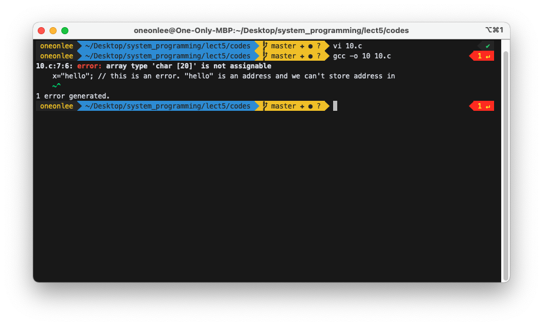

- 위의 코드를 실행하면 `10.c:7:6: error: array type 'char [20]' is not assignable`라는 오류가 발생한다. `x="hello"`에서 "hello"는 주소값이고 x는 포인터 값이 아닌 단순한 배열을 의미한다. 배열에서는 assign(`=`)을 사용할 수 없다.

### 11. [You need memory space for `strcpy`] Try below and explain why we have an error. How can you fix it?

```c
    char *y;
    y="hello1"; // this is ok
    strcpy(y, "hello2"); // error because y has no space for "hello2"
```

- 위의 코드를 실행하면 `y`가 포인터 변수이기 때문에 `strcpy`를 수행할 때의 memory space가 없기 때문에 오류가 발생한다.


- 위와 같이 수정하여 오류를 해결할 수 있다.

### 12. [You need memory space for `scanf`] Try below and explain why you have an error. Fix it.

```c
    char \*y;
    printf("enter a string\n");
    scanf("%s", y); // error becuase y has no space for a string
    printf("you entered %s\n", y);
```

- 위의 코드를 실행하면 `y`가 포인터 변수이기 때문에 `scanf`를 수행할 때의 memory space가 없기 때문에 오류가 발생한다.

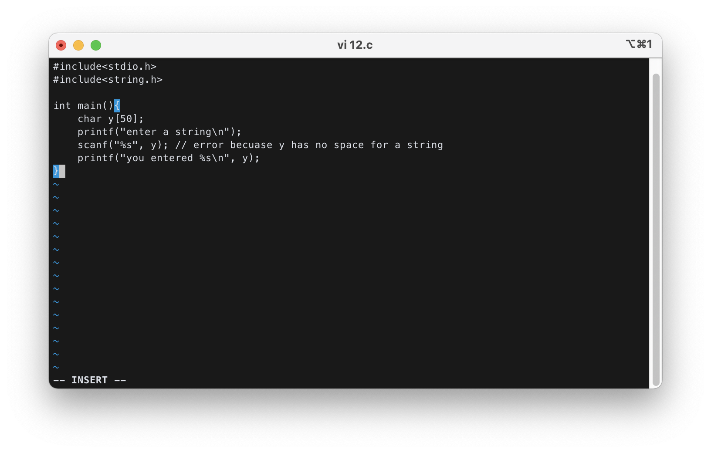
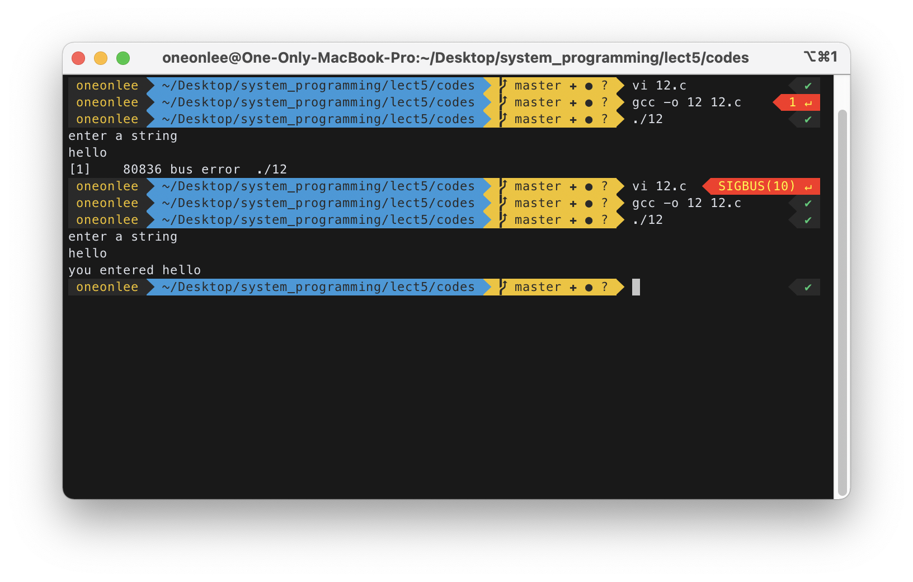

- 위와 같이 수정하여 오류를 해결할 수 있다.

### 13. [char pointer array] Define a character pointer array and store/display strings as below.

```c
    char \* x[10];
    x[0]="hi"; x[1]="bye"; x[2]="hello";
    printf("%s %s %s\n", x[0],x[1],x[2]);
```

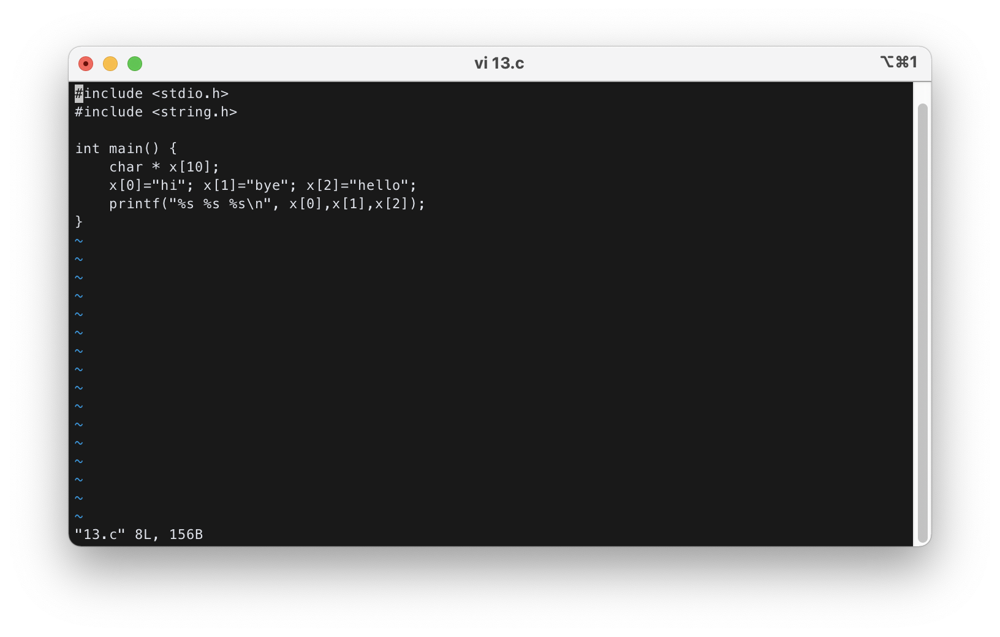
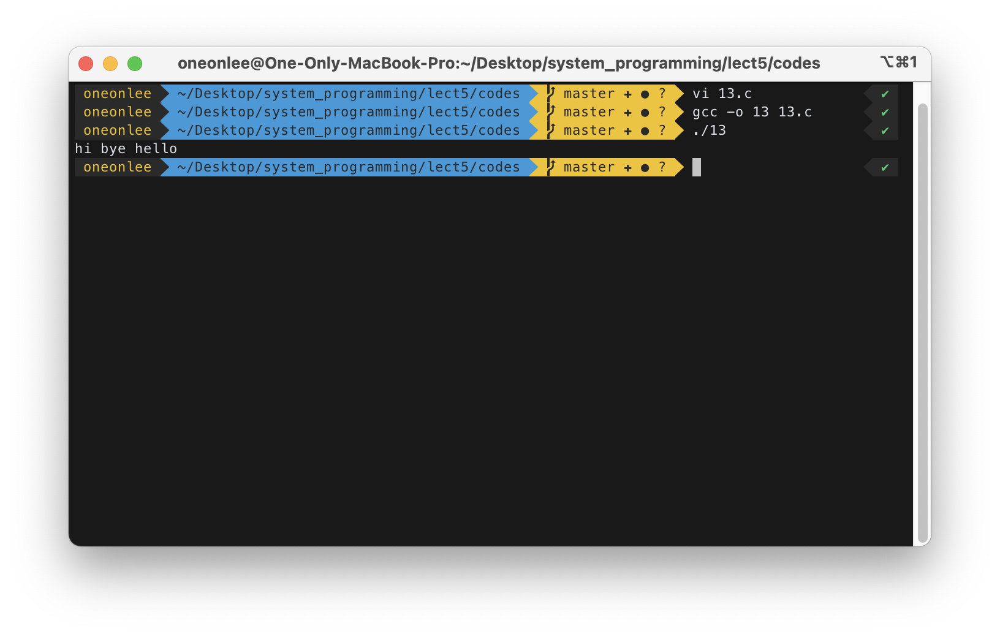

### 14. [char pointer array, `strcmp`, `new`] Write a program that keeps reading strings and store them in a character pointer array. It stops when the user enters "end" and displays all strings entered so far. Use `new` to allocate memory and use g++ to compile.

```
Enter a string
hi
Enter a string
aaa
Enter a string
bbb
Enter a string
end
Strings entered so far are
hi aaa bbb
```

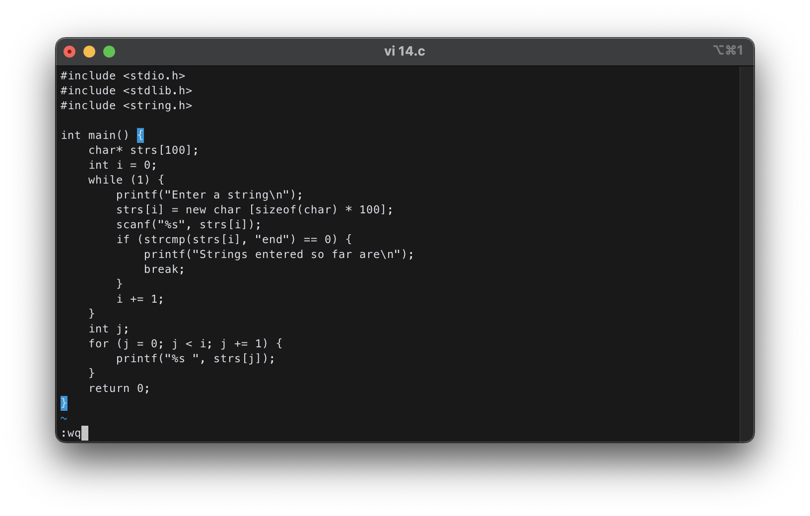
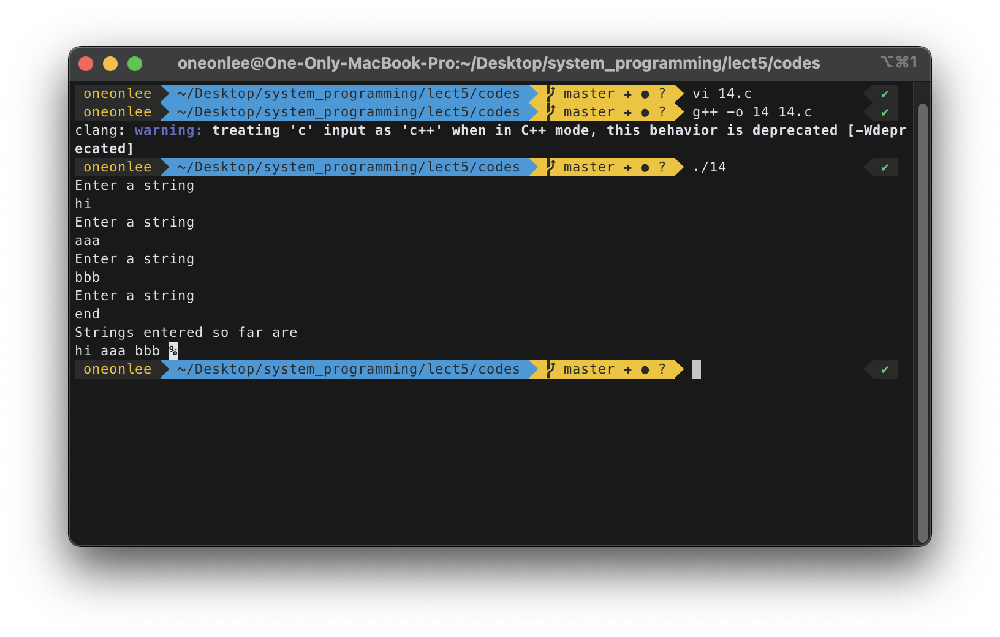

### 15. [gets, fgets] Read the same sentence with gets() and fgets() and explain the difference. (Ignore warning for gets. It is a security warning because gets can cause security problem.)

```c
   char x[100];
   printf("enter a sentence\n");
   gets(x);
   int slen=strlen(x);
   printf("sentence length after gets:%d\n", slen);
   for(i=0;i<slen;i++){
      printf("%x ", x[i]);
   }
   printf("\nenter the same sentence\n");
   fgets(x, 99, stdin); // read max 99 char's.
   slen=strlen(x);

   printf("sentence length after fgets:%d\n", slen);
   for(i=0;i<slen;i++){
      printf("%x ", x[i]);
   }
```

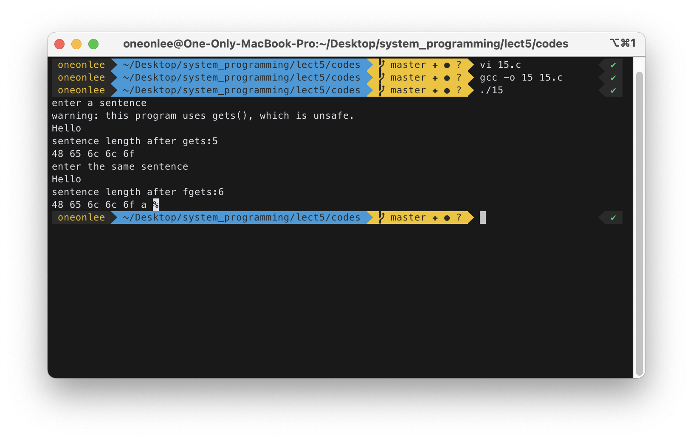

- `gets()` 함수는 \n(줄바꿈문자)까지 가져오고, \n을 \0으로 대체 한다.
- `fgets()` 함수는 \n(줄바꿈문자)까지 가져오고, 추가적으로 \0을 붙인다.
- 따라서 실행 결과를 참고하면, 읽어온 길이 수에 차이를 보인다.

### 16. [`strtok`] Use `strtok` to extract words from a sentence and store them in an array. Display the number of words as below. Note that you need to copy the sentence to another string variable before doing `strtok` because `strtok` will destroy the original sentence.

```
algorithm:
read a line
tokenize
display tokens
```

```
Enter a sentence
aa bcd e e ff aa bcd bcd hijk lmn al bcd
You entered aa bcd e e ff aa bcd bcd hijk lmn al bcd
There were 12 words:
aa
bcd
e
e
ff
aa
bcd
bcd
hijk
lmn
al
bcd
The original sentence was: aa bcd e e ff aa bcd bcd hijk lmn al bcd
```


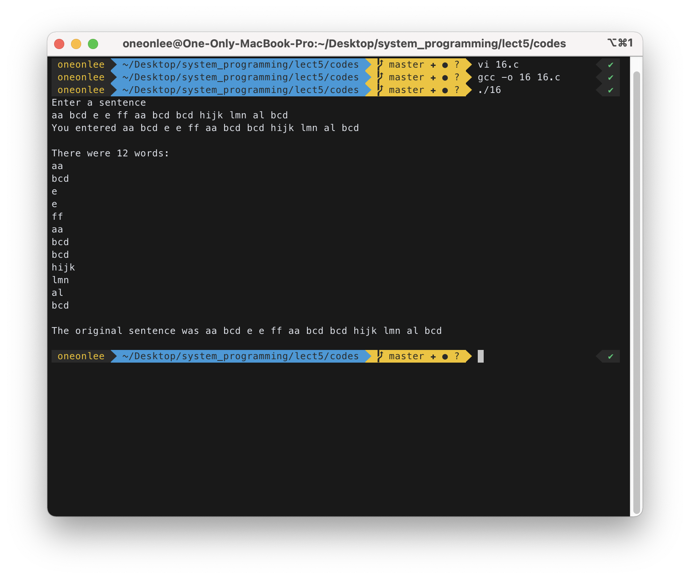

### 17. [char pointer array, new, strcmp] Write a program that keeps reading a name and stores it in a character pointer array until the user enters bye. The program should display all names after it sees "bye".

```
Enter a name
kim han kook
Enter a name
park dong il
Enter a name
hong gil dong
bye
There were 3 names.
The names were
kim han kook
park dong il
hong gil dong
```

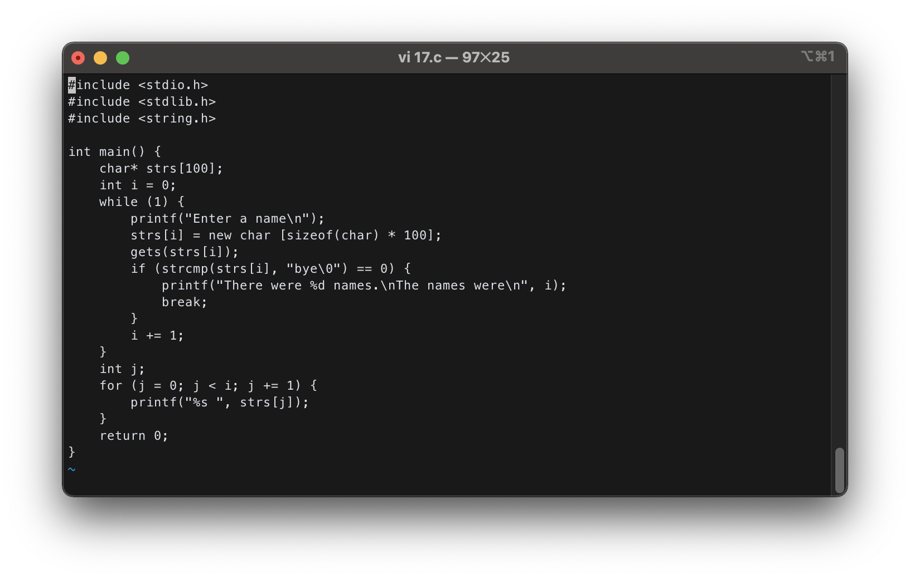

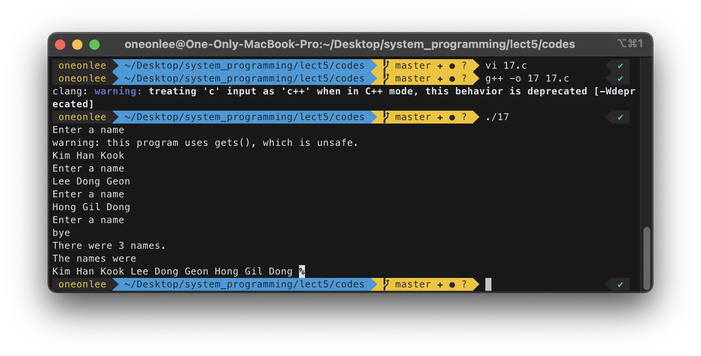

### 18. [There is a hidden 0 at the end of a string] Try below and explain why it behaves strange. How can you fix it?

```c
int x1;
char x2[12];
x1=33;
strcpy(x2,"abcdefghijkl");
printf("%d %s",x1,x2);
```

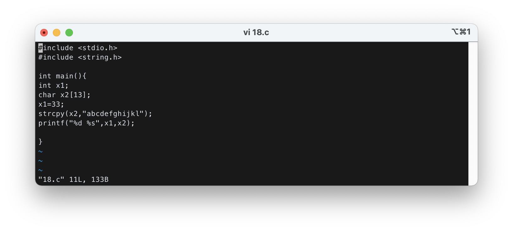


- `"abcdefghijkl"`에는 숨겨진 문자인 `\0`이 존재하기 때문에 문자열의 길이가 13이다. 이때, `x2`의 배열의 길이가 12이므로 에러가 발생하였다.
- `char x2[13];`으로 배열의 길이를 늘려준다면 에러가 발생하지 않는다.

### 19. [You need memory space for `strcpy`] What is wrong with the following program? How can you fix it?

```c
int main(){
   char * strarr[10]={NULL};
   strarr[0]="hello";
   strcpy(strarr[1],"bye");
   printf("%s %s\n", strarr[0], strarr[1]);
}
```

- `strcpy(strarr[1],"bye");`을 실행 할 때, `strarr[1]`의 크기가 정해져 있지 않으므로 에러가 발생한다.
- 아래와 같이 코드를 수정하면 해결할 수 있다.

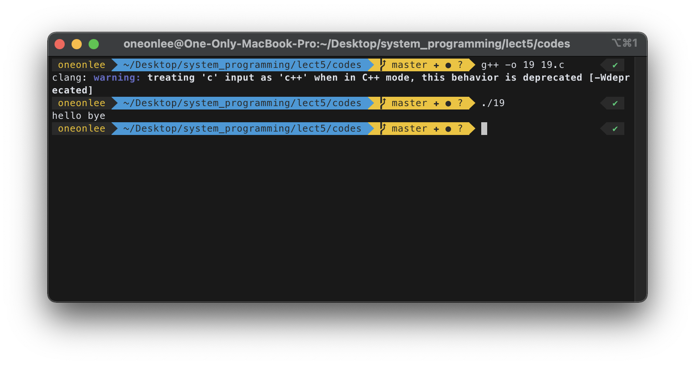
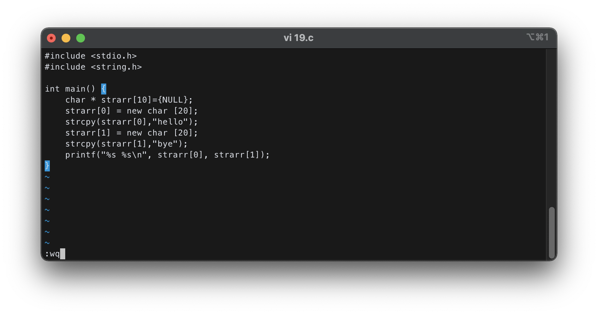

### 20. [char pointer array, `new`, `strcmp`] Write a program that reads a long sentence and displays the frequency of each word as below. It also prints the word that has the maximum frequency.

```
algorithm:
read a line
tokenize
display tokens
compute frequency
display frequencies
compute max frequency word and display it
```

```
algorithm for compute frequency:
for each token
if it is already in unique_tokens[] array, increase its frequency
otherwise store in unique_tokens[] and initialize its frequency=1
```

```
Enter a sentence
aa bcd e e ff aa bcd bcd hijk lmn al bcd
You entered aa bcd e e ff aa bcd bcd hijk lmn al bcd
There were 12 words: aa bcd e e ff aa bcd bcd hijk lmn al bcd
Frequencies: aa 2 bcd 4 e 2 ff 1 hijk 1 lmm 1 al 1
The word with the max freq: bcd
```

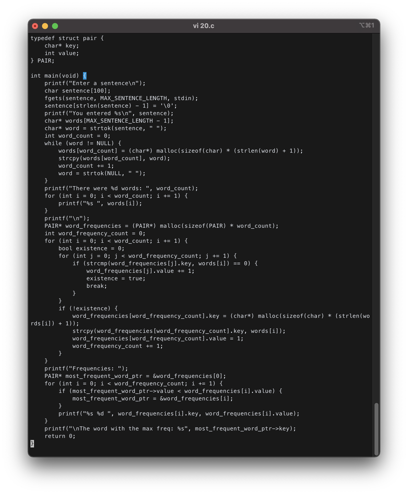
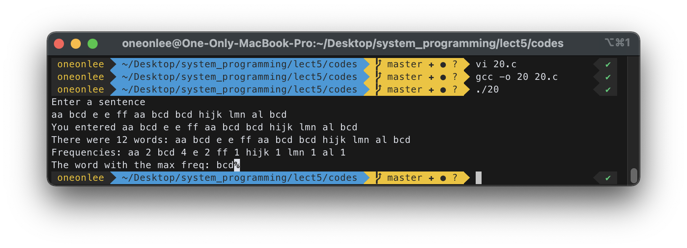
