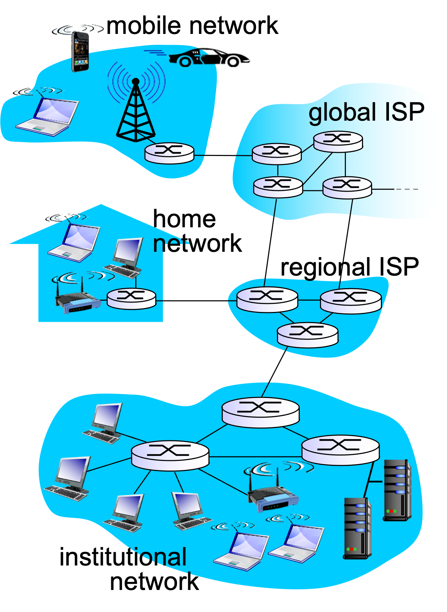
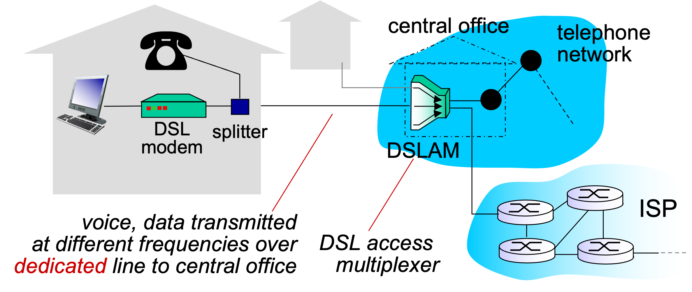
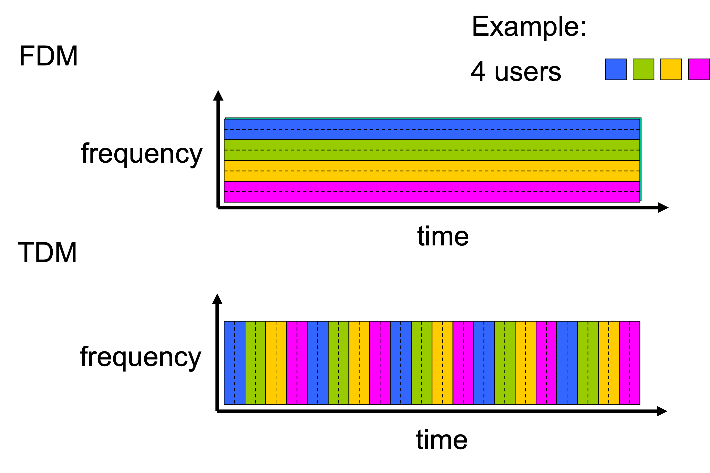

# Computer Network and Internet

overview:

- [What’s the Internet and protocol?](#1-what-is-the-internet)
- [Network edge device: hosts, access net, physical media](#2-network-edge)
- [Network core device: packet/circuit switching, Internet structure](#3-network-core)
- [Performance: loss, delay, throughput](#4-delay-loss-throughput-in-networks)
- [Protocol layers, service models](#5-protocol-layers-service-models)

## 1. What is the Internet?

- millions of connected computing devices:
  - hosts = end systems
  - running network apps
- communication links
  - fiber, copper, radio, satellite
  - transmission rate:
    - bandwidth
- Packet switches: forward packets (chunks of data)
  - routers and switches
- Internet: “network of networks”
  - Interconnected ISPs
- protocols control sending, receiving of msgs
  - e.g., TCP, IP, HTTP, Skype, 802.11
- Internet standards
  - RFC: Request for comments
  - IETF: Internet Engineering Task Force

### What is the Internet?: a service view

- Infrastructure that provides services to applications:
  - Web, VoIP, email, games, e-commerce, social nets, …
- provides programming interface to apps
  - hooks that allow sending and receiving app programs to “connect” to Internet
  - provides service options, analogous to postal service
  - e.g., socket programming

### What’s a protocol?

protocols define format, order of msgs sent and received among network entities, and actions taken on msg transmission, receipt

#### a human protocol and a computer network protocol:

## 2. Network Edge

end systems, access networks, links

### A closer look at network structure:

- network edge:
  - hosts: clients(서비스를 요청하는 자) and servers(서비스를 제공하는 자)
  - servers often in data centers
- access networks:
  - end-system이 core에 접속하는데에 도움을 주는 중간 단계 network
  - wired, wireless communication links
- network core:
  - interconnected routers
  - network of networks

### Access networks and physical media

- Q: How to connect end systems to edge router?
  - residential access nets
  - institutional access networks (school, company)
  - mobile access networks

### Access net: digital subscriber line (DSL)

- use existing telephone line to central office DSLAM
  - data over DSL phone line goes to Internet
  - voice over DSL phone line goes to telephone net
- < 2.5 Mbps upstream transmission rate (typically < 1 Mbps)
- < 24 Mbps downstream transmission rate (typically < 10 Mbps)
- splitter : 하나의 전화선으로 컴퓨터와 전화를 둘 다 사용할 수 있게 함

### Access net: home network

### Enterprise access networks (Ethernet)

- typically used in companies, universities, etc
- 10 Mbps, 100Mbps, 1Gbps, 10Gbps transmission rates
- today, end systems typically connect into Ethernet switch

### Wireless access networks

- shared wireless access network connects end system to router
  - via base station aka “access point”

#### wireless LANs:

- within building (100 ft)
- 802.11b/g (WiFi): 11, 54 Mbps transmission rate

#### wide-area wireless access

- provided by telco (cellular) operator, 10’s km
- between 1 and 10 Mbps
- 3G, 4G: LTE

### Host: sends packets of data

- host sending function:
  - takes application message
  - breaks into smaller chunks, known as packets, of length L bits
  - transmits packet into access network at transmission rate R
    - link transmission rate, aka link capacity, aka link bandwidth

## 3. network core

Packet-switching, Circuit-switching, network structure

### The network core

- mesh of interconnected routers
- packet-switching: hosts break application-layer messages into packets
  - forward packets from one router to the next, across links on path from source to destination
  - each packet transmitted at full link capacity

### Packet-switching

#### Packet-switching: store-and-forward

- takes L/R seconds to transmit (push out) L-bit packet into link at R bps
- store and forward: entire packet must arrive at router before it can be transmitted on next link
- end-end delay = 2L/R (assuming zero propagation delay)
- one-hop numerical example:
  - L = 7.5 Mbits
  - R = 1.5 Mbps
  - one-hop transmission delay = 5 sec

#### Packet-switching: queueing delay, loss

- queuing and loss:
  - If arrival rate (in bits) to link exceeds transmission rate of link for a period of time:
    - packets will queue, wait to be transmitted on link
    - packets can be dropped (lost) if memory (buffer) fills up

#### Two key network-core functions

### Circuit-switching

#### Alternative core: circuit switching

- end-end resources allocated to, reserved for “call” between source & dest:
  - In diagram, each link has four circuits.
    - call gets 2nd circuit in top link and 1st circuit in right link.
  - dedicated resources: no sharing
    - circuit-like (guaranteed) performance
  - circuit segment idle if not used by call (no sharing)
  - Commonly used in traditional telephone networks

#### Circuit-switching: FDM versus TDM

- FDM (frequency division multiplex, 주파수 분할 다중 방식)
- TDM (time division multiplex, 시간 분할 다중 방식)

### Packet-switching versus Circuit-switching

#### packet switching allows more users to use network!

- example:
  - 1 Mb/s link
  - each user:
    - 100 kb/s when “active”
    - active 10% of time

##### circuit-switching:

- 10 users

##### packet switching:

- with 35 users, probability > 10 active at same time is less than .0004

#### Is packet switching a “slam dunk winner?”

- great for bursty data (데이터의 전송 간격이 불규칙한 데이터)
  - resource sharing
  - simpler, no call setup
- excessive congestion possible: packet delay and loss
  - protocols needed for reliable data transfer, congestion control (혼잡이 발생하여 delay와 loss가 발생할 수 있지만 control 할 수는 없음)
    - 데이터를 송신할 때, 별도의 congestion algorithm을 사용
- Q: How to provide circuit-like behavior?
  - 'virtual circuit packet switching'
  - bandwidth guarantees needed for audio/video apps
  - still an unsolved problem

### Internet structure: network of networks

- End systems connect to Internet via access ISPs (Internet Service Providers)
  - Residential, company and university ISPs
- Access ISPs in turn must be interconnected.
  - So that any two hosts can send packets to each other
- Resulting network of networks is very complex
  - Evolution was driven by economics and national policies
- Let’s take a stepwise approach to describe current Internet structure

## 4. delay, loss, throughput in networks

### How do loss and delay occur?

- packets queue in router buffers
  - packet arrival rate to link (temporarily) exceeds output link capacity
  - packets queue, wait for turn

### Four sources of packet delay

- d_proc: nodal processing
  - check bit errors
  - determine output link
  - typically < msec
- d_queue: queueing delay
  - time waiting at output link for transmission
  - depends on congestion level of router
- d_trans: transmission delay:
  - L: packet length (bits)
  - R: link bandwidth (bps)
  - d_trans = L/R
- d_prop: propagation delay:
  - d: length of physical link
  - s: propagation speed in medium (~2x108 m/sec)
  - d_prop = d/s
  - d_trans and d_prop are very different!

### Queueing delay (revisited)

- R: link bandwidth (bps)
- L: packet length (bits)
- a: average packet arrival rate

La/R ~ 0: avg. queueing delay small
La/R -> 1: avg. queueing delay large
La/R > 1: more “work” arriving
than can be serviced, average delay infinite!

### “Real” Internet delays and routes

- what do “real” Internet delay & loss look like?
- `traceroute` program: provides delay measurement from source to router along end-end Internet path towards destination. For all i:
  - sends three packets that will reach router i on path towards destination
  - router i will return packets to sender
  - sender times interval between transmission and reply.

### Packet loss

- queue (aka buffer) preceding link in buffer has finite capacity
- packet arriving to full queue dropped (aka lost)
- lost packet may be retransmitted by previous node, by source end system, or not at all

### Throughput

- throughput: rate (bits/time unit) at which bits transferred between sender/receiver
  - instantaneous: rate at given point in time
  - average: rate over longer period of time

## 5. protocol layers, service models

### Protocol “layers”

- Networks are complex, with many “pieces”:
  - hosts
  - routers
  - links of various media
  - applications
  - protocols
  - hardware, software

### Why layering?

- dealing with complex systems:
  - explicit structure allows identification, relationship of complex system’s pieces
    - layered reference model for discussion
  - modularization eases maintenance, updating of system
    - change of implementation of layer’s service transparent to rest of system
    - e.g., change in gate procedure doesn’t affect rest of system
  - layering considered harmful?

### Internet protocol stack

- application: supporting network applications
  - FTP, SMTP, HTTP
- transport: process-process data transfer
  - TCP, UDP
- network: routing of datagrams from source to destination
  - IP, routing protocols
- link: data transfer between neighboring network elements
  - Ethernet, 802.111 (WiFi), PPP
- physical: bits “on the wire”

### ISO/OSI reference model

- presentation: allow applications to interpret meaning of data
  - e.g., encryption, compression, machine-specific conventions
- session: synchronization, checkpointing, recovery of data exchange
- Internet stack “missing” these layers!
  - these services, if needed, must be implemented in application
  - needed?
