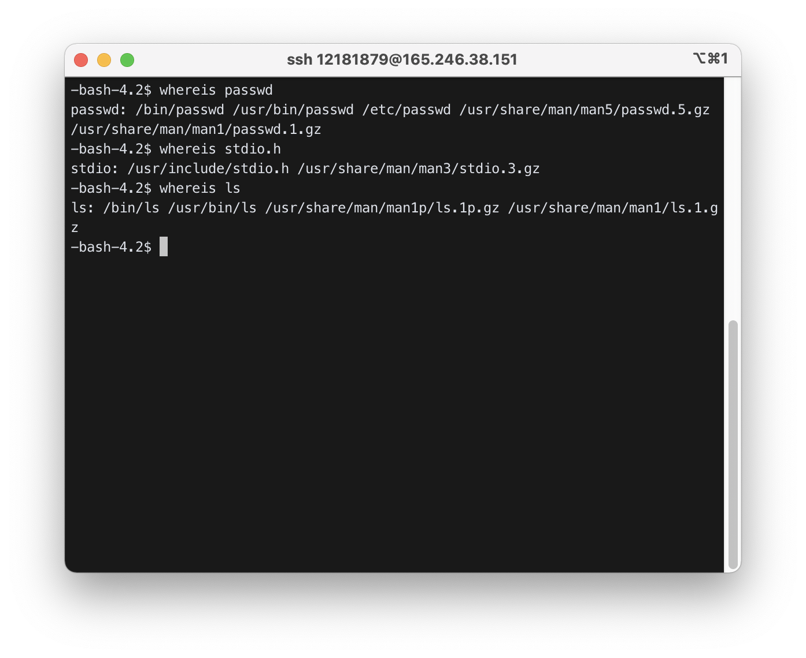
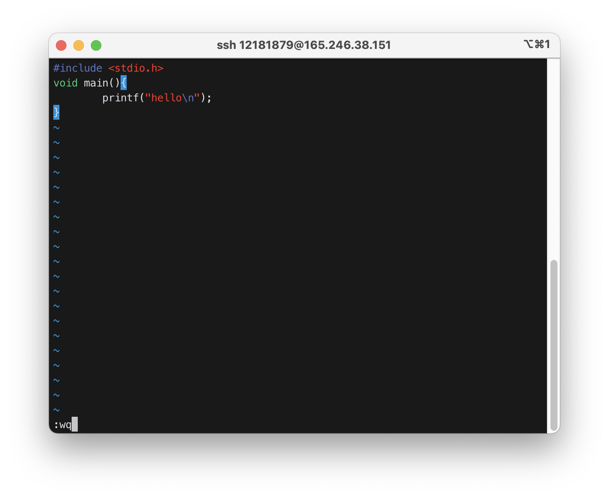
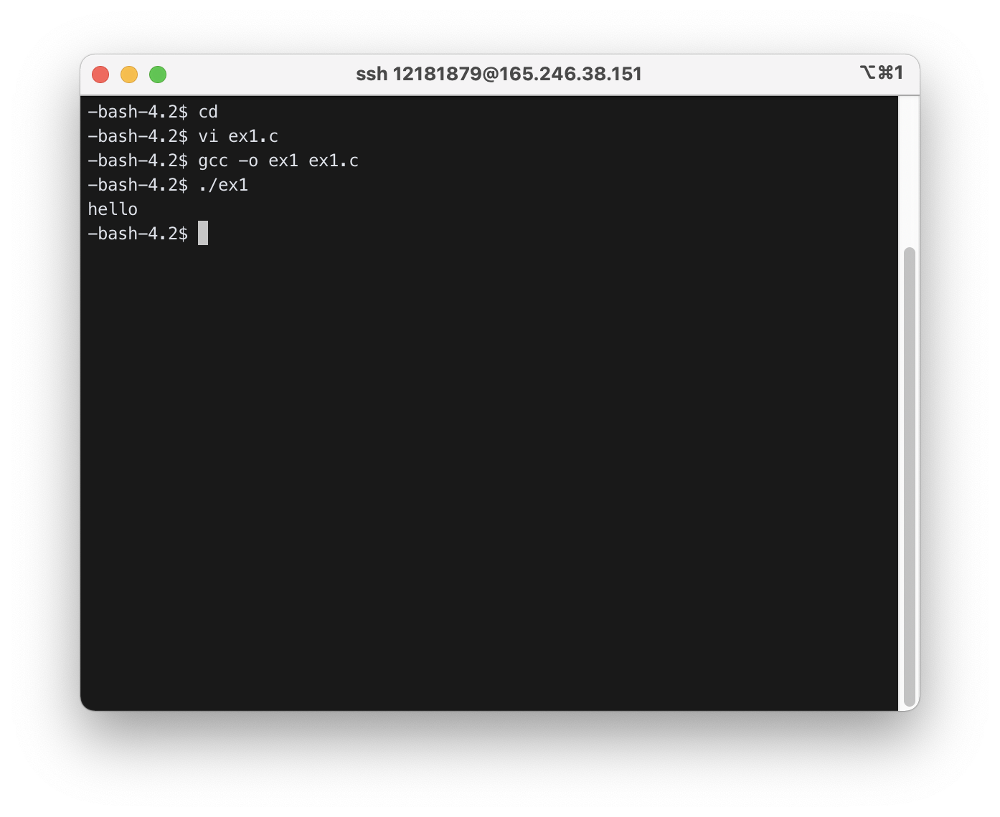

# Running a C program in Linux

## Commands

- `gcc` : C program을 컴파일한다.

  - `gcc -o ex1 ex1.c`
    - "ex1.c"을 컴파일하고, “ex1”이라는 실행파일 object를 생성한다.
    - `-o` 옵션으로 executable file name을 지정할 수 있다.
    - "ex1"이라는 실행파일을 사용하려면 `./ex1` 명령어 사용
  - gcc –S ex1.c
    - compile을 하지만, assemble 하지 않는다.
    - assembly language file인 "ex1.s"를 생성한다.

- `g++` : C++ program 을 컴파일한다.

  - `g++ -o ex1 ex1.cpp`

- `kill` : process에게 신호를 보낸다.

  - `kill 1234`
    - `pid`가 "1234"인 process를 kill한다.

- `^c` : 현재 실행되고 있는 process를 'kill'한다.
   
   - 참고로 `^`이란 키보드에서 컨트롤 키(control)를 의미한다.
   - `^c`는 Ctrl 키랑 c키를 동시에 누르면 된다. (복사 단축어처럼)

## Exercise

### 1) Login to the system. Show the current directory. Show what files are in your directory.


### 2) Go to “/etc” directory. `file *` will show the information for all files in the current directory. Combine `file *` and `grep` using the pipe symbol(`|`) to display file information only for text files.

`$ file * | grep text`


### 3) Find the location of the password file (“passwd”), the location of C header files such as `stdio.h`, and the location of utility programs (or Linux commands) such as `ls`. Use `whereis` command.



### 4) Go to your login directory (`cd` without arguments will move you to your login directory). Make ex1.c using vi. Compile with `gcc` and run.

`vi ex1.c`

```c
#include <stdio.h>
void main(){
   printf(`hello\n`);
}
```

`$ gcc -o ex1 ex1.c`<br>
`$ ./ex1`<br>
`hello`<br>




To compile with `g++`, change `void main()` => `int main()`

```cpp
#include <stdio.h>
int main(){
   printf(`hello\n);
}
```


`$ g++ -o ex1 ex1.c`<br>
`$ ./ex1`<br>
`hello`


### 5) Display the contents of ex1.c using `cat` and `xxd`. With `xxd`, you can see the ascii code for each character in ex1.c. Find the ascii codes for the first line of the program: `#include <stdio.h>`.


`2369 6e63 6c75 6465 203c 7374 6469 6f2e 683e`

### 6) Display the contents of ex1 (the executable file). You cannot use `cat` to see ex1. Why?

- If use `xxd` command

  - 

- If use `cat` command
  - 
  - You cannot use `cat` to see ex1. Because ex1 was written by a Machine code.

#### 6-1) The compiler has translated the C statements in ex1.c into machine instructions and stored in ex1:

```
         55               -- push rbp
         48 89 e5         -- mov rbp, rsp
         bf f0 05 40 00    -- mov edi, 0x40005f0
         .........
```

Find these machine instructions in ex1 with `xxd`. Use `/pattern` command in vi to search for a string.

`$ xxd ex1 > x`<br>
`$ vi x`


### 7) Copy ex1.c to ex2.c, ex3.c, and ex4.c. Remove ex2.c. Rename ex3.c to y.c.


### 8) Make a subdirectory. Copy y.c in this subdirectory.


### 9) Redirect the output of ex1 to another file using `>` symbol.

`$ ./ex1 > f1`


### 10) Use grep to search `hello` in all files (use -nr option).


### 11) Find out what processes exist in your system. Use `ps -ef`.


### 12) `ps -ef` shows all the processes in the system. How do you know which ones are yours? Use `tty` for this purpose. Note that when a user logs in, the system allocates a terminal, and you can find the terminal number with `tty` command. What is your terminal number?


My terminal number is `pts/13`.

### 13) Modify ex1.c so that it receives two numbers from the user and prints the sum. Use scanf() for this.


### 14) Modify ex1.c so that it contains an infinite loop after printing `hello`.

```c
printf("hello");
fflush(stdout);  // to make it print hello immediately
for(;;);
```


### 15) Run the program with & at the end, and use `ps` to check its status. `&` puts the process in the background so that you can type next command.

```
$ ./ex1 &
$ ps
```


### 16) Kill it with `kill` command.


### 17) Run the program again without & at the end. Open another login window, find out the process ID of the process running in the first window, and kill it.


### 18) Use `objdump -D -M intel ex1` to dump the assembly code of ex1.c. Find <main>.


```
00000000004005bc <main>:
  4005bc:	55                   	push   rbp
  4005bd:	48 89 e5             	mov    rbp,rsp
  4005c0:	bf 90 06 40 00       	mov    edi,0x400690
  4005c5:	b8 00 00 00 00       	mov    eax,0x0
  4005ca:	e8 c1 fe ff ff       	call   400490 <printf@plt>
  4005cf:	48 8b 05 6a 0a 20 00 	mov    rax,QWORD PTR [rip+0x200a6a]        # 601040 <__TMC_END__>
  4005d6:	48 89 c7             	mov    rdi,rax
  4005d9:	e8 e2 fe ff ff       	call   4004c0 <fflush@plt>
  4005de:	eb fe                	jmp    4005de <main+0x22>
```

### 19) Run following and tell the difference between gets and fgets

```c
#include <stdio.h>
#include <string.h>
int main(){
  char buf[20];
  printf("enter a sentence\n");
  gets(buf);
  printf("I got %s from you. length:%d\n", buf, strlen(buf));
  printf("enter the same sentence again\n");
  fgets(buf, 20, stdin);
  printf("I got %s from you. length:%d\n", buf, strlen(buf));
}
```


It causes wanings. (`warning: ‘gets’ is deprecated (declared at /usr/include/stdio.h:640) [-Wdeprecated-declarations]`) <br>
`gets` is deprecated because it's dangerous, it may cause buffer overflow.<br>

`gets()` keeps reading input until newline character or end-of-file is reached. It stores that into a string variable and it is possible that we get buffer overflow error when the buffer for `gets()` overflows.<br>
`fgets()` is a safer version of `gets()` where you can provide limitation on input size. You can also decide to take input from which stream(e.g. File or standard input).

### 20) Write a program to read a sentence and echo it as follows. Use gets() or fgets(). Do `man gets` or `man fgets` to find out the usage of them.

> Enter a sentence

> aa bcd e e ff aa bcd bcd hijk lmn al bcd

> You entered aa bcd e e ff aa bcd bcd hijk lmn al bcd


### 21) Show the first 20 bytes of ex1.c in Problem 4 with `xxd`. Interpret them.


`#include <stdio.h>`

### 22) [ELF format] Show the first 20 bytes of ex1, the executable file (not ex1.c) in Problem 4, with `xxd`. Interpret them. An executable file in Linux follows ELF (Executable and Linkable Format) format as below.


```
-bash-4.2$ xxd -l 20 ex1
0000000: 7f45 4c46 0201 0100 0000 0000 0000 0000  .ELF............
0000010: 0200 3e00                                ..>.
```

```
ELF format= ELF header + Program header table + Section 1 + Section 2 + ... + Section n + Section header table

ELF header =
e_ident(16)+e_type(2)+e_machine(2)+e_version(4)+e_entry(4)+e_phoff(4)+e_shoff(4)+
e_flags(4)+e_ehsize(2)+e_phentsize(2)+e_phnum(2)+e_shentsize(2)+e_shnum(2)+
e_shstrndx(2)

e_ident=7f E L F + EI_CLASS(1) + EI_DATA(1) + EI_VERSION(1) + EI_OSABI(1) + EI_ABIVERSION(1) + EI_PAD(7)
EI_CLASS = 1 if 32bit application or 2 if 64bit application
EI_DATA = 1 if little endian or 2 if big endian
EI_VERSION = 1
EI_OSABI = 0 for System V, 1 for HP-UX, 2 for NetBSD, 3 for Linux, 4 for GNU Hurd, ...
EI_ABIVERSION = depends on ABI version
EI_PAD = 9 zero's

e_type= 1 for relocatable file, 2 for executable file, 3 for shared object file
e_machine = 3 for x386, 0x32 for IA-64, 0x3e for amd64, ...
e_version = 1
e_entry = program starting address
.................
```

(\* Refer to https://en.wikipedia.org/wiki/Executable_and_Linkable_Format for the rest of ELF file format)

- [0 ~ 3 : File indentification]
  - `7f 45 4c 46` is a 4-byte magic number to identify that it is an ELF file and contains a value of 7f 45(E) 4c(L) 46(F).
- [4 : Class]
  - `02` indicates the class or capacity of the file.
    - ELFCLASSNONE = 0 = Invalid class
    - ELFCLASS32 = 1 = 32-bit objects
    - ELFCLASS64 = 2 = 64-bit objects
- [5 : Data encoding]
  - `01` indicates data encoding method information.
    - ELFDATANONE = 0 = Invalid data encoding
    - ELFDATA2LSB = 1 = LSB(가장 오른쪽에 있는 비트)가 가장 낮은 주소
    - ELFDATA2MSB = 2 = MSG(가장 왼쪽에 있는 비트)가 가장 낮은 주소
- [6 : File Version]
  `01` is the ELF header version number, and EV_CURRENT = 1 is currently used.
- [7 : Start of padding bytes]
  - `00 00 00 00 00 00 00 00 00` currently unused, should be filled with zeros.
- [16 : Size of e_ident[]]
  - `02 00` identifies object file type.
    - e_type : Object file type
      - ET_NONE = 0 = No file type
      - ET_REL = 1 = Relocatable file
      - ET_EXEC = 2 = Executable file
      - ET_DYN = 3 = Shared object file
      - ET_CORE = 4 = Core file
- [18 : Instruction Set]
  - `3e 00` specifies target instruction set architecture.
    - 0x00 No specific instruction set
    - 0x02 SPARC
    - 0x03 x86
    - 0x08 MIPS
    - 0x14 PowerPC
    - 0x28 ARM
    - 0x2A SuperH
    - 0x32 IA-64
    - 0x3E x86-64
    - 0xB7 AArch64
