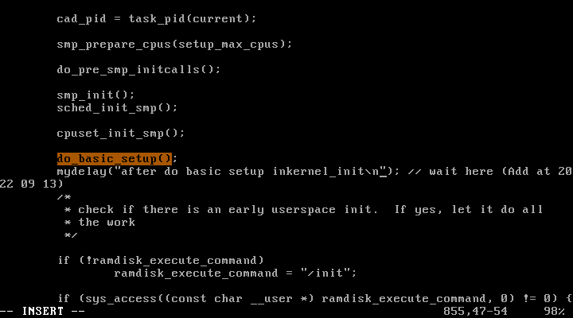
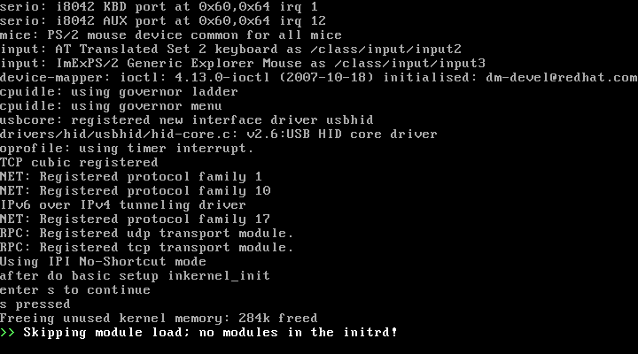

# 4. Interrupt

## 1218179 이동건

### 1) Following events will cause interrupts in the system. What interrupt number will be assigned to each event? For system call interrupt, also give the system call number.

- A packet has arrived
  - network interface : 42
- An application program calls `scanf()`
  - `system_call()` => `sys_read()(3)` : 128
- A key is pressed
  - `interrupt[1]` : 33
- An application causes a divide-by-zero error
  - Exception interrupt : 0
- An application program calls `printf()`
  - `system_call()` => `sys_read()(3)` :128
- An application causes a page-fault error
  - `page_fault()` => `do_page_fault()` :14

## 2) Change `drivers/input/keyboard/atkbd.c` as follows.

```bash
$ vi drivers/input/keyboard/atkbd.c
```

```c
static irqreturn_t atkbd_interrupt(....){
   return IRQ_HANDLED;  // Add this at the first line
   .............
}
```


#### Recompile the kernel and reboot with it.

```bash
$ make bzImage
$ cp arch/x86/boot/bzImage /boot/bzImage
$ reboot
```

#### What happens and why does this happen? Show the sequence of events that happen when you hit a key in a normal Linux kernel (as detail as possible): hit a key => keyboard controller sends a signal through IRQ line 1 => ......etc. Now with the changed Linux kernel show which step in this sequence has been modified and prevents the kernel to display the pressed key in the monitor.


부팅이 끝나면 로그인 입력이 출력되지만, Keyboard action이 먹히지 않는다.

원래 코드는interrupt가 발생 후, 키보드 입력과정을 처리한 뒤 `IRQ_HANDLED`를 리턴하는데, 이 과정들을 거치지 않고 바로 리턴하도록 했기 때문에, 어떤 문자를 입력해도 실행이 되지 않는다.

### 3) Change the kernel such that it prints "x pressed" for each key pressing, where x is the scan code of the key. After you change the kernel and reboot it, do followings to see the effect of your changing.

```bash
$ vi drivers/input/keyboard/atkbd.c
```

`code`를 `printk`로 출력할 수 있도록 `printk("%x pressed\n", code);`를 추가하였다.

`drivers/input/keyboard/atkbd.c`:


이후, 컴파일하고 재부팅하여 새로운 리눅스 커널을 적용하였다.

```bash
$ cat /proc/sys/kernel/printk
1  4  1  7
```

위는 현재의 콘솔 로그 레벨, 기본 로그 레벨, 최소 로그 레렐, 최대 로그 레벨을 나타낸다. 현재는 `1`로 기본 레벨보다 낮기 때문에 `printk()`로 출력되는 문자들이 화면에 나타나지 않는다.

```bash
$ echo 8 > /proc/sys/kernel/printk
```

위 명령으로 현재 콘솔 로그 레벨을 `8`로 바꾸면 아래와 같이 레벨이 바뀐다.

```bash
$ cat /proc/sys/kernel/printk
8   4   1   7
```

현재는 레벨이 `8`이기 때문에 `printk`로 출력되는 문자들이 화면에 보인다. 위와 같이 입력되는 키 코드가 화면에 보인다.

```bash
$ echo 1 > /proc/sys/kernel/printk
```

`printk` 출력을 보이지 않게 하려면 현재 로그 레벨을 `1`로 되돌리면 된다.


### 4) Change the kernel such that it displays the next character in the keyboard scancode table. For example, when you type "root", the monitor would display "tppy". How can you log in as root with this kernel?

```bash
$ vi drivers/input/keyboard/atkbd.c
```

키보드 입력이 들어오면, 실제 입력한 글자의 다음 글자를 입력한 것으로 처리하도록 `unsigned int code = data;`를 `unsigned int code = data+1;`로 수정하였다.

`drivers/input/keyboard/atkbd.c`:


이후, 컴파일하고 재부팅하여 새로운 리눅스 커널을 적용하였다.


재부팅하고 로그인을 하기 위해 "root"를 입력하면 키보드에서 한 글자씩 밀린 "tppy"가 출력된다.

### 5) Define a function `mydelay` in `init/main.c` which whenever called will stop the booting process until you hit 's'. Call this function after `do_basic_setup()` function call in `kernel_init()` in order to make the kernel stop and wait for 's' during the booting process. You need to modify `atkbd.c` such that it changes `exit_mydelay` to 1 when the user presses 's'.

`init/main.c` :

```c
........
int exit_mydelay;    // define a global variable
void mydelay(char *str){
   printk(str);
   printk("enter s to continue\n");
   exit_mydelay=0;  // init to zero
   for(;;){  // and wait here until the user press 's'
      msleep(1); // sleep 1 micro-second so that keyboard interrupt ISR
                 // can do its job
      if (exit_mydelay==1) break; // if the user press 's', break
   }
}
void kernel_init(){
    ...............
    do_basic_setup();
    mydelay("after do basic setup in kernel_init\n"); // wait here
    .........
}
```




`drivers/input/keyboard/atkbd.c` :

```c
.........
extern int exit_mydelay;  // declare as extern since it is defined in main.c
static irqreturn_t atkbd_interrupt(....){
    .............
    // detect 's' key pressed and change exit_mydelay
    if (code == 31) {
        printk("s pressed\n");
        exit_mydelay = 1;
    }
    .............
}
```


이후, 컴파일하고 재부팅하여 새로운 리눅스 커널을 적용하였다.


부팅 시 "enter s to continue"라는 메세지와 함께 사용자의 입력을 기다리고 있다.



's'를 입력하면 부팅이 이어서 진행된다.
