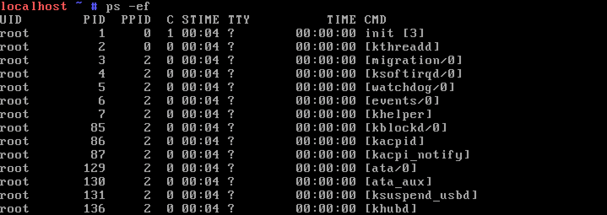
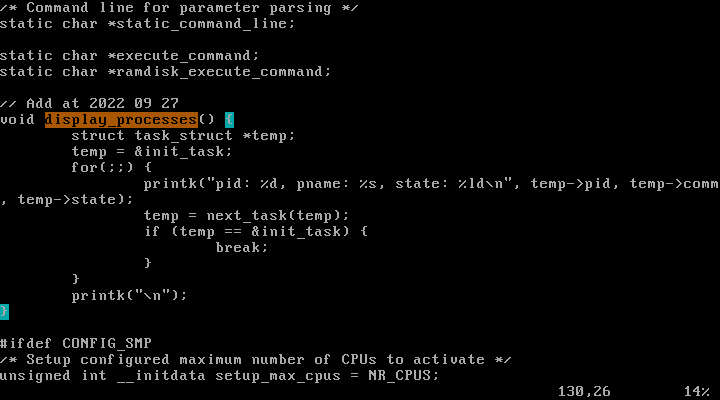
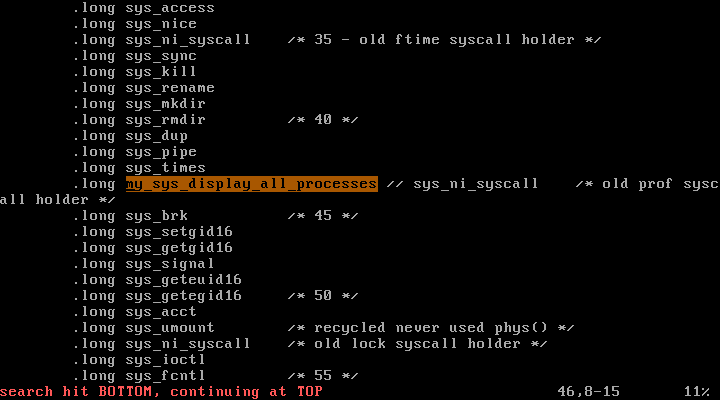
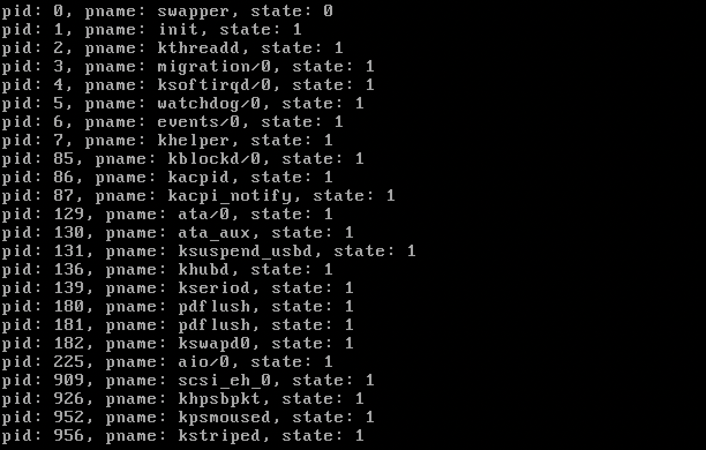
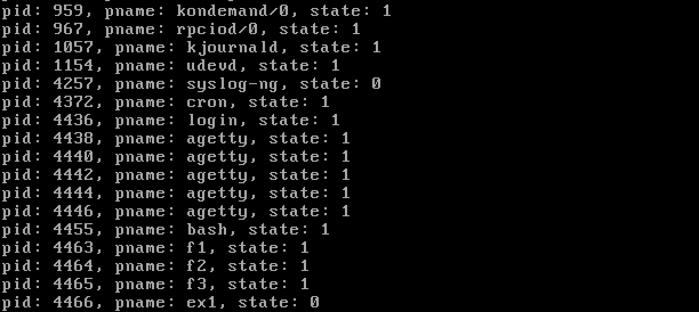
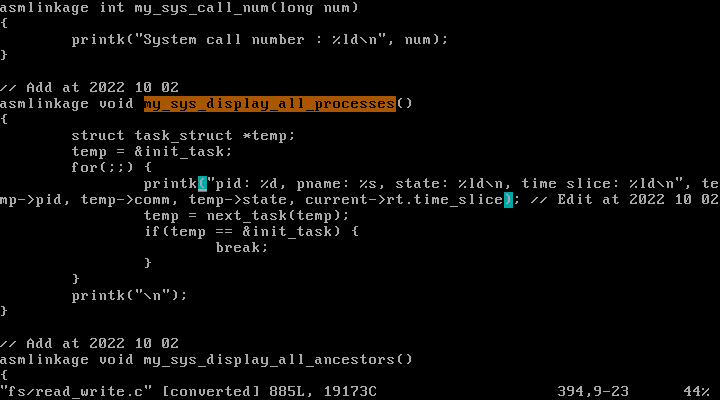

# Process

- What is process
- History of OS
- Data structures for process
- fork, exec, exit, wait

## 1. What is a process

A process is a program loaded in the memory.

## 2. History of OS

- 1945 ~ 1955 :
  - No OS.
- 1955 ~ 1965 :
  - FMS (Fortran Monitoring System). Runs a set of programs one by one.
  - cpu utilization problem: over 90% time the cpu was idle
- 1965 ~ :
  - Multiprogramming. Load several programs at once. Run one by one. If the current one is blocked because of I/O, go to the next process. Fairness problem: cpu-bound program is favored.
- Now :
  - Time Sharing. Allocate x ticks to each process. Now all processes will be stopped either if it executes an I/O instruction or the timer expires.

## 3. Data structures for process

- process descriptor:
  - one for each process.
  - contains information about the corresponding process such as process ID, ticks
  - remained, register values of the last stop-point, memory location, size, etc.
  - `task_struct{}` is the process descriptor in Linux. (`include/linux/sched.h`)
  - "current" points to the current process
  - `thread_union{}` = `task_struct{}` + Kernel Mode Stack
  - `init_task` is the kernel's process descriptor (`arch/x86/kernel/init_task.c`, `include/linux/init_task.h`)
    ```c
        struct task_struct  init_task = INIT_TASK(init_task);
        INIT_TASK(init_task) = {
            ........
            .parent = &init_task,
            .comm = "swapper",
            ........
        }
    ```
- process queue:
  - linked list of process descriptors
  - `&init_task` is the start of this queue.
  - traversing the process queue
    ```c
    void display_processes(){
        struct task_struct *temp;
        temp = &init_task;
        for(;;){
            print process id, user id, program name, process state for temp;
            temp = next_task(temp); // find next process
            if (temp == &init_task) break;
        }
        printk("\n");
    }
    ```
- run queue
  - A linked list of runnable processes.
  - The scheduler looks at this queue to pick the next process after each interrupt
  - Each cpu has its own run queue
  - Each run queue is an array of queues based on the priority
    - : `struct prio_array{}.queue[]`

### Exercise

#### 3.1) `task_struct` is defined in `include/linux/sched.h` (search for "`task_struct {`"). <br>Which fields of the `task_struct` contain information for process ID, parent process ID, user ID, process status, children processes, the memory location of the process, the files opened, the priority of the process, program name?

- Process ID : `pid_t pid`
- Parent process ID : `struct task_struct parent;`
  - `/* parent process */`
- User ID : `uid_t uid`
- Process status : `volatile long state;`
  - `/* -1 unrunnable, 0 runnable, >0 stopped */`
- Children processes : `struct list_head children;`
  - `/* list of my children */`
- The memory location of the process : `struct mm_struct *mm`
- The files opened : `struct files_struct *files;`
  - `/* open file information */`
- The priority of the process : `int orio, static prio, normal prio;`
- Program name : `char comm[TASK_COMM_LEN]`

#### 3.2) Display all processes with `ps –ef`. Find the pid of `ps -ef`, the process you have just executed. Find the pid and program name of the parent process of it, then the parent of this parent, and so on, until you see the `init_task` whose process ID is 0.

<br>
<br>


```bash
$ ps -ef
UID     PID   PPID    C   STIME   TTY        TIME  CMD
root      1      0    1   00:04   ?      00:00:00  init [3]
...     ...    ...  ...     ...   ...         ...  ...
root   4467      1    0   00:05   tty1   00:00:00  /bin/login --
...     ...    ...  ...     ...   ...         ...  ...
root   4486   4467    0   00:05   tty1   00:00:00  -bash
root   4491   4486    0   00:05   tty1   00:00:00  ps -ef
```

- `ps -ef`의 PID는 4491이다.
- `ps -ef`의 PPID는 4486이므로, parent process는 PID가 4486인 `-bash`이다.
- `-bash`의 PPID는 4467이므로, parent process는 PID가 1인 `init [3]`이다.
- `init [3]`의 PPID는 0으로, parent process는 PID가 0인 `init_task`이다.

#### 3.3) Define `display_processes()` in `init/main.c` (right before the first function definition). Call this function in the beginning of `start_kernel()`. <br>Confirm that there is only one process in the beginning. Find the location where the number of processes becomes 2. Find the location where the number of processes becomes 3. Find the location where the number of processes is the greatest. Use `dmesg` to see the result of `display_processes()`.

`init/main.c` : <br>
<br>

- `init/main.c`에 `display_processes()`를 정의하였다. 코드가 의미하는 바는 다음과 같다.<br>
  - 포인터형 `struct`인 `temp`를 선언하고, `init_task` (커널의 process descriptor) 을 넣어준다.<br>
  - 해당하는 프로세스마다 각각 pid, pname, state를 출력하고, `temp`는 그 다음 프로세스를 지정하도록 한다. <br>
  - `init_task` 다음에도 `init_task`라면 for문을 탈출하고 함수가 끝나게 된다.

<br>
`start_kernel` 함수가 호출되면 `display_processes()`를 가장 먼저 호출할 수 있게 하였다.

변경사항을 적용하기 위해 커널을 컴파일하고, 재부팅하였다.

```bash
$ make bzImage
$ cp arch/x86/boot/bzImage /boot/bzImage
$ reboot
```

`dmesg`로 부팅 메세지를 확인해보았다.<br>
<br>

```bash
pid: 0, pname: swapper, state: 0
```

실행 결과 하나의 프로세스만 있었고, `swapper` 프로세스가 'pid: 0'으로 생성된 것을 볼 수 있었다.

실행 중인 프로세스가 2개가 된 첫 번째 시점은 `kernel_init`의 최상단에서 `display_processes`를 호출했을 때이다.

가장 많은 프로세스가 보여지는 곳은 `kernel_init`에서 `init_post`가 호출된 이후이다.

#### 3.4) Make a system call that, when called, displays all processes in the system. Run an application program that calls this system call and see if this program displays all processes in the system.

프로세스 정보를 출력하는 system call을 만드는 것이므로 `fs/read_write.c`에 함수를 추가한다.

`fs/read_write.c` :<br>


이후 `arch/x86/kernel/syscall_table_32.S` 에서 비어있는 44번 index에 해당 함수를 설정해주었다.

`arch/x86/kernel/syscall_table_32.S` :<br>


이후, 변경사항을 적용하기 위해 `make` 명령어로 리눅스 커널을 컴파일하고 재부팅한 하였다.

```bash
$ make bzImage
$ cp arch/x86/boot/bzImage /boot/bzImage
$ reboot
```

재부팅 후, 만든 시스템 콜 함수를 호출하는 프로그램을 작성하였다.

`syscall_44.c` : <br>

```c
#include <unistd.h>

int main(void) {
    syscall(44);
    return 0;
}
```

로그 레벨을 바꾸고 프로그램을 실행해 시스템 콜 함수를 호출하면 프로세스 목록이 보여진다.

```bash
$ echo 8 > /proc/sys/kernel/printk
$ ./syscall_44
```

<br>
<br>


##### 3.4.1) Make a system call that, when called, displays all ancestor processes of the calling process in the system. For example, if `ex1` calls this system call, you should see: `ex1`, `ex1`’s parent, `ex1`’s parent’s parent, etc. until you reach pid=0 which is Linux itself.

모든 부모의 프로세스 정보를 출력하는 system call을 만드는 것이므로 `fs/read_write.c`에 함수를 추가한다.

`fs/read_write.c` :<br>


`my_sys_display_all_ancestors` 함수에서는, 현재 process의 정보를 얻기 위해, current 포인터를 반환해주는 커널 함수인 `get_current`를 사용하였다.

<br>

이후 `arch/x86/kernel/syscall_table_32.S` 에서 비어있는 53번 index에 해당 함수를 설정해주었다.

`arch/x86/kernel/syscall_table_32.S` :<br>


이후, 변경사항을 적용하기 위해 `make` 명령어로 리눅스 커널을 컴파일하고 재부팅한 하였다.

```bash
$ make bzImage
$ cp arch/x86/boot/bzImage /boot/bzImage
$ reboot
```

재부팅 후, 만든 시스템 콜 함수를 호출하는 프로그램을 작성하였다.

`syscall_53.c` : <br>

```c
#include <unistd.h>

int main(void) {
    syscall(53);
    return 0;
}
```

로그 레벨을 바꾸고 프로그램을 실행해 시스템 콜 함수를 호출하면 현재 프로세스와 조상들의 프로세스 목록이 보여진다.

```bash
$ echo 8 > /proc/sys/kernel/printk
$ ./syscall_53
```


#### 3.5) Run three user programs, `f1`, `f2`, and `f3`, and run another program that calls the above system call as follows. <br>State 0 means runnable and 1 means blocked. Observe the state changes in `f1`, `f2`, `f3` and explain what these changes mean.

`f1.c` :

```c
int i,j; double x=1.2;
for(i=0;i<100;i++){
   for(j=0;j<10000000;j++){ // make f1 busy for a while
       x=x*x;
   }
   // and then sleep 1sec
   usleep(1000000);
}
```

`f2.c` :

```c
int i,j; double x=1.2;
for(i=0;i<100;i++){
   for(j=0;j<10000000;j++){ // make f2 busy for a while
       x=x*x;
   }
   // and then sleep 2sec
   usleep(2000000);
}
```

`f3.c` :

```c
int i,j; double x=1.2;
for(i=0;i<100;i++){
   for(j=0;j<10000000;j++){ // make f3 busy for a while
       x=x*x;
   }
   // and then sleep 3sec
   usleep(3000000);
}
```

`ex1.c` :

```c
      for(i=0;i<100;i++){
         sleep(5);
         syscall(17); // show all processes
                     // assuming the system call number in exercise (3.4) is 44
      }
```

```bash
$ echo 8 > /proc/sys/kernel/printk
$ ./f1&
$ ./f2&
$ ./f3&
$ ./ex1
```

<br>
<br>
<br>
<br>
<br>
<br>
<br>
<br>
<br>
<br>
<br>
<br>
<br>
<br>
<br>
<br>
<br>
<br>
<br>

실행 결과, `f1`, `f2`, `f3`의 상태가 바뀌는 것을 확인할 수 있었다. `ex1`의 state는 0으로 유지되었다.

<br>
<br>


`f1` > `f2` > `f3` > `ex1` 순으로 종료되었다.

#### 3.6) Modify your `my_sys_display_all_processes()` so that it can also display the remaining time slice of each process (`current->rt.time_slice`) and repeat 3.5) as below to see the effect. <br>`chrt -rr 30 ./f1` will run `f1` with priority value = `max_priority`-30 (lower priority means higher priority). <br>`-rr` is to set scheduling policy to `SCHED_RR` (whose `max_priority` is 99).

`init/main.c` :


`display_processes` 함수의 `printk`에 `current->rt.time_slice`를 추가해주고,<br>
변경사항을 적용하기 위해 커널을 컴파일하고, 재부팅하였다.

```bash
$ make bzImage
$ cp arch/x86/boot/bzImage /boot/bzImage
$ reboot
```

`chrt`는 프로세스의 real-time 속성을 수정하는 명령어로, `-rr`은 스케줄링 정책을 `SCHED_RR`으로 설정하는 것을 의미한다.<br>
이때, 프로세스는 낮은 숫자를 가질수록 높은 우선순위를 가진다.

```bash
$ chrt –rr 30 ./f1&
$ chrt -rr 30 ./f2&
$ chrt -rr 30 ./f3&
$ chrt -rr 30 ./ex1
```

<br>
<br>
<br>
<br>
<br>
<br>
<br>
<br>
<br>
<br>
<br>
<br>

실행 결과 각 프로세스가 실행될 때의 잔여 타임 슬라이스를 보여준다. <br>
초 단위로 추측되며 6~9개의 프로세스가 같은 값을 가지는 것으로 보아 굉장히 짧은 시간에 여러 프로세스들이 처리되는 것을 알 수 있다.

처음에는 250 정도가 주어지고 0에 도달하면 25 정도가 새로 채워졌다. 이 과정이 `ex1`이 끝날 때까지 반복되었다.

## 4. Kernel code for process data structures and the scheduler

`include/linux/sched.h` :

```c
struct task_struct {
   long state;  // 0: runnable, >0 : stopped or dead
   int prio;    // priority
   const struct sched_class *sched_class; // scheduling functions depending on
                                          // scheduling class of this process
   struct sched_entity se;  // scheduling info
   struct list_head tasks;  // points to next task
   struct mm_struct *mm;    // memory occupied by this process
   pid_t pid;
   struct task_struct *parent;
   struct list_head children;
   uid_t uid; // owner of this process
   char comm[TASK_COMM_LEN]; // program name
   struct thread_struct thread; // pointer to saved registers
   struct fs_struct *fs;
   struct files_struct *files;
   struct signal_struct *signal;
   struct sighand_struct *sighand;
}

struct sched_class {  // fair class has func name such as task_tick_fair, enqueue_task_fair..
                      // rt class has task_tick_rt, enqueue_task_rt, ...
   void (*enqueue_task)(struct rq *rq, struct task_struct *p, ...);
   void (*dequeue_task)(struct rq *rq, struct task_struct *p, ...);
   struct task_struct *(*pick_next_task)(struct rq *rq);
   void (*task_tick)(struct rq *rq, struct task_struct *p,...);
   .........
}

struct sched_entity {
   u64 sum_exec_runtime;
   u64 vruntime;  // actual runtime normalized(weighted) by the number of
                  // runnable processes. unit is nanosecond
   ................
}
```

struct list_head is little tricky. It does not point to the next item directly. <br>
For example,<br>
`struct list_head tasks;`<br>
does not mean `(current->tasks).next` points to the next task.

`include/linux/list.h` :

```c
struct list_head{
            struct list_head  *next, *prev;
};
```

- `(current->tasks).next` simply points to another struct `list_head` that is included in the next process. To find the next process, use macro: `list_entry()` or `next_tasks()`
  - `list_entry( (current->tasks).next, struct task_struct, tasks)`
  - or
  - `next_task(current)`

We can display all processes in the system by

```c
       struct task_struct *temp;
       temp = &init_task;
       for(;;) {
          printk("pid %d ",temp->pid);
          temp = list_entry(temp->tasks.next, struct task_struct, tasks);
          if (temp == &init_task) break;
       }
```

To display run queues, it is more difficult. <br>
Each process has a priority (“prio” field in `task_struct`), and there are 0 to 139 priorities. <br>
For each priority we have different run queue.
`run_list` points to the next process in the run queue with the priority of the corresponding process. <br>
`this_rq()` will point to the “struct rq” structure for the current cpu. This structure contains 140 run queues.

`kernel/sched.c` :

```c
union  thread_union{
    struct  thread_info  thread_info;
    unsigned long  stack[THREAD_SIZE/sizeof(long)];  // 8192 bytes
}
#define next_task(p)  list_entry(rcu_dereference((p)->tasks.next), struct task_struct, tasks)
#define for_each_process(p)  for(p=&init_task;(p=next_task(p))!=&init_task;) do
```
