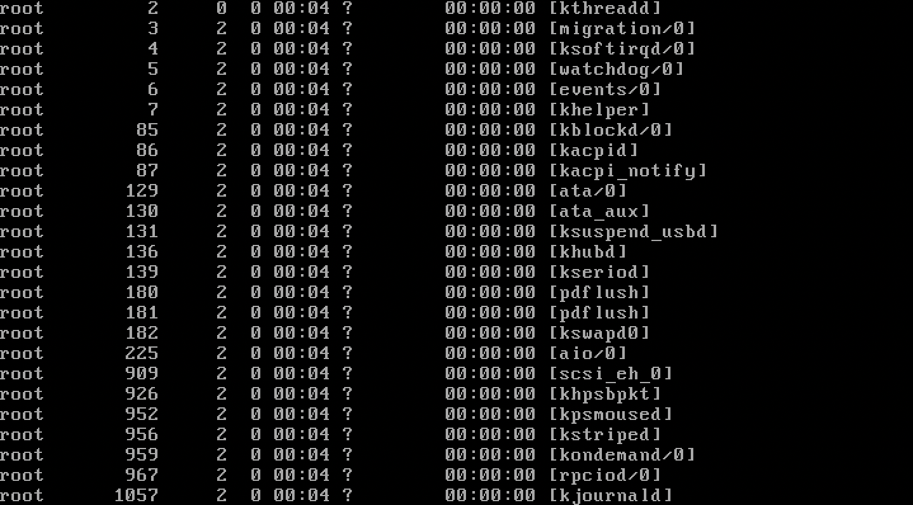
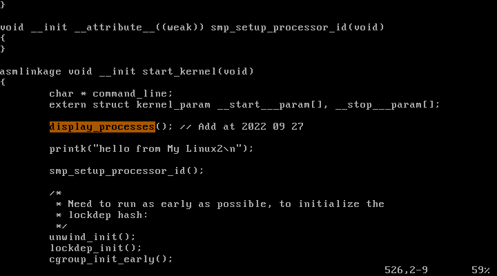
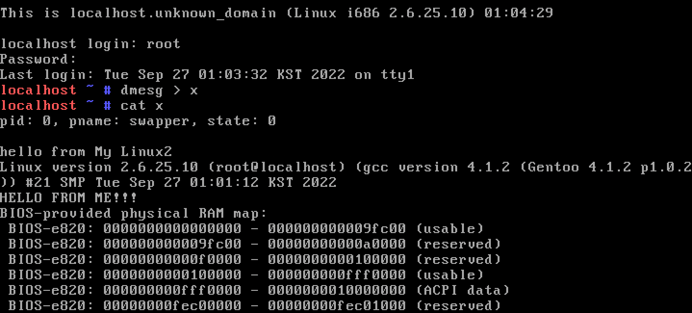
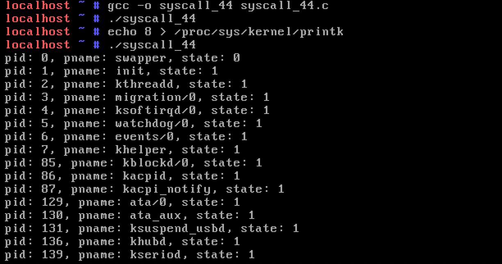
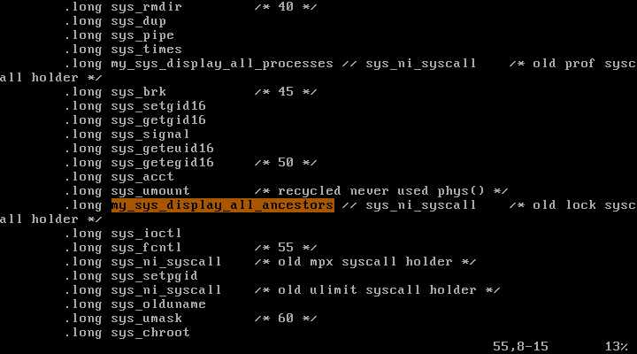

# Process

- interrupt, process, file, memory, I/O
- process definition
- Multiprogramming, Timesharing
- process descriptor, process queue, run queue
- pid, process state, time slice, mm, eip
- `task_struct{}`, `thread_union{}`, KMS(Kernel Mode Stack)
- `init_task`, `current`
- process schedule example
- How processes are created and destroyed
- `fork`, `exec`, `exit`, `wait`
  - `fork`: duplicate the parent
  - `exec`: transform the current process into another
  - `exit`: stop the current process
  - `wait`: wait until the child dies
  - All processes in Linux is created through `fork` and `exec`
- process vs thread
- `pthread_create`
- `kernel_thread`
- shell
- Linux initialization
- Where is CPU

## 1. What is a process

A process is a program loaded in the memory.

## 2. History of OS

- 1945 ~ 1955 :
  - No OS.
- 1955 ~ 1965 :
  - FMS (Fortran Monitoring System). Runs a set of programs one by one.
  - cpu utilization problem: over 90% time the cpu was idle
- 1965 ~ :
  - Multiprogramming. Load several programs at once. Run one by one. If the current one is blocked because of I/O, go to the next process. Fairness problem: cpu-bound program is favored.
- Now :
  - Time Sharing. Allocate x ticks to each process. Now all processes will be stopped either if it executes an I/O instruction or the timer expires.

## 3. Data structures for process

- process descriptor:
  - one for each process.
  - contains information about the corresponding process such as process ID, ticks
  - remained, register values of the last stop-point, memory location, size, etc.
  - `task_struct{}` is the process descriptor in Linux. (`include/linux/sched.h`)
  - "current" points to the current process
  - `thread_union{}` = `task_struct{}` + Kernel Mode Stack
  - `init_task` is the kernel's process descriptor (`arch/x86/kernel/init_task.c`, `include/linux/init_task.h`)
    ```c
        struct task_struct  init_task = INIT_TASK(init_task);
        INIT_TASK(init_task) = {
            ........
            .parent = &init_task,
            .comm = "swapper",
            ........
        }
    ```
- process queue:
  - linked list of process descriptors
  - `&init_task` is the start of this queue.
  - traversing the process queue
    ```c
    void display_processes(){
        struct task_struct *temp;
        temp = &init_task;
        for(;;){
            print process id, user id, program name, process state for temp;
            temp = next_task(temp); // find next process
            if (temp == &init_task) break;
        }
        printk("\n");
    }
    ```
- run queue
  - A linked list of runnable processes.
  - The scheduler looks at this queue to pick the next process **after each interrupt**
  - Each cpu has its own run queue
  - Each run queue is an array of queues based on the priority
    - : `struct prio_array{}.queue[]`

### Exercise-1

#### 3.1) `task_struct` is defined in `include/linux/sched.h` (search for "`task_struct {`"). <br>Which fields of the `task_struct` contain information for process ID, parent process ID, user ID, process status, children processes, the memory location of the process, the files opened, the priority of the process, program name?

- Process ID : `pid_t pid`
- Parent process ID : `struct task_struct parent;`
  - `/* parent process */`
- User ID : `uid_t uid`
- Process status : `volatile long state;`
  - `/* -1 unrunnable, 0 runnable, >0 stopped */`
- Children processes : `struct list_head children;`
  - `/* list of my children */`
- The memory location of the process : `struct mm_struct *mm`
- The files opened : `struct files_struct *files;`
  - `/* open file information */`
- The priority of the process : `int orio, static prio, normal prio;`
- Program name : `char comm[TASK_COMM_LEN]`

#### 3.2) Display all processes with `ps –ef`. Find the pid of `ps -ef`, the process you have just executed. Find the pid and program name of the parent process of it, then the parent of this parent, and so on, until you see the `init_task` whose process ID is 0.

<br>
<br>


```bash
$ ps -ef
UID     PID   PPID    C   STIME   TTY        TIME  CMD
root      1      0    1   00:04   ?      00:00:00  init [3]
...     ...    ...  ...     ...   ...         ...  ...
root   4467      1    0   00:05   tty1   00:00:00  /bin/login --
...     ...    ...  ...     ...   ...         ...  ...
root   4486   4467    0   00:05   tty1   00:00:00  -bash
root   4491   4486    0   00:05   tty1   00:00:00  ps -ef
```

- `ps -ef`의 PID는 4491이다.
- `ps -ef`의 PPID는 4486이므로, parent process는 PID가 4486인 `-bash`이다.
- `-bash`의 PPID는 4467이므로, parent process는 PID가 1인 `init [3]`이다.
- `init [3]`의 PPID는 0으로, parent process는 PID가 0인 `init_task`이다.

#### 3.3) Define `display_processes()` in `init/main.c` (right before the first function definition). Call this function in the beginning of `start_kernel()`. <br>Confirm that there is only one process in the beginning. Find the location where the number of processes becomes 2. Find the location where the number of processes becomes 3. Find the location where the number of processes is the greatest. Use `dmesg` to see the result of `display_processes()`.

`init/main.c` : <br>
<br>

- `init/main.c`에 `display_processes()`를 정의하였다. 코드가 의미하는 바는 다음과 같다.<br>
  - 포인터형 `struct`인 `temp`를 선언하고, `init_task` (커널의 process descriptor) 을 넣어준다.<br>
  - 해당하는 프로세스마다 각각 pid, pname, state를 출력하고, `temp`는 그 다음 프로세스를 지정하도록 한다. <br>
  - `init_task` 다음에도 `init_task`라면 for문을 탈출하고 함수가 끝나게 된다.

<br>
`start_kernel` 함수가 호출되면 `display_processes()`를 가장 먼저 호출할 수 있게 하였다.

변경사항을 적용하기 위해 커널을 컴파일하고, 재부팅하였다.

```bash
$ make bzImage
$ cp arch/x86/boot/bzImage /boot/bzImage
$ reboot
```

`dmesg`로 부팅 메세지를 확인해보았다.<br>
<br>

```bash
pid: 0, pname: swapper, state: 0
```

실행 결과 하나의 프로세스만 있었고, `swapper` 프로세스가 'pid: 0'으로 생성된 것을 볼 수 있었다.

실행 중인 프로세스가 2개가 된 첫 번째 시점은 `kernel_init`의 최상단에서 `display_processes`를 호출했을 때이다.

가장 많은 프로세스가 보여지는 곳은 `kernel_init`에서 `init_post`가 호출된 이후이다.

#### 3.4) Make a system call that, when called, displays all processes in the system. Run an application program that calls this system call and see if this program displays all processes in the system.

프로세스 정보를 출력하는 system call을 만드는 것이므로 `fs/read_write.c`에 함수를 추가한다.

`fs/read_write.c` :<br>


이후 `arch/x86/kernel/syscall_table_32.S` 에서 비어있는 44번 index에 해당 함수를 설정해주었다.

`arch/x86/kernel/syscall_table_32.S` :<br>


이후, 변경사항을 적용하기 위해 `make` 명령어로 리눅스 커널을 컴파일하고 재부팅한 하였다.

```bash
$ make bzImage
$ cp arch/x86/boot/bzImage /boot/bzImage
$ reboot
```

재부팅 후, 만든 시스템 콜 함수를 호출하는 프로그램을 작성하였다.

`syscall_44.c` :

```c
#include <unistd.h>

int main(void) {
    syscall(44);
    return 0;
}
```

로그 레벨을 바꾸고 프로그램을 실행해 시스템 콜 함수를 호출하면 프로세스 목록이 보여진다.

```bash
$ echo 8 > /proc/sys/kernel/printk
$ ./syscall_44
```

<br>
<br>


##### 3.4.1) Make a system call that, when called, displays all ancestor processes of the calling process in the system. For example, if `ex1` calls this system call, you should see: `ex1`, `ex1`’s parent, `ex1`’s parent’s parent, etc. until you reach pid=0 which is Linux itself.

모든 부모의 프로세스 정보를 출력하는 system call을 만드는 것이므로 `fs/read_write.c`에 함수를 추가한다.

`fs/read_write.c` :<br>


`my_sys_display_all_ancestors` 함수에서는, 현재 process의 정보를 얻기 위해, current 포인터를 반환해주는 커널 함수인 `get_current`를 사용하였다.

<br>

이후 `arch/x86/kernel/syscall_table_32.S` 에서 비어있는 53번 index에 해당 함수를 설정해주었다.

`arch/x86/kernel/syscall_table_32.S` :<br>


이후, 변경사항을 적용하기 위해 `make` 명령어로 리눅스 커널을 컴파일하고 재부팅한 하였다.

```bash
$ make bzImage
$ cp arch/x86/boot/bzImage /boot/bzImage
$ reboot
```

재부팅 후, 만든 시스템 콜 함수를 호출하는 프로그램을 작성하였다.

`syscall_53.c` :

```c
#include <unistd.h>

int main(void) {
    syscall(53);
    return 0;
}
```

로그 레벨을 바꾸고 프로그램을 실행해 시스템 콜 함수를 호출하면 현재 프로세스와 조상들의 프로세스 목록이 보여진다.

```bash
$ echo 8 > /proc/sys/kernel/printk
$ ./syscall_53
```


#### 3.5) Run three user programs, `f1`, `f2`, and `f3`, and run another program that calls the above system call as follows. <br>State 0 means runnable and 1 means blocked. Observe the state changes in `f1`, `f2`, `f3` and explain what these changes mean.

`f1.c` :

```c
int i,j; double x=1.2;
for(i=0;i<100;i++){
   for(j=0;j<10000000;j++){ // make f1 busy for a while
       x=x*x;
   }
   // and then sleep 1sec
   usleep(1000000);
}
```

`f2.c` :

```c
int i,j; double x=1.2;
for(i=0;i<100;i++){
   for(j=0;j<10000000;j++){ // make f2 busy for a while
       x=x*x;
   }
   // and then sleep 2sec
   usleep(2000000);
}
```

`f3.c` :

```c
int i,j; double x=1.2;
for(i=0;i<100;i++){
   for(j=0;j<10000000;j++){ // make f3 busy for a while
       x=x*x;
   }
   // and then sleep 3sec
   usleep(3000000);
}
```

`ex1.c` :

```c
      for(i=0;i<100;i++){
         sleep(5);
         syscall(17); // show all processes
                     // assuming the system call number in exercise (3.4) is 44
      }
```

```bash
$ echo 8 > /proc/sys/kernel/printk
$ ./f1&
$ ./f2&
$ ./f3&
$ ./ex1
```

<br>
<br>
<br>
<br>
<br>
<br>
<br>
<br>
<br>
<br>
<br>
<br>
<br>
<br>
<br>
<br>
<br>
<br>
<br>

실행 결과, `f1`, `f2`, `f3`의 상태가 바뀌는 것을 확인할 수 있었다. `ex1`의 state는 0으로 유지되었다.

<br>
<br>


`f1` > `f2` > `f3` > `ex1` 순으로 종료되었다.

#### 3.6) Modify your `my_sys_display_all_processes()` so that it can also display the remaining time slice of each process (`current->rt.time_slice`) and repeat 3.5) as below to see the effect. <br>`chrt -rr 30 ./f1` will run `f1` with priority value = `max_priority`-30 (lower priority means higher priority). <br>`-rr` is to set scheduling policy to `SCHED_RR` (whose `max_priority` is 99).

`init/main.c` :


`display_processes` 함수의 `printk`에 `current->rt.time_slice`를 추가해주고,<br>
변경사항을 적용하기 위해 커널을 컴파일하고, 재부팅하였다.

```bash
$ make bzImage
$ cp arch/x86/boot/bzImage /boot/bzImage
$ reboot
```

`chrt`는 프로세스의 real-time 속성을 수정하는 명령어로, `-rr`은 스케줄링 정책을 `SCHED_RR`으로 설정하는 것을 의미한다.<br>
이때, 프로세스는 낮은 숫자를 가질수록 높은 우선순위를 가진다.

```bash
$ chrt –rr 30 ./f1&
$ chrt -rr 30 ./f2&
$ chrt -rr 30 ./f3&
$ chrt -rr 30 ./ex1
```

<br>
<br>
<br>
<br>
<br>
<br>
<br>
<br>
<br>
<br>
<br>
<br>

실행 결과 각 프로세스가 실행될 때의 잔여 타임 슬라이스를 보여준다. <br>
초 단위로 추측되며 6~9개의 프로세스가 같은 값을 가지는 것으로 보아 굉장히 짧은 시간에 여러 프로세스들이 처리되는 것을 알 수 있다.

처음에는 250 정도가 주어지고 0에 도달하면 25 정도가 새로 채워졌다. 이 과정이 `ex1`이 끝날 때까지 반복되었다.

## 4. Kernel code for process data structures and the scheduler

`include/linux/sched.h` :

```c
struct task_struct {
   long state;  // 0: runnable, >0 : stopped or dead
   int prio;    // priority
   const struct sched_class *sched_class; // scheduling functions depending on
                                          // scheduling class of this process
   struct sched_entity se;  // scheduling info
   struct list_head tasks;  // points to next task
   struct mm_struct *mm;    // memory occupied by this process
   pid_t pid;
   struct task_struct *parent;
   struct list_head children;
   uid_t uid; // owner of this process
   char comm[TASK_COMM_LEN]; // program name
   struct thread_struct thread; // pointer to saved registers
   struct fs_struct *fs;
   struct files_struct *files;
   struct signal_struct *signal;
   struct sighand_struct *sighand;
}

struct sched_class {  // fair class has func name such as task_tick_fair, enqueue_task_fair..
                      // rt class has task_tick_rt, enqueue_task_rt, ...
   void (*enqueue_task)(struct rq *rq, struct task_struct *p, ...);
   void (*dequeue_task)(struct rq *rq, struct task_struct *p, ...);
   struct task_struct *(*pick_next_task)(struct rq *rq);
   void (*task_tick)(struct rq *rq, struct task_struct *p,...);
   .........
}

struct sched_entity {
   u64 sum_exec_runtime;
   u64 vruntime;  // actual runtime normalized(weighted) by the number of
                  // runnable processes. unit is nanosecond
   ................
}
```

struct list_head is little tricky. It does not point to the next item directly. <br>
For example,<br>
`struct list_head tasks;`<br>
does not mean `(current->tasks).next` points to the next task.

`include/linux/list.h` :

```c
struct list_head{
            struct list_head  *next, *prev;
};
```

- `(current->tasks).next` simply points to another struct `list_head` that is included in the next process. To find the next process, use macro: `list_entry()` or `next_tasks()`
  - `list_entry( (current->tasks).next, struct task_struct, tasks)`
  - or
  - `next_task(current)`

We can display all processes in the system by

```c
       struct task_struct *temp;
       temp = &init_task;
       for(;;) {
          printk("pid %d ",temp->pid);
          temp = list_entry(temp->tasks.next, struct task_struct, tasks);
          if (temp == &init_task) break;
       }
```

To display run queues, it is more difficult. <br>
Each process has a priority (“prio” field in `task_struct`), and there are 0 to 139 priorities. <br>
For each priority we have different run queue.
`run_list` points to the next process in the run queue with the priority of the corresponding process. <br>
`this_rq()` will point to the “struct rq” structure for the current cpu. This structure contains 140 run queues.

`kernel/sched.c` :

```c
union  thread_union{
    struct  thread_info  thread_info;
    unsigned long  stack[THREAD_SIZE/sizeof(long)];  // 8192 bytes
}
#define next_task(p)  list_entry(rcu_dereference((p)->tasks.next), struct task_struct, tasks)
#define for_each_process(p)  for(p=&init_task;(p=next_task(p))!=&init_task;) do
```

`arch/i386/kernel/init_task.c` :

```c
union thread_union init_thread_union;
struct task_struct  init_task = INIT_TASK(init_task);
```

`include/asm-i386/thread_info.h` :

```c
struct thread_info{
   struct task_struct *task;        // main task structre
   struct exec_domain *exec_domain; // execution domain
   long               flags;
   long               status;
   __u32              cpu;          // cpu for this thread
   mm_segment_t       addr_limit;   // 0-0xBFFFFFFF (3G bytes) for user-thread
                                    // 0-0xFFFFFFFF (4G bytes) for kernel-thread
}
```

`kernel/sched.c` :

```c
#define DEF_TIMESLICE (100*HZ/1000)     // 100 ms for default time slice. HZ=1000
                                        // HZ is num of timer interrupts per second.
struct prio_array {  // run queue
   unsigned int nr_active;
   struct list_head queue[MAX_PRIO];    // run queues for various priorities
};
void __activate_task(p, struct rq *rq) { // wake up p
   struct prio_array * target = rq->active;
   enqueue_task(p, target);
   p->array = array;
}
```

process priority: each process has priority in “prio” (value 0..139)
0..99 is for real time task. 100..139 for user process

140 priority list

The kernel calls schedule() at the end of each ISR(Interrupt Service Routine) to pick the next process.

`kernel/sched.c` :

```c
void schedule() {
   struct task_struct *prev, *next;
   struct prio_array *array;

   prev = current;
   rq = this_rq();  // run queue of the belonging cpu
   array = rq->active;  // active run queue
   deactivate_task(prev, rq);
   idx = sched_find_first_bit(array->bitmap);
   queue = array->queue + idx;
   /** old code
   next = list_entry(queue->next, struct task_struct, run_list); // next task
   array = next->array;
   **/
   next=pick_next_task(rq, prev);
   rq->curr = next;  // next is the curr task
   context_switch(rq, prev,next); // move to next
}

struct task_struct * pick_next_task(..){
   class=sched_class_highest;
   p=class->pick_next_task(rq);
   return p;
}

struct task_struct *pick_next_task_fair(rq){ // for cfs case
      cfs_rq=&rq->cfs;
      se=pick_next_entiry(cfs_rq);
      p = task_of(se);
      return p;
}

struct sched_entity *pick_next_entity(..){
   rb_entry(.....); // find the next task in rb tree
}

#define this_rq()  (&__get_cpu_var(runqueues))
static DEFINE_PER_CPU_SHARED_ALIGNED(struct rq, runqueues);
#define DEFINE_PER_CPU_SHARED_ALIGNED(type, name) \
__attribute__((__section__(“.data.percpu”))) __typeof__(type) per_cpu__##name
```

The above will make

```c
static  struct  rq  per_cpu_ruqueues;

void wake_up_new_task(struct task_struct *p, ..){
   struct rq *rq, *this_rq;
   int  this_cpu, cpu;
   rq = task_rq_lock(p, ...);  // the runqueue of the cpu this task belongs to
   cpu = task_cpu(p);  // cpu p belongs to
   __activate_task(p, rq);  // insert p in rq
}

void scheduler_tick(){ // timer interrupt calls this to
                     // decrease time slice of current p (in old code)
                      // in new code (after 2.6.23), it increases curr->se->vruntime
   int cpu=smp_processor_id();
   struct rq *rq=cpu_rq(cpu);
   struct task_struct *curr=rq->curr;
   curr->sched_class->task_tick(rq, curr, 0); // task_running_tick() in old code
   .......
}

/** old code
void task_running_tick(rq, p){
   if (!--p->time_slice){ // decrease it. if 0, reschedule
      dequeue_task(p, rq->active);
      set_tsk_need_resched(p);
      p->time_slice=task_timeslice(p);  // reset time slice
      enqueue_task(p, rq->active); // put back at the end
   }
}
**/

void task_tick_fair(rq, curr, ..){
      se=&curr->se;  // sched_entity
      cfs_rq=cfs_rq_of(se);
      entity_tick(cfs_rq, se, ...);
}
void entity_tick(cfs_rq, ...){
   update_curr(cfs_rq);
   .........
}
void update_curr(cfs_rq){
   struct sched_entity *curr=cfs_rq->curr;
   now=rq_of(cfs_rq)->clock;
   delta_exec=now - curr->exec_start; // running time so far for curr
   __update_curr(cfs_rq, curr, delta_exec);
   curr->exec_start = now;
}
void __update_curr(cfs_rq, struct sched_entity *curr, delta_exec){
   curr->sum_exec_runtime += delta_exec;
   delta_exec_weighted=calc_delta_fair(delta_exec, curr);
   curr->vruntime += delta_exec_weighted;
}
```

## 5. fork

When the kernel starts, we have only one process: `init_task`, which represents the kernel itself. Other processes are created by `fork`.

### 1) fork system call duplicates a process.

example:

```c
#include <sys/types.h>
#include <sys/wait.h>
#include <unistd.h>
int x;
void main(){
   x= fork();
   if (x!=0) {
      printf("korea %d\n", x);
      while (1);
   }
   else {
      printf("china\n");
      while (1);
   }
}
```

What is the result of above code?

### 2) Algorithm of `fork`

`fork()` ==> `mov $2`, `%eax`<br>
`int $0x80`<br>
==> `system_call` ==> `arch/x86/kernel/process_32.c/sys_fork`<br>
=> `kernel/fork.c/do_fork()`

`fork` is translated into 2 assembly instructions as below by C library:

```
        mov $2, %eax
        int $0x80
```

- The ISR for interrupt 0x80 is `system_call` which calls in turn `sys_fork` when eax=2. `sys_fork` calls `do_fork` and `do_fork` does followings:
  - (1) copy the body of the parent process
  - (2) copy thread_union of the parent process, and adjust some information
  - (3) insert child into the process queue
  - (4) return 0 to the child, and return child’s pid to the parent

### 3) pthread_create

pthread_create is similar to `fork()` except it does not copy the body of the parent.

`p1.c:`

```c
#include <stdio.h>
#include <stdlib.h>
#include <pthread.h>

void * foo(void * aa){
   printf("hello from child\n");
   return NULL;
}

void main(){
   pthread_t x;
   pthread_create(&x, NULL, foo, NULL); // make a child which starts at foo
   printf("hello from parent\n");
}
```

```bash
$ gcc –o p1 p1.c –lpthread
$./p1
hello from child
hello from parent
```

### 4) kernel_thread

Use `kernel_thread()` in Linux kernel which is similar to pthread_create().

```c
    start_kernel() {
       trap_init();
       init_IRQ();
       time_init();
       console_init();
       ...............
       rest_init();
    }
    rest_init() {
       .........
       kernel_thread(kernel_init, ...........);
       pid=kernel_thread(kthreadd, ....);
       schedule();
       cpu_idle();
    }
```

The above Linux code calls `kernel_thread`(`kernel_init`, ....). <br>
After this call the kernel is duplicated (but only the thread_union of the kernel is duplicated), and the child's starting location is `kernel_init()`.<br>
Similarly, after `kernel_thread`(`kthreadd`,...), another child is born whose starting location is `kthreadd`. <br>
Since we have three processes, they will be scheduled one by one.

## 6. exec

### 1) `exec` system call transforms one process to another

`ex1.c` :

```c
void main(){
   printf("I am ex1\n");
}
```

`ex2.c` :

```c
void main(){
   execve("./ex1", 0,0);
   printf("I am ex2\n");
}
```

```bash
$ gcc ex1.c -o ex1
$ gcc ex2.c -o ex2
$ ex2
```

What will be the result?

### 2) Algorithm of `exec`

`exec` ==> `mov $11`, `%eax` ==> `system_call` ==> `sys_execve`<br>
`int $0x80`

`exec` is translated into 2 assembly instructions as below by C library:

```
        mov $11, %eax
        int $0x80
```

- The ISR for interrupt 0x80 is `system_call` which calls in turn `sys_execve` when eax=11. (`sys_execve` is in `arch/x86/kernel/process_32.c`)<br>
  `sys_execve` calls `do_execve`(`fs/exec.c`) which does following things:
  - (1) remove old body
  - (2) load new body
  - (3) update the `task_struct`
  - (4) update the KMS (the stack portion in `thread_union`) such that
    - KMS.eip = starting location of the new body

### 3) example code

`exec1.c` :

```c
#include <sys/types.h>
#include <sys/wait.h>
#include <unistd.h>
int x;
void main(){
        char * exec2 = "./exec2";
        char * argv[2];
        argv[0]=exec2;
        argv[1]=0;

        x=fork();
        if (x!=0){
                printf("korea %d\n",x);
                execve("./exec2", argv, 0);
                printf("exec failed\n");
        }
        else{
                printf("japan\n");
                for(;;);
        }
}
```

`exec2.c` :

```c
#include <sys/types.h>
#include <sys/wait.h>
#include <unistd.h>
int x;
void main(){
   printf("china\n");
}
```

```bash
$ gcc -o exec2 exec2.c
$ gcc -o exec1 exec1.c
exec1
```

## 7. shell

shell uses `fork()` and `exec()` to run the command:

```c
#include <stdio.h>
#include <unistd.h>
#include <errno.h>

void main(){
   int x,y;
   char buf[50];
   char * argv[2];

   for(;;){
      printf("$ ");
      scanf("%s", buf); // get command. no arg can be input this way
      argv[0]=buf;
      argv[1]=NULL;

      x=fork();
      if (x==0){ // child
          printf("I am child to execute %s\n", buf);
          y=execve(buf, argv, 0);
          if (y<0){
             printf("exec failed. errno is %d\n", errno);
             exit(1);
          }
      } else wait();
   }
}
```

## 8. Initialization process of Linux

```c
start_kernel()
==> rest_init()
==> kernel_thread(kernel_init, ....); // now we have two processes (init_task and kernel_init)
==> kernel_thread(kthreadd, ...); // init_task runs first and create another thread.

// now we have three processes(init_task, kernel_init, kthredd)

==> schedule(); // init_task calls schedule. the scheduler picks kernel_init.
                // prio of init_task is 140. prio of the other two is 120.
==> kernel_init()
==> do_basic_setup()
...........
init_post();
==> init_post()
==> run_init_process("/sbin/init", ......);
==> kernel_execve(“/sbin/init”, ...); //kernel_init is transformed into /sbin/init.
==> /sbin/init
==> for (i=0;i < number of programs listed in /etc/inittab; i++) {
       x=fork();
       if (x==0){ // child
           execve(next program listed in /etc/inittab, ...);
       }
     } // parent goes back to the loop to create the next child
     for(;;){ // parent
       waits here;
     }
==> fork();
==> child init calls execve(“/sbin/agetty”,..); // child init
                                                //  is transformed into /sbin/agetty
==> when user logins to this server /sbin/agetty execs to /bin/login
    and display
          login:
==> when user types login ID and password correctly /bin/login makes a child and
     execs the child to the shell as specified in /etc/passwd, which is usually /bin/bash
          root:x:0:0:root:/root:/bin/bash
          ...............
==> /bin/bash runs the shell code: display '#', read command, fork, let the child exec to the command, etc.
==> when user types ps -ef, shell forks and execs the child to ps -ef
init_task->/sbin/init->/sbin/agetty->/bin/login->/bin/bash->ps –ef
```

## 9. What happens when you enter a Linux command?

Shell code again

```c
   .........
   for(;;){
      printf("$ ");
      scanf("%s", buf); // get command. no arg can be input this way
      .................
      x=fork();
      if (x==0){ // child
          y=execve(buf, argv, 0);
          ............
      } else wait();
   }
```

- 1. Shell runs `printf("$")`, and this library function calls `write(1, "$", 1)` which will display prompt. (`printf` => `write` => `INT 128` => `sys_write` => `display "$"`)
- 2. Shell runs `scanf("%s", buf);`, and this library function calls `read(0, buf, n)` which will make the shell sleep until the user enters a command. <br>Making shell sleep means setting shell's state to TASK_INTERRUPTIBLE (a blocked state) and taking it out of the run queue. <br>Since shell cannot be scheduled, the scheduler picks kernel (pid=0) as the next process and runs `cpu_idle()`. (`scanf` => `read` => `INT 128` => `sys_read` => make shell sleep; cpu jumps to `cpu_idle`)
- 3. A user types command.<br>`$ ls<Enter>`
- 4. Each key typing will raise keyboard interrupt.<br>`press l` => `INT 33` => `atkbd_interrupt` => store `l` => cpu goes back to `cpu_idle()` <br>=> release `l` => `INT 33` => `atkbd_interrupt` => ignore key release => cpu goes back to `cpu_idle()` <br>=> press `s` => `INT 33` => ...... <br>=> press <Enter> => `INT 33` => `atkbd_interrupt` => store `ls` in shell's buf and wakes up shell.
  - Waking up shell means set its state to TASK_RUNNING and put it back to the run queue. Now the scheduler picks shell as the next process and shell resumes execution.
- 5. shell runs `x=fork()`, and `fork()` will make a child.<br>(`fork` => `INT 128` => `do_fork()` => make a child; assume the scheduler picks parent first)
- 6. parent shell runs `wait()`, and `wait()` will make it sleep. Now the scheduler picks child.<br>(`wait` => `INT 128` => `sys_wait`)
- 7. child shell runs `execve("ls", ....)` which will change it to `/bin/ls` program. The scheduler picks the child again (parent is still sleeping).<br>(`execve` => `INT 128` => `do_execve`)
- 8. `/bin/ls` runs and shows all file names in the current directory in the screen. <br>At the end, it calls `exit()`. `exit()` will make it a zombie (set its state to TASK_ZOMBIE) and sends a signal to parent. <br>This signal wakes up parent (set its state to TASK_RUNNING). <br>The scheduler now picks parent.
- 9. parent goes back to the beginning of `for(;;)` loop and runs `printf("$")`.<br>`$`

## 10. Exercise-2

### 1) Run the program below. What happens? Explain the result.

`ex1.c` :

```c
void main(){
   int x;
   x=fork();
   printf("x:%d\n", x);
}
```

### 2) Try below and explain the result.

`ex1.c` :

```c
void main(){
   fork();
   fork();
   fork();
   for(;;);
}
```

```bash
$ gcc –o ex1 ex1.c
$ ./ex1 &
$ ps –ef
```

### 3) Run following code. What happens? Explain the result.

`ex1.c` :

```c
void main(){
   int i; float y=3.14;
   fork();
   fork();
   for(;;){
      for(i=0;i<1000000000;i++) y=y*0.4;
      printf("%d\n", getpid());
   }
}
```

### 4) Try below and explain the result.

`ex1.c` :

```c
void main(){
char *argv[10];
   argv[0]=”./ex2”;
   argv[1]=0;
   execve(argv[0], argv, 0);
}
```

`ex2.c` :

```c
void main(){
   printf("korea\n");
}
```

```bash
$ gcc –o ex1 ex1.c
$ gcc –o ex2 ex2.c
$ ./ex1
```

### 5) Run following code and explain the result.

```c
void main(){
char *argv[10];
   argv[0]=”/bin/ls”;
   argv[1]=0;
   execve(argv[0], argv, 0);
}
```

### 6) Run following code and explain the result.

```c
void main(){
char *argv[10];
   argv[0]=”/bin/ls”;
   argv[1]="-a";
   argv[2]=0;
   execve(argv[0], argv, 0);
}
```

### 7) Run following code and explain the result.

`p1.c` :

```c
#include <stdio.h>
#include <stdlib.h>
#include <pthread.h>
void * foo(void * aa){
   printf("hello from child\n");
   return NULL;
}
void main(){
   pthread_t x;
   pthread_create(&x, NULL, foo, NULL); // make a child which starts at foo
   printf("hi from parent\n");
   pthread_join(x, NULL);                // wait for the child

}
```

```bash
$ gcc –o p1 p1.c –lpthread
$ ./p1
```

### 8) Run following code and explain the difference.

`p1` :

```c
#include <stdio.h>
int y=0;
void main(){
   int x;
   x=fork();
   if (x==0){
      y=y+2;
      printf("process child:%d\n", y);
   }else{
      y=y+2;
      printf("process parent:%d\n", y);
   }
}
```

`p2` :

```c
#include <stdio.h>
#include <stdlib.h>
#include <pthread.h>
int y=0;
void * foo(void *aa){ // aa is arguments passed by parent, if any.
   y=y+2;
   printf("thread child:%d\n", y);
   return NULL;
}
void main(){
   pthread_t x;
   pthread_create(&x, NULL, foo, NULL);
   y=y+2;
   printf("thread parent:%d\n", y);
   pthread_join(x, NULL);                // wait for the child
}
```

## 11. Homework-3

### 1) Try the shell code in section 7. Try Linux command such as `/bin/ls`, `/bin/date`, etc.

### 2) Print the pid of the current process (`current->pid`) inside `rest_init()` and `kernel_init()`. The pid printed inside `rest_init()` will be 0, but the pid inside `kernel_init()` is 1. 0 is the pid of the kernel itself. <br>Why do we have pid=1 inside `kernel_init()`? Find a location where `current->pid` will print `2`.

### 3) The last function call in `start_kernel()` is `rest_init()`. If you insert `printk()` after `rest_init()`, it is not displayed during the system booting. Explain the reason.

```c
    void start_kernel(){
        ............
        printk("before rest_init\n");  // this will be printed out
        rest_init();
        printk("after rest_init\n");   // but this will not.
    }
```

### 4) The CPU is either in some application program or in Linux kernel. You always should be able to say where is the CPU currently. Suppose we have a following program (`ex1.c`).

```c
      void main(){
         printf("korea\n");
      }
```

When the shell runs this, CPU could be in shell program or in `ex1` or in kernel. Explain where is CPU for each major step of this program. You should indicate the CPU location whenever the cpu changes its location among these three programs. Start the tracing from the moment when the shell prints a prompt until it prints next prompt.

```c
shell: printf("$");               // CPU is in shell
=> write(1, "$", 1)               // CPU is in c library
=> INT 128                        // CPU is in c library

kernel:
      sys_write()                // CPU is in kernel and display '$' in screen
                                 // after sys_write() kernel schedules shell again
                                 // and CPU goes back to shell

shell: scanf("%s", buf);         // CPU is in shell
..............
.............
shell: printf("$");              // CPU is back in shell
```

### 5) What happens if the kernel calls `kernel_init` directly instead of calling `kernel_thread(kernel_init, ...)` in `rest_init()`? Call `kernel_init` with `NULL` argument and explain why the kenel falls into panic.

```c
             ...............
             kernel_init(NULL);
             .............
```

### 6) Trace `fork`, `exec`, `exit`, `wait` system call to find the corresponding code for the major steps of each system call.

### 7) Explain the result of following:

```bash
$ ./startsys;./sysnum;./stopsys
```

where, `startsys` sets the kernel flag so that system call number can be displayed, `stopsys` resets it, and `sysnum` calls `printf`.

`sysnum.c` :

```c
void main(){
   printf("hi\n");
}
```

`startsys.c` :

```c
void main(){
   syscall(31); // start printing sysnum
}
```

`stopsys.c` :

```c
void main(){
   syscall(32); // stop printing sysnum
}
```

### 8) When the shell runs

```c
         execve(argv[0], argv, 0);
```

how the Linux knows the value of `argv`?

### 9) Write a program that causes divide-by-zero fault:

```c
        int x,y;
        y=0;
        x=20/y;
```

This program, when run, will print:<br>
`Floating point exception`<br>
and dies. It dies because of divide-by-zero exception. Modify the kernel such that the system prints instead (when this program runs):<br>
`Divide-by-zero exception`<br>
`Floating point exception`<br>

Tip) to make a call to a new function from `entry.S`, you need to protect registers as follows:

```
       SAVE_ALL
       call new_function
       RESTORE_REGS
```

## 11. exit

All programs end with `exit()` `system call`. Even If the programmer didn't put `exit()` in his code, the compiler will provide it in crtso (**C** **r**un-**t**ime **s**tart-**o**ff function).

### 1) algorithm

- remove body
- make it a zombie
- send SIGCHLD to the parent
- adopt children to init process
- schedule next process

### 2) kernel code

`exit` -> `sys_exit` ->
`kernel/exit.c`:

```c
do_exit() {
      struct  task_struct  *tsk = current;
      exit_mm(tsk);  // remove body
      exit_sem(tsk);
      __exit_files(tsk);
      __exit_fs(tsk);      // remove resouces
      exit_notify(tsk);  // send SIGCHLD to the parent, ask init to adopt my own child,
                       // set tsk->exit_state = EXIT_ZOMBIE to make it a zombie
      tsk->state = TASK_DEAD;
      schedule();     // call a scheduler
}
```

## 12. wait

The parent should wait in `wait` to collect the child; otherwise the child stays as a zombie consuming 8192 bytes of the memory.

### 1) algorithm

```
if child has exit first (that is, if the child is a zombie)
    let it die completely (remove its process descriptor)
else (child is not dead yet)
    block parent
    remove parent from the run queue
    schedule next process
When later the child exits, the parent will get SIGCHLD, wakes up, and be inserted into the run queue.
```

### 2) kernel code

`wait` -> `sys_wait4` ->
`kernel/exit.c` :

```c
do_wait() {
   struct  task_struct *tsk;
   DECLARE_WAITQUEUE(wait, current);  // make a "wait" queue
   add_wait_queue(&current->signal->wait_chldexit, &wait);
   current->state = TASK_INTERRUPTIBLE; // block parent
   tsk = current;
   do{
      list_for_each(_p, &task-children){
         p = list_entry(...);
         if (p->exit_state == EXIT_ZOMBIE){ // if child has exit first
            wait_task_zombie(p, ...); // kill it good
            break;
         }
         // otherwise, it's still alive. wait here until it is dead
         wait_task_contiuned(p,...);
         break;
   }
   schedule();
}
```
