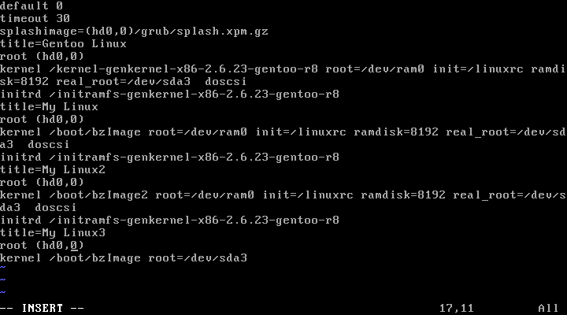
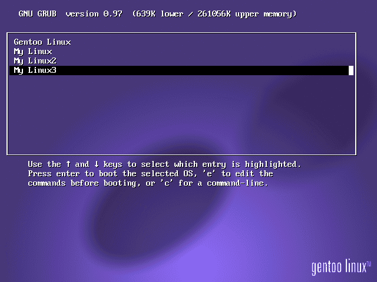
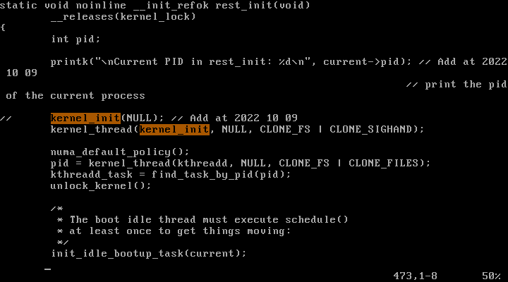
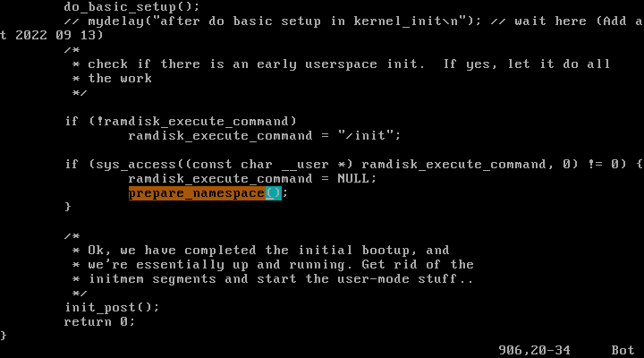
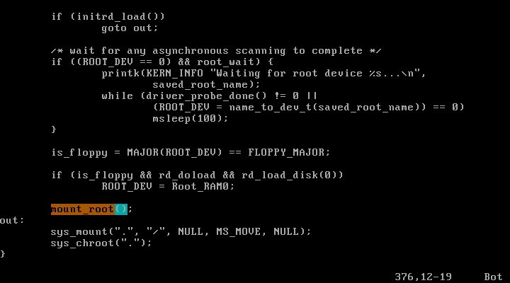
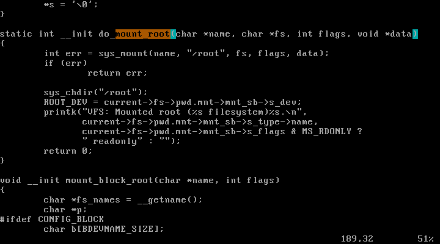
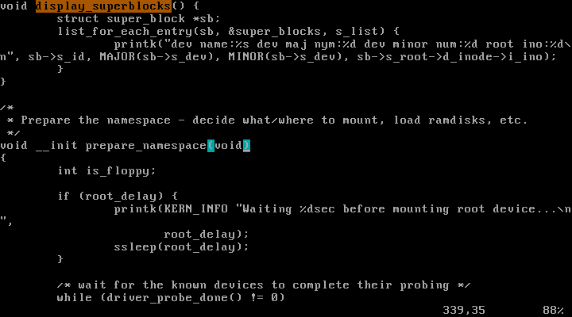
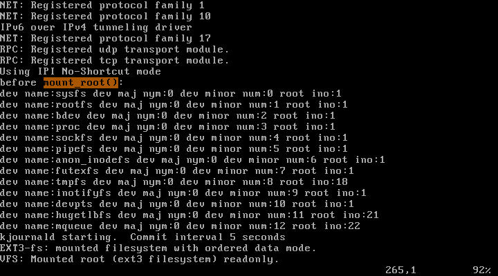
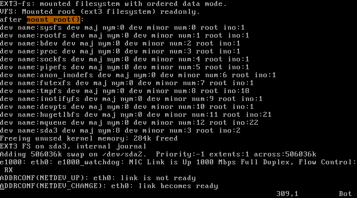
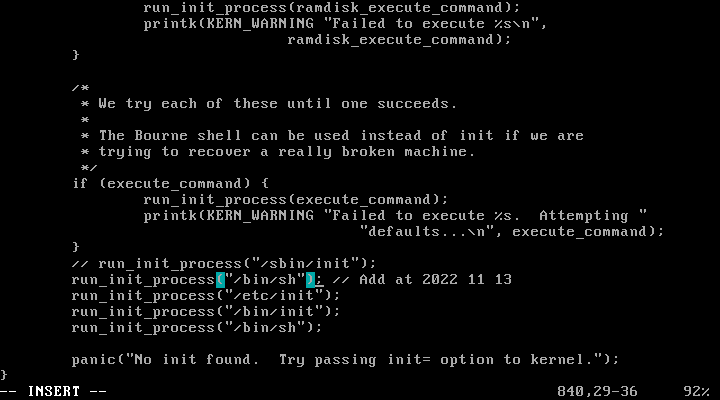

## 5. homework

### 1) Your Gentoo Linux has two disks: `/dev/sda3` and `/dev/sda1`. Which one is the root file system? Where is the mounting point for the other one? Use `mount` command to answer this.

```bash
$ mount
```


`/dev/sda3`은 `/`에 연결되었고, `/dev/sda1`은 `/boot`에 연결되었다. 따라서 `/dev/sda3`은 루트 파일 파티션이고, `/dev/sda1`은 부팅 파티션이다.

### 1-1) Redo 1) after mounting myfd to temp directory as you did in hw3 in lecture6-fs.docx.

```bash
$ mkdir temp
$ mount -o loop myfd temp # connect myfd to temp direcotry, which is called mounting
$ mount
```


`/root/linux-2.6.25.10/myfd`은 `/root/linux-2.6.25.10/temp`에 추가로 연결된 것을 확인할 수 있다.

### 2) Add another entry in `/boot/grub/grub.conf` as below. This boot selection does not use initrd directive to prevent initramfs loading (initramfs is a temporary in-ram file system used for performance improvement).

`/boot/grub/grub.conf`에 아래와 같이 entry를 추가하였다.

```bash
$ vi /boot/grub/grub.conf
```

```
title=MyLinux3
root (hd0,0)
kernel /boot/bzImage root=/dev/sda3
```



그 후, 변경사항을 컴파일 하고 재부팅시켰다.

```bash
$ cd linux-2.6.25.10
$ make bzImage
$ cp arch/x86/boot/bzImage /boot/bzImage
$ reboot
```


재부팅 후에는 My Linux3를 사용하였다.



### 3) The kernel calls `mount_root` to cache the root file system. Starting from `start_kernel`, find out the chain of intermediate functions that eventually calls `mount_root`. Confirm your prediction by printing out messge at each intermediate function of this chain until you reach `mount_root()`.

`init/main.c` - `start_kernel` :<br>
<br>
`start_kernel`에서는 `rest_init`을 호출한다.

`init/main.c` - `rest_init` :<br>
<br>
`rest_init`에서는 `kernel_init`을 호출한다.

`init/main.c` - `kernel_init` :<br>
<br>
`kernel_init`에서는 `init/do_mounts.c`에 있는 `prepare_namespace`을 호출한다.

`init/do_mounts.c` - `prepare_namespace` :<br>
<br>
`prepare_namespace`에서는 `mount_root`을 호출한다.

`init/do_mounts.c` - `mount_root` :<br>
<br>
`mount_root`는 root file system을 caching한다.

### 4) Find the data type for each added variable for `super_block`, `inode`, `buffer_head`, and `dentry`.

`include/linux/fs.h`:

```c
struct super_block {
    struct list_head s_list; /* Keep this first */
    dev_t s_dev;             /* search index; _not_ kdev_t */
    unsigned long s_blocksize;
    unsigned char s_blocksize_bits;
    unsigned char s_dirt;
    unsigned long long s_maxbytes; /* Max file size */
    struct file_system_type *s_type;
    const struct super_operations *s_op;
    struct dquot_operations *dq_op;
    struct quotactl_ops *s_qcop;
    const struct export_operations *s_export_op;
    unsigned long s_flags;
    unsigned long s_magic;
    struct dentry *s_root;
    struct rw_semaphore s_umount;
    struct mutex s_lock;
    ...
};

struct inode {
    struct hlist_node i_hash;
    struct list_head i_list;
    struct list_head i_sb_list;
    struct list_head i_dentry;
    unsigned long i_ino;
    atomic_t i_count;
    unsigned int i_nlink;
    uid_t i_uid;
    gid_t i_gid;
    dev_t i_rdev;
    u64 i_version;
    loff_t i_size;
#ifdef __NEED_I_SIZE_ORDERED
    seqcount_t i_size_seqcount;
#endif
    struct timespec i_atime;
    struct timespec i_mtime;
    struct timespec i_ctime;
    unsigned int i_blkbits;
    blkcnt_t i_blocks;
    unsigned short i_bytes;
    umode_t i_mode;
    spinlock_t i_lock; /* i_blocks, i_bytes, maybe i_size */
    struct mutex i_mutex;
    ...
};
```

`include/linux/buffer_head.h`:

```c
struct buffer_head {
    unsigned long b_state;           /* buffer state bitmap (see above) */
    struct buffer_head *b_this_page; /* circular list of page's buffers */
    struct page *b_page;             /* the page this bh is mapped to */

    sector_t b_blocknr; /* start block number */
    size_t b_size;      /* size of mapping */
    char *b_data;       /* pointer to data within the page */

    struct block_device *b_bdev;
    bh_end_io_t *b_end_io;             /* I/O completion */
    void *b_private;                   /* reserved for b_end_io */
    struct list_head b_assoc_buffers;  /* associated with another mapping */
    struct address_space *b_assoc_map; /* mapping this buffer is associated with */
    atomic_t b_count;                  /* users using this buffer_head */
};
```

`include/linux/deache.h`:

```c
struct dentry {
    atomic_t d_count;
    unsigned int d_flags;  /* protected by d_lock */
    spinlock_t d_lock;     /* per dentry lock */
    struct inode *d_inode; /* Where the name belongs to - NULL is negative */
    /*
     * The next three fields are touched by __d_lookup.  Place them here
     * so they all fit in a cache line.
     */
    struct hlist_node d_hash; /* lookup hash list */
    struct dentry *d_parent;  /* parent directory */
    struct qstr d_name;

    struct list_head d_lru; /* LRU list */
    /*
     * d_child and d_rcu can share memory
     */
    union {
        struct list_head d_child; /* child of parent list */
        struct rcu_head d_rcu;
    } d_u;
    struct list_head d_subdirs; /* our children */
    struct list_head d_alias;   /* inode alias list */
    unsigned long d_time;       /* used by d_revalidate */
    struct dentry_operations *d_op;
    struct super_block *d_sb; /* The root of the dentry tree */
    void *d_fsdata;           /* fs-specific data */
#ifdef CONFIG_PROFILING
    struct dcookie_struct *d_cookie; /* cookie, if any */
#endif
    int d_mounted;
    unsigned char d_iname[DNAME_INLINE_LEN_MIN]; /* small names */
};
```

### 5) Change the kernel such that it displays all superblocks before it calls `mount_root` and after `mount_root`. Boot with "My Linux3" to see what happens.

모든 superblocks를 표시하기 위해 아래 코드를 `prepare_namespace` 함수 정의 전에 추가해주었다.

```c
void display_superblocks(){
    struct super_block *sb;
    list_for_each_entry(sb, &super_blocks, s_list) {
        printk("dev name:%s dev maj num:%d dev minor num:%d root ino:%d\n",
                sb->s_id, MAJOR(sb->s_dev), MINOR(sb->s_dev),
                sb->s_root->d_inode->i_ino);
    }
}
```



그리고, `prepare_namespace` 함수 정의 내에서 `mount_root` 함수를 호출하는 부분의 앞뒤로 `display_superblocks()` 함수를 호출해주었다.

변경사항을 적용하기 위해 컴파일하고, 재부팅하며 부팅 메세지를 확인하였다.

```bash
$ make bzImage
$ cp arch/x86/boot/bzImage /boot/bzImage
$ reboot
# Boot with "My Linux3"
$ dmesg > x
$ vi x
```




mount_root가 호출된 이후에는 "dev name: sda3, dev major num: 8, dev minor num: 3, root ino: 2"가 더 출력된다.

디바이스 번호는 각 디바이스의 고유번호이다. "/dev"에 각 디바이스의 파일 이름이 적혀 있고, ls -l을 통해 각 디바이스의 major, minor 번호를 볼 수 있다. major 번호는 그 디바이스의 번호이고, minor 번호는 그 디바이스 종류 안에서의 구별 번호를 의미한다. 위 내용은 "Documentation/devices.txt"으로 가면 자세한 정보를 볼 수 있다.

### 6) Change the kernel such that it displays all cached inodes before it calls `mount_root` and after `mount_root`. Boot with "My Linux3" to see what happens.

To display all cached indoes, use below.

```c
extern struct list_head inode_in_use;
void display_all_inodes(){
    struct inode *in;
    list_for_each_entry(in, &inode_in_use, i_list){
        printk("dev maj num:%d dev minor num:%d inode num:%d sb dev:%s\n",
MAJOR(in->i_rdev), MINOR(in->i_rdev), in->i_ino, in->i_sb->s_id);
    }
}
```

#### 6-1) Modify display_all_inodes such that it can also diplay the file name and file byte size of each file represented by the inode.

#### 6-2) Make a system call that displays file name and file byte size of all inodes in use. Show only the first 100 files. Look at the result with dmesg command.

#### 6-3) Modify your system call in 6-2) so that it can display mounting points. Mount myfd to temp directory and confirm your system call can detect it.

### 7) The pid=1 process (kernel_init) eventually execs to `/sbin/init` with `run_init_process("/sbin/init");` by calling `kernel_execve("/sbin/init", ....)` in `init/main.c/init_post()`. Change the kernel such that it execs to `/bin/sh`. Boot the kernel, and you will find you cannot access `/boot/grub/grub.conf`. Explain why.

`init/main.c` :<br>


커널이 로드되면 메모리, 프로세서, I/O 등 여러 하드웨어를 초기화하고 설정한다. 압축된 initramfs 이미지를 메모리의 미리 정해진 위치로부터 읽어 "/sysroot/"에 직접 풀고, 모든 필요한 드라이버를 로드한다. 그 후, 커널은 루트 장치를 생성하여 읽기 전용으로 루트 파티션을 마운트하고 사용되지 않는 메모리를 해제한다.

커널이 로드되면 사용자 환경을 설정하기 위해 "/sbin/init" 프로그램을 실행한다. "/sbin/init" 프로그램은 최상위 프로세스(pid = 1)로, 나머지 부트 프로세스를 주관하며 사용자를 위한 환경을 설정하는 역할을 한다.

"/sbin/init"는 파일 시스템의 구조를 검사하고, 시스템을 마운트하고, 서버 데몬을 띄우고, 사용자 로그인을 기다리는 등의 역할을 한다. 만약 "/sbin/init"을 실행하지 않고 "/bin/sh"를 실행하면, "/dev/sda1"가 "/boot"에 연결되지 않을 것이다.

### 8) Try following code. Make /aa/bb and type some text with length longer than 50 bytes. Explain the result.

```c
      x=open("/aa/bb", O_RDONLY, 00777);
      y=read(x, buf, 10);
      buf[y]=0;
      printf("we read %s\n", buf);
      lseek(x, 20, SEEK_SET);
      y=read(x, buf, 10);
      buf[y]=0;
      printf("we read %s\n", buf);
      x1=dup(x);
      y=read(x1, buf, 10);
      buf[y]=0;
      printf("we read %s\n", buf);
      link("/aa/bb", "/aa/newbb");
      x2=open("/aa/newbb", O_RDONLY, 00777);
      y=read(x2, buf, 10);
      buf[y]=0;
      printf("we read %s\n", buf);
```

### 9) Check the inode number of /aa/bb and /aa/newbb and confirm they are same.

```bash
$ ls –i /aa/*
```

### 10) Try `fork()` and confirm the parent and child can access the same file.

```c
    x=open("/aa/bb", ...);
    y=fork();
    if (y==0){
       z=read(x, buf, 10);
       buf[z]=0;
       printf("child read %s\n", buf);
    }else{
       z=read(x, buf, 10);
       buf[z]=0;
       printf("parent read %s\n", buf);
   }
```

### 11) (Using "chroot" and "chdir") Do following and explain the result of "ex1".

#### a. Make f1 in several places with different content (in "/", in "/root", and in "/root/d1") as follows.

```bash
$ cd  /
$ echo hello1 > f1
$ cd
$ echo hello2 > f1
$ mkdir d1
$ echo hello3 > d1/f1
```

#### b. Make ex1.c that will display "/f1" before and after "chroot", and "f1" before and after "chdir" as follows.

```c
      display_root_f1();  // display the content of "/f1"
      chroot(".");
      display_root_f1();
      display_f1();       // display the content of "f1"
      chdir("d1");
      display_f1();
```

where "display_root_f1()" is

```c
    x=open("/f1", ...);
    y=read(x, buf, 100);
    buf[y]=0;
    printf("%s\n", buf);
```

and "display_f1()" is

```c
    x=open("f1", ...);
    y=read(x, buf, 100);
    buf[y]=0;
    printf("%s\n", buf);
```

### 12) Make a new system call, “show_fpos()”, which will display the current process ID and the file position for fd=3 and fd=4 of the current process. Use this system call to examine file position as follows. (Use %lld to print the file position since f_pos is long long integer)

```c
          x=open("f1", .............);
          y=open("f2", .............);
         show_fpos(); // f_pos right after opening two files
         read(x, buf, 10);
         read(y, buf, 20);
         show_fpos(); // f_pos after reading some bytes
```

### 13) Modify your show_fpos() such that it also displays the address of f_op->read and f_op->write function for fd 0, fd 1, fd 2, fd 3, and fd 4, respectively. Find the corresponding function names in System.map. Why the system uses different functions for fd 0, 1, 2 and fd 3 or 4?

### 14) Use show_fpos() to explain the result of the following code. File f1 has “ab” and File f2 has “q”. When you run the program, File f2 will have “ba”. Explain why f2 have “ba” after the execution.

```c
             int  f1, f2, x; char buf[10];
             f1=open(“./f1”, O_RDONLY, 00777);
             f2=open(“./f2”,O_WRONLY, 00777);
             printf(“f1 and f2 are %d %d\n”, f1, f2); // make sure they are 3 and 4
             x=fork();
             if (x==0){
                 show_fpos();
                 read(f1,buf,1);
                 sleep(2);
                 show_fpos();
                 write(f2, buf, 1);
             }else{
                 sleep(1);
                 show_fpos();
                 read(f1,buf,1);
                 write(f2,buf,1);
             }

```

### 15) Find corresponding kernel code for each step below in open and read system calls:

- `x=open(fpath, .......);`
  - 1.  find empty fd
  - 2.  search the inode for "fpath"
        - 2-1) if "fpath" starts with "/", start from "fs->root" of the current process
        - 2-2) otherwise, start from "fs->pwd"
        - 2-3) visit each directory in "fpath" to find the inode of the "fpath"
        - 2-4) while following mounted file path if it is a mounting point.
  - 3.  find empty file{} entry and fill-in relevant information.
  - 4.  chaining
  - 5.  return fd
- `read(x, buf, n);`
  - 1.  go to the inode for x
  - 2.  read n bytes starting from the current file position
  - 3.  save the data in buf
  - 4.  increase the file position by n

### 16) Make a file, /f1. Write some text in it.

```bash
$ cd /
$ vi f1
..........
$
```

Try to read this file before “mount_root”, after “mount_root”, after sys_mount(“.”, “/”, ...), and after sys_chroot(“.”) in init/do_mounts.c/prepare_namespace(). Explain what happens and why. For this problem, the kernel_init process should exec to /sbin/init.
