# 01. Debugging a program

(intel instruction set: refer to
http://www.arl.wustl.edu/~lockwood/class/cs306/books/artofasm/Chapter_6/CH06-1.html)

Editing, compiling, running, and debugging a C program in Linux.
Understanding ASM code: where is local variable, stack change during `call`/`ret` instruction, ....
Understanding the process image.

## 0. Background for Buffer Overflow Attack

- Understand `CALL`, `RET` instruction
- x86 instruction set
- Debugging a program at instruction level
- Drawing a memory map
- Using gdb to debug a program

## 1. Example program: ex1.c

```c
#include <stdio.h>
void main(){
   int x;
   x=30;
   printf("x is %d\n", x);
}
```

## 2. Compiling and Running

```bash
$ gcc –m32 -o ex1 ex1.c
$ ./ex1
x is 30
```

## 3. ASM code

```bash
$ objdump -D -M intel ex1 > ex1.txt
$ vi ex1.txt
/main
```

repeat `/` until you find "<main>:"

```bash
080483c4 <main>:
80483c4: 55                        push   ebp
80483c5: 89 e5                     mov    ebp, esp
80483c7: 83 e4 f0                  and    esp, 0xfffffff0
80483ca: 83 ec 20                  sub    esp, 0x20
80483cd: c7 44 24 1c 1e 00 00 00   mov   DWORD PTR [esp+0x1c], 0x1e
80483d5: b8 b4 84 04 08            mov   eax, 0x80484b4
80483da: 8b 54 24 1c               mov   edx, DOWRD PTR [esp+0x1c]
80483de: 89 54 24 04               mov   DWORD PTR [esp+0x4], edx
80483e2: 89 04 24                  mov   DWORD PTR [esp], eax
80483e5: e8 0a ff ff ff            call   80482f4
80483ea: c9                        leave
80483eb: c3                        ret
......
```

```
push  x
     esp = esp – 4
     mem[esp]  x
pop  x
     x  mem[esp]
     esp = esp + 4
mov  reg1, data
     reg1  data
and  reg, data
     reg  reg AND data
sub  reg, data
     reg  reg – data
mov DWORD PTR [addr], data
     4 byte in mem[addr]  data
call  x
     push return-addr (the address of the instruction after "call x")
     jump to x
leave
     esp  ebp
     pop  ebp
ret
     eip  mem[esp]
     esp = esp + 4
```

### Exercise

#### (1) Edit, compile, and run [ex1.c](#1-example-program-ex1c).

```bash
$ vi ex1.c
$ gcc –m32 -o ex1 ex1.c
$ ./ex1
x is 30
```


#### (2) Get `ex1.txt` as above and show the asm code for `main`.

```bash
$ objdump -D -M intel ex1 > ex1.txt
$ vi ex1.txt
/main
```

`objdump` 명령어를 이용해 기계어 파일 `ex1`을 intel format으로 볼 수 있도록 변환 후, "txt" 형식으로 저장하였다.

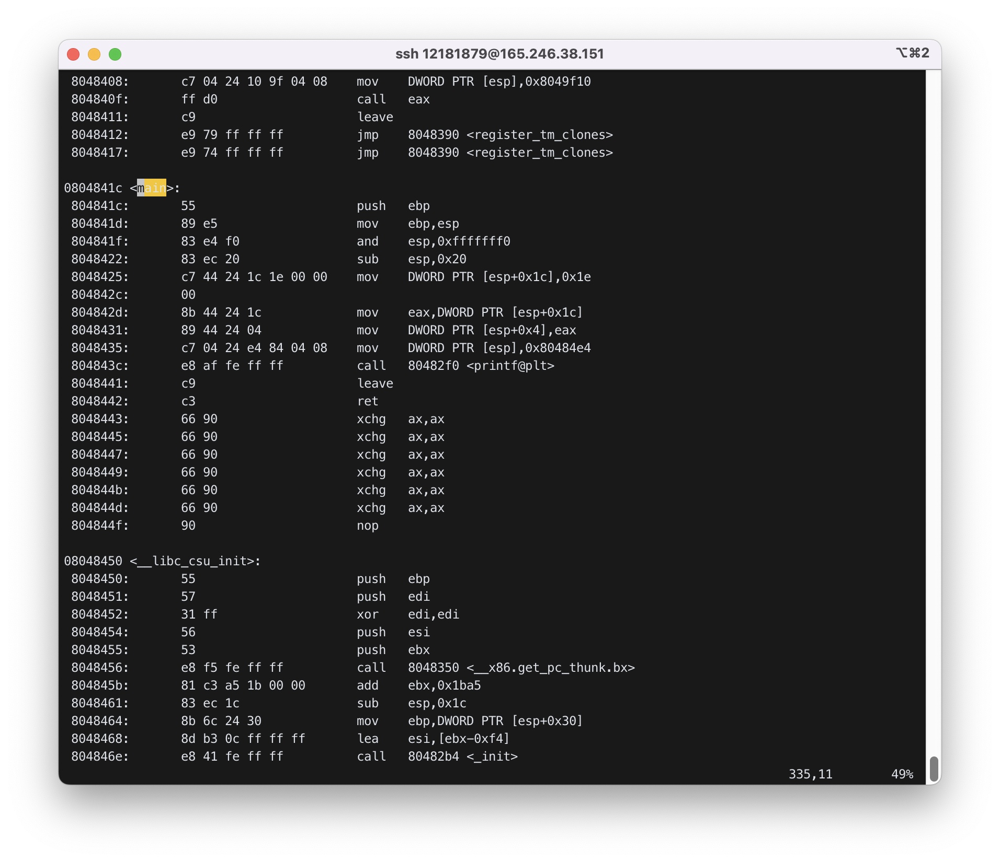

- 각 레지스터의 역할은 다음과 같다.
  - `ebp` : 스택 시작지점 주소 저장
    - 베이스 포인터
  - `esp` : 스택 끝지점 주소 저장
    - `push`/`pop` 따라 `esp` 값은 4byte 씩 늘었다가 줄었다 함
  - `DWORD PTR` : `WORD`는 2byte, `D`ouble`WORD`는 **2\*2byte**
    - DWORD PTR means DoubleWord Pointer.
    - Double word means 4 byte.
    - `mov DWORD PTR [1000], 0x21` instruction will store 0x21 in the 4 byte at memory address 1000.
  - `eax` : accumulator register – 산술, 논리연산 수행 + 함수 반환값 여기에 저장됨
  - `edx` : 데이터 복사 시, 목적지의 주소 저장
  - `eip` : 다음에 실행할 명령어를 가리키는 포인터, 명령 실행 후 자동으로 업데이트 됨

#### (3) Draw the memory map and show all the changes in registers and memory after each instruction up to the `ret` instruction.

Assume `esp = 0xbffff63c` and `ebp = 0xbffff6b8` in the beginning of `main`.

우선, `<main>` asm 코드는 아래와 같다.

##### `<main>` asm code

```bash
0804841c <main>:
 804841c:       55                      push   ebp
 804841d:       89 e5                   mov    ebp,esp
 804841f:       83 e4 f0                and    esp,0xfffffff0
 8048422:       83 ec 20                sub    esp,0x20
 8048425:       c7 44 24 1c 1e 00 00    mov    DWORD PTR [esp+0x1c],0x1e
 804842c:       00
 804842d:       8b 44 24 1c             mov    eax,DWORD PTR [esp+0x1c]
 8048431:       89 44 24 04             mov    DWORD PTR [esp+0x4],eax
 8048435:       c7 04 24 e4 84 04 08    mov    DWORD PTR [esp],0x80484e4
 804843c:       e8 af fe ff ff          call   80482f0 <printf@plt>
 8048441:       c9                      leave
 8048442:       c3                      ret
 8048443:       66 90                   xchg   ax,ax
 8048445:       66 90                   xchg   ax,ax
 8048447:       66 90                   xchg   ax,ax
 8048449:       66 90                   xchg   ax,ax
 804844b:       66 90                   xchg   ax,ax
 804844d:       66 90                   xchg   ax,ax
 804844f:       90                      nop
```

##### 0. Beginning of `main`

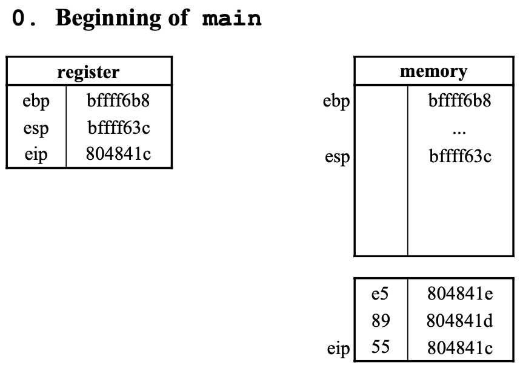

- `main`이 `804841c`부터 시작하므로 `eip`는 `804841c`가 된다.

##### 1. `push ebp`

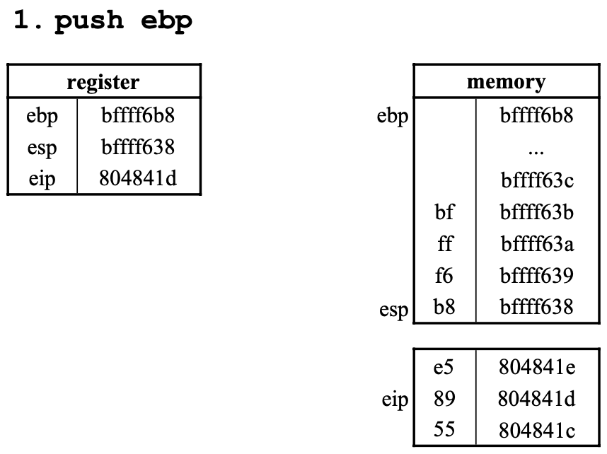

- `esp`를 4만큼 내리고
- `esp`가 가리키는 메모리에 `ebp`를 기록한다.
- `eip`가 다음으로 하나 이동한다.

##### 2. `mov ebp, esp`


- `esp` 값을 `ebp`에 저장(move)한다.

##### 3. `and esp,0xfffffff0`

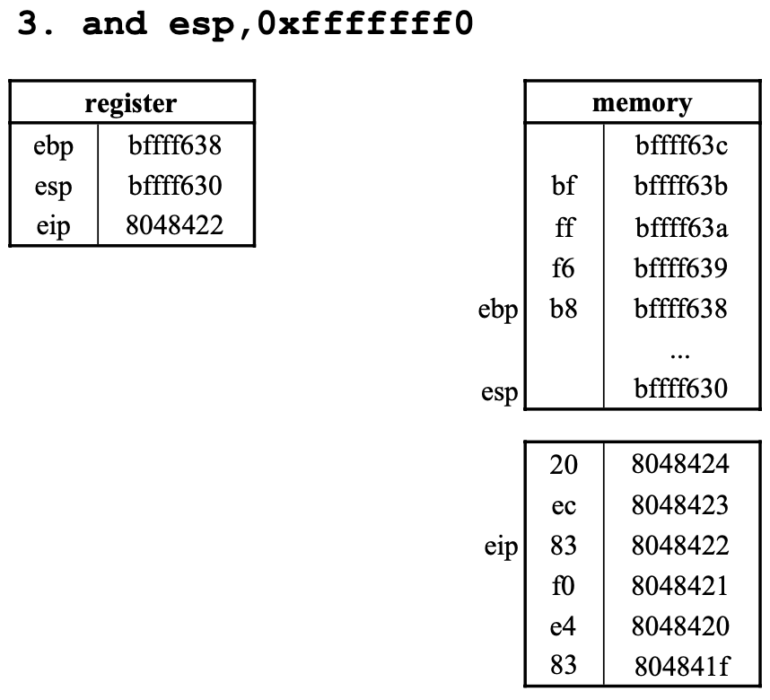

- `esp`값과 `0xfffffff0` 값을 비트 별로 `and` 연산하고
- 그 값을 다시 `esp`에 집어넣는다
- `esp` 는 2진수로 `10111111111111111111011000111000`,
- `0xfffffff0`는 2진수로 `11111111111111111111111111110000` 이므로
- `and` 연산을 하면 `10111111111111111111011000110000` == `0xbffff630`이다.

##### 4. `sub esp,0x20`

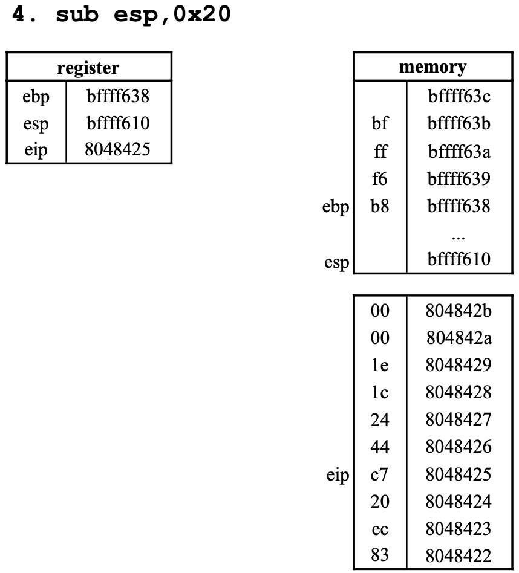

-`esp`에서 `0x20`만큼 뺀 값을 `esp`에 저장한다.

- 이전 `esp` 값인 `0xbffff630`에서 `0x20`만큼 뺀 값은 `0xbffff610`이다.

##### 5. `mov DWORD PTR [esp+0x1c], 0x1e`

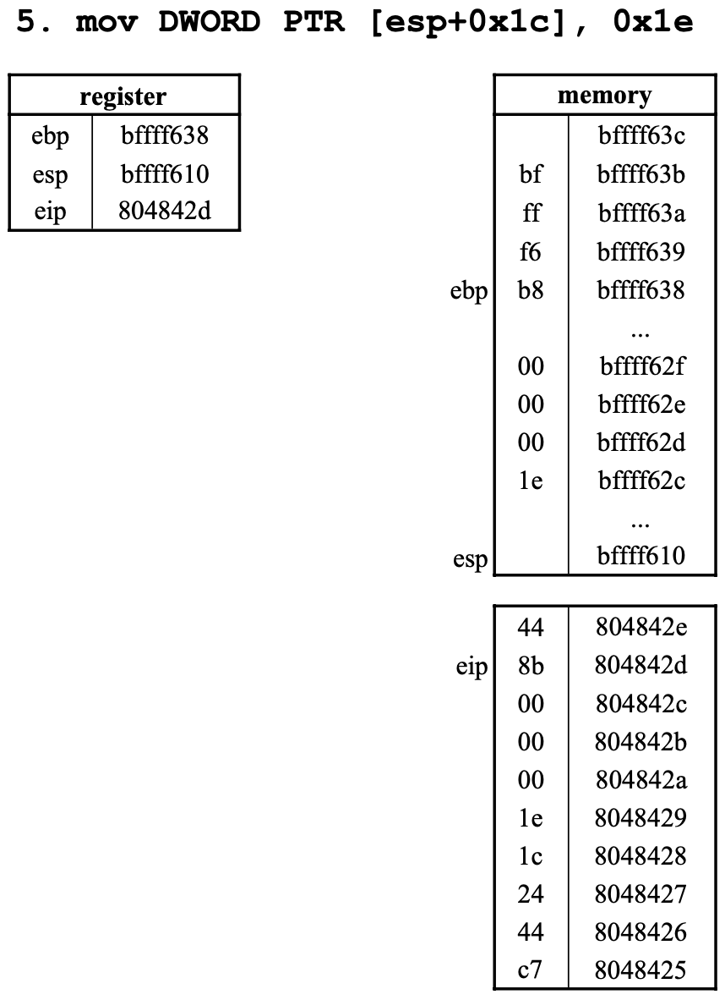

- `esp` 값은 `0xbffff610`이다.
- `esp` 값에 `0x1c`를 더한 값은 `0xbffff62c`이다.

##### 6. `mov eax, DWORD PTR [esp+0x1c]`

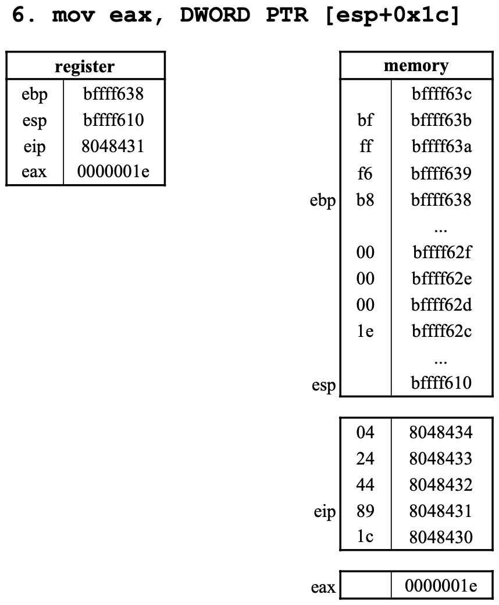

- `DWORD PTR [esp+0x1c]` 값을 `eax`에 저장한다.
- `esp` 값은 `0xbffff610`
- `esp`에 `0x1c`를 더하면 `0xbffff62c`
- `DWORD PTR`이므로 4byte
- 그러므로 `eax`는 `0x1e`이다.

##### 7. `mov DWORD PTR [esp+0x4], eax`


- `esp` + `0x4` = `0xbffff614`
- `DWORD PTR`이므로 4byte
- `0xbffff614`에 `0x1e`를 넣는다.

##### 8. `mov DWORD PTR [esp], 0x80484e4`

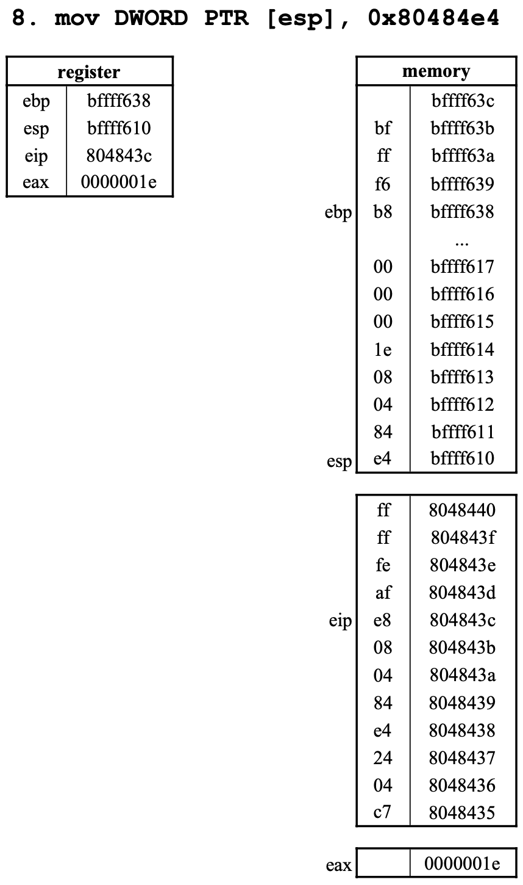

##### 9. `call 80482f0 <printf@plt>`

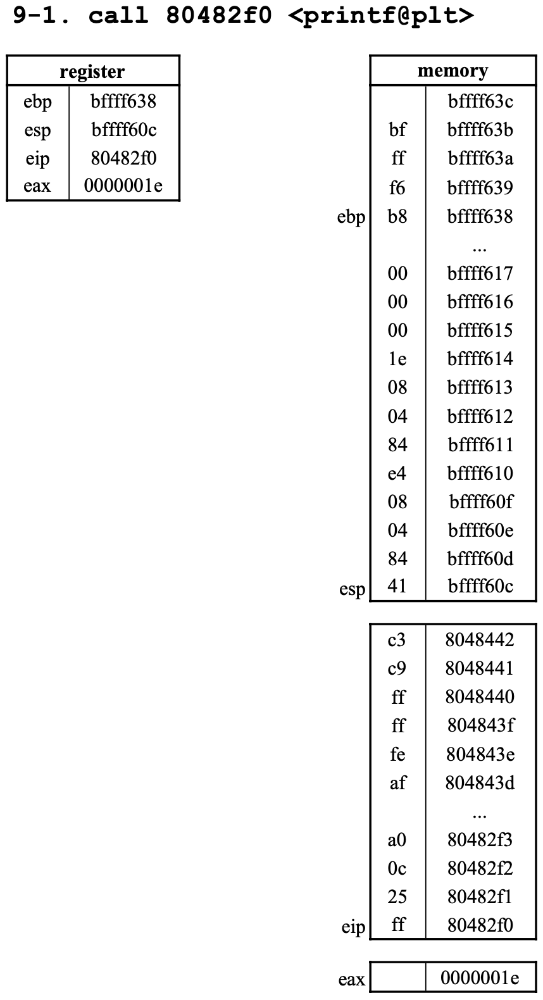

- `0x80482f0`에 있는 코드 실행 전,
- 돌아올 주소 (return-addr) 즉, `call` 명령어의 다음 명령어의 위치인 `0x8048441`를 `push` 한 후
- `0x80482f0`로 `jump` 한다.
- `push` 과정에서 `esp`는 4만큼 감소되고,
- `esp`가 가리키는 메모리에 `0x8048441`가 기록되며,
- `jump` to `0x80482f0`로 인해 `eip`는 `0x80482f0`로 업데이트된다.
- 그 후 `0x80482f0`에 있는 `<printf@plt>`의 명령어를 실행하기 시작한다.
- `<printf@plt>` asm 코드는 아래와 같다.

```bash
080482f0 <printf@plt>:
 80482f0:       ff 25 0c a0 04 08       jmp    DWORD PTR ds:0x804a00c
 80482f6:       68 00 00 00 00          push   0x0
 80482fb:       e9 e0 ff ff ff          jmp    80482e0 <_init+0x2c>
```

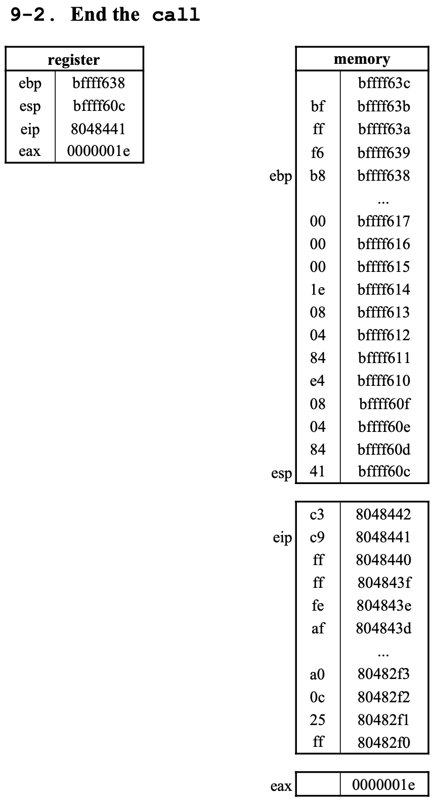

- `call`이 종료되면 `eip`는 `esp`에 저장해둔 `0x8048441`로 이동한다.

##### 10. `leave`


- 먼저 `move esp, ebp`를 수행하여 `esp`와 `ebp`에 `bffff638`이 저장된다. (`ebp -> esp = ebp`)
- 이어서 `pop ebp`를 수행하여 `ebp`에 `esp`가 가리키는 메모리에 기록된 data를 `ebp`에 기록한 후
- `esp`를 4**byte**만큼 증가시켜 `esp`는 `bffff63c`이 된다.

##### 11. `ret`

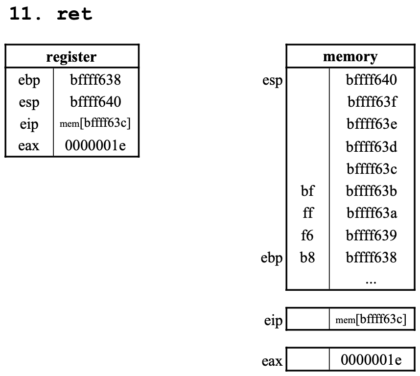

- `eip`를 현재 `esp`인 `bffff63c`가 가리키는 return address로 이동시키고
- `esp`의 값에 4를 더한다.
- (`esp`가 가리키는 위치에 있는 값을 알 수 없기에 정확한 `eip` 값은 알 수 없다.)

#### (4) Find corresponding instructions for `x=30;` and `printf("x is %d\n",x);` in the ASM code.

##### `x=30;`

`x=30;`에서 10진수 `30`을 16진수로 변환하면 `0x1e`이다.

[`<main>` asm 코드](#main-asm-code)에서 `1e`를 찾아보면 아래와 같다.

```bash
0804841c <main>:
 ......         ......                  ...    ......
 8048425:       c7 44 24 1c 1e 00 00    mov    DWORD PTR [esp+0x1c],
 ......         ......                  ...    ......
```

`0x08048425`에서 `mov DWORD PTR [esp+0x1c]` 이므로 `esp+0x1c`에 `30`을 저장 한다. 즉, `c7 44 24 1c 1e 00 00`가 `x=30;`을 나타낸다.

##### `printf("x is %d\n",x);`

```bash
0804841c <main>:
 ......         ......                  ...    ......
 804842d:       8b 44 24 1c             mov    eax,DWORD PTR [esp+0x1c]
 8048431:       89 44 24 04             mov    DWORD PTR [esp+0x4],eax
 8048435:       c7 04 24 e4 84 04 08    mov    DWORD PTR [esp],0x80484e4
 ......         ......                  ...    ......
```

`80484e4`를 확인하면 아래와 같다.


- `78 20 69 73 20 25 64 0a 00`을 해석하면 다음과 같다.
- `x [space] is space %d LF`이다.
- `esp`의 주소 공간에 문장을 저장한다.
- `0x08048431`에서는 `x`를 저장,
- `0x08048435`에서 `x [space] is space %d LF`를 저장,
- `0x0804843c`에서 `print`를 호출 하는 것을 알 수 있다.

#### (5) What is the memory location of the variable `x`?

```bash
0804841c <main>:
 ......         ......                  ...    ......
 8048425:       c7 44 24 1c 1e 00 00    mov    DWORD PTR [esp+0x1c],
 ......         ......                  ...    ......
```

위 [Exercise (4)](#4-find-corresponding-instructions-for-x30-and-printfx-is-dnx-in-the-asm-code)와 동일하게 `esp + 0x1c`인 것을 알 수 있다.

#### (6) Find the memory address where the string `"x is %d\n"` is stored. Confirm the ascii codes for `"x is %d\n"` at that address.


- 위 [Exercise (4)](#4-find-corresponding-instructions-for-x30-and-printfx-is-dnx-in-the-asm-code)와 동일하다.
- `78 20 69 73 20 25 64 0a 00`을 해석하면 다음과 같다.
- `x [space] is space %d LF`이므로 `0x080484e4`, `0x080484e6`에 저장 되는 것을 알 수 있다.

#### (7) Show the memory address where `main()` begins.

[`<main>` asm code](#main-asm-code)를 확인해보면 `0x0804841c`가 메모리 주소인 것을 확인할 수 있다.

## 4. Debugging

### 1. compile with `-m32` (for 32 bit environment) and `-g` (for gdb) option

```bash
$ gcc -m32 -g -o ex1 ex1.c
```

### 2. copy `.gdbinit` to configure gdb

```bash
$ cp ../../linuxer1/.gdbinit  .
```

### 3. run `gdb`

```bash
$ gdb ex1
     ....................
gdb$ set disassembly-flavor intel  # to see asm output in intel syntax
gdb$ disassemble main              # disassemble main() and show asm code for main
Dump of assembler code for function main:
     0x804841c <+0>:  push ebp          # first instruction of main
     ....................
End of assembler dump.
gdb$ display $esp # display the value of esp after each ni
gdb$ display $ebp
gdb$ display $eax
gdb$ b *0x804841c # set break point at addr=0x804841c (first instr addr of main)
     ....................
gdb$ r # start running the program
[0x002B:0xFFFFD5EC]------------------------------------------------------[stack]
0xFFFFD63C : 20 83 04 08 00 00 00 00 - F0 5D D0 44 79 D7 D2 44  ........].Dy..D
0xFFFFD62C : 00 00 00 00 00 00 00 00 - 00 00 00 00 01 00 00 00 ................
0xFFFFD61C : 00 00 00 00 00 00 00 00 - 5D 83 CC CE 2B 26 D7 94 ........]...+&..
0xFFFFD60C : 02 00 00 00 02 00 00 00 - 00 60 EC 44 00 00 00 00 .........`.D....
0xFFFFD5FC : B0 C6 FF F7 01 00 00 00 - 01 00 00 00 00 00 00 00 ................
0xFFFFD5EC : 65 D8 D2 44 01 00 00 00 - 84 D6 FF FF 8C D6 FF FF e..D............
--------------------------------------------------------------------------[code]
=> 0x804841c <main>:    push   ebp
   0x804841d <main+1>:  mov    ebp,esp
   0x804841f <main+3>:  and    esp,0xfffffff0
   0x8048422 <main+6>:  sub    esp,0x20
--------------------------------------------------------------------------------

Breakpoint 1, main () at ex1.c:2
2       void main(){
3: $eax = 0x1
2: $ebp = (void *) 0x0
1: $esp = (void *) 0xffffd5ec

gdb$ ni # execute next instruction ("push ebp")
gdb$ ni # execute next instruction ("mov ebp, esp")
gdb$ ni # execute next instruction ("and esp, 0xfffffff0")
     ....................
gdb$ ni # execute "sub esp, 0x20"
     ....................
gdb$ ni # execute "mov dword ptr [esp+0x1c], 0x1e
gdb$ ni # execute "mov eax, DWORD PTR [esp+0x1c]
     ....................
gdb$ ni # execute "DWORD PTR [esp+0x4], eax
     ....................
gdb$ ni # execute DWORD PTR [esp], 0x80484e4
     ....................
gdb$ si # execute "call printf" with si to enter the function
```

### Exercise

#### (8) Follow above steps to show the content of the registers or memory that have been changed after each instruction in `main()`. You should indicate the changed part in your picture (the captured output screen from `gdb`) for all instructions one by one. For "call" instruction use `si` command to enter the function and show the changes in the stack and register.


컴파일 시, `-g` 옵션을 추가하여 debug가 가능하도록 하였다.
`.gdbinit` 을 복사 후 `gdb`를 실행하였다.


`set disassembly-flavor intel`로 ASM이 intel format으로 출력이 되도록 하며, `disassemble main` 명령어로 `main`의 ASM 코드를 확인하였다.


break point를 `main` 함수의 메모리 주소인 `0x0804841c`로 하였다.
`display $esp, ebp, eax, eip`로 명령어를 실행 할 때마다 값이 출력 되도록 하였다.


`r`로 디버깅을 시작 했으며, `0x804841c`에서 breakpoint를 만나 멈췄으며, stack과 ASM code를 확인 할 수 있었다. 그리고 설정한 `eip`, `eax`, `ebp`, `esp` 값을 확인 할 수 있었다.

<br>

`ni`로 다음 줄을 실행 하였다.


`push ebp`는 1) `esp = esp-4`, 2) `ebp = esp`<br>
의 과정을 거쳐 `esp`가 4만큼 감소 감소하며, `eip`가 이동 한 것을 알 수 있다.

그리고 stack `0xffffd4f8`에 `00 00 00 00`이 된 것을 알 수 있다.


`and esp,0xfffffff0 esp` 가 `esp and 0xfffffff0`의 값 (`0xffffd4f8`)을 가지게 된다.


`sub esp,0x20` 명령어로
`esp`가 `esp-0x20` 값을 가지게 된다. 그러므로 `esp`는 `0xffffd4f0`이 된다.


`mov DWORD PTR [esp+0x1c],0x1e`이므로 4byte에 `0x1e`를 저장한다.
`[esp+0x1c]`에 `0x1e`가 저장 되는 것을 알 수 있다.


`mov eax,DWORD PTR [esp+0x1c]`이므로 `[esp+0x1c]` 부분에 `0x1e` 값이 채워져있었기 때문에, `eax` 값이 30(`0x1e`)이 된다.


`mov DWORD PTR [esp+0x4],eax`이므로 `[esp+0x4]`에 `eax`를 저장한다.


`mov DWORD PTR [esp],0x80484e4`이므로 `esp` 위치에 `0x80484e4`를 저장한다.


`call 0x80482f0 <printf@plt>`이므로 우선 `esp`가 4 감소 하며, return address `0x08048441`를 저장
한다.


`jmp DWORD PTR ds:0x804a00c`


`push 0x0`이므로 `esp-4`(`0x0`)이 저장 되는 것을 알 수 있다.


`jmp 0x80482e0`이므로 `eip`가 jump한다.


`push DWORD PTR ds:0x804a004`이므로 `esp`는 4가 내려가며 stack에 저장된다.


`jmp DWORD PTR ds:0x804a008`이므로 `eip`가 jump한다.

## 5. `gdb` commands

```bash
gdb$ b *addr        # break at addr
gdb$ b funcname     # break at function "funcname"
gdb$ r              # rerun
gdb$ bt             # backtrack stack frames
gdb$ p expr         # print the value of expr ex) p $sp or p/x $eax (in hexa)
gdb$ nexti          # run next instruction (do not go into a function). same as ni.
gdb$ stepi          # run next instruction (go inside a function). same as si.
gdb$ info f         # show the stack frame of the current function
gdb$ display $eip   # show the value of eip after every gdb command
gdb$ display $esp   # show the value of esp after every gdb command
gdb$ info registers # show the value of all registers
gdb$ info registers eip # show the value of eip
gdb$ info line      # memory address of the current function
gdb$ info line main # memory address of function main
gdb$ x/8xb addr     # show 8 bytes in hexa starting from addr
gdb$ x/20xh addr    # show 20 half words (2 bytes) in hexa starting from addr
gdb$ x/13xw addr    # show 13 words (4 bytes) in hexa starting from addr
```

## 6. 64-bit Linux shows different output compared to 32-bit Linux

1. It uses 8-byte registers (`rsp`, `rip`, `rbp`, ...) instead of `esp`, `eip`, `ebp`, ...
2. The calling convention (how to pass function arguments) is different.
   - 64-bit Linux passes function arguments in registers instead of stack:
   - The first six integer or pointer arguments are passed in `rdi`, `rsi`, `rdx`, `rcx`, `r8`, `r9` (in that order left to right), while xmm0, xmm1, xmm2, .., xmm7 are used for floating point arguments.
   - Additional arguments are passed on the stack and return value is stored in rax.
