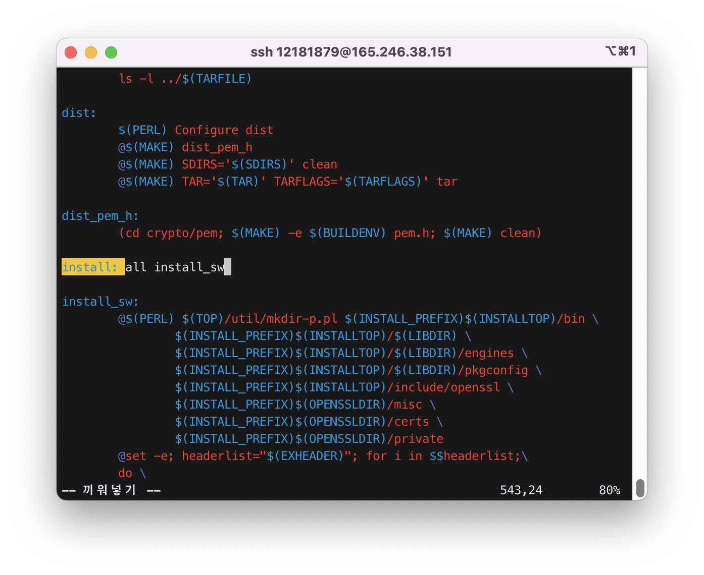
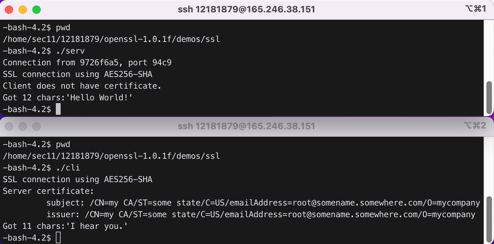
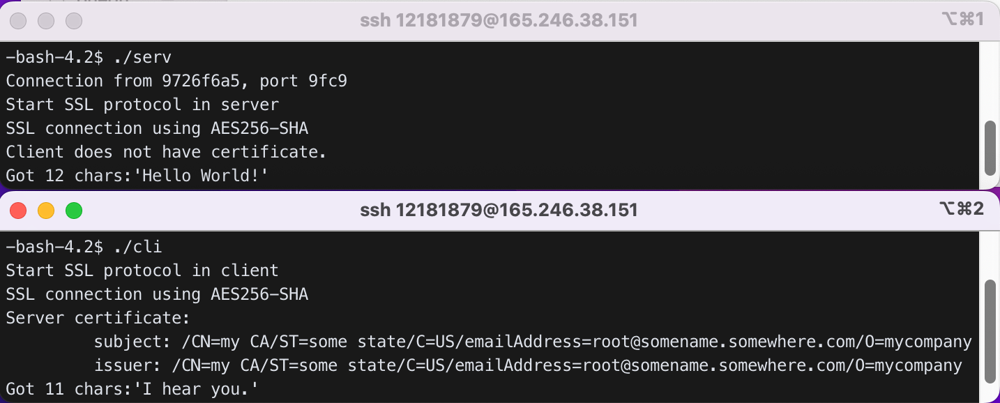
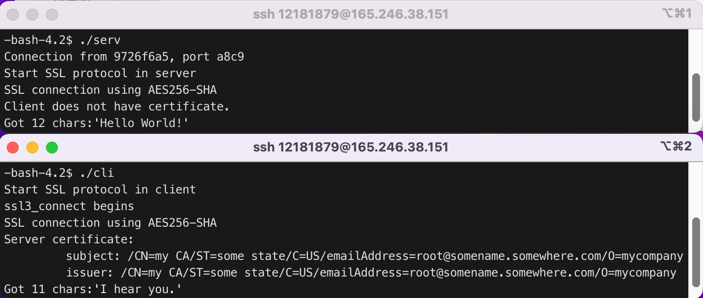

# Programming with OpenSSL

12181879 이동건

## 2. Making an ssl client/server in the lab server.

### 1) Copy `openssl-1.0.1f.tar.gz` into your home directory(assume it is `/home/sec11/12181879`), and un-tar it to create `openssl-1.0.1f` directory.

```bash
$ pwd
/home/sec11/12181879
$ cp ../../openssl-1.0.1f.tar.gz .
$ tar xvf openssl-1.0.1f.tar.gz
```

### 2) config

```bash
$ mkdir openssl
$ cd openssl-1.0.1f
$ pwd
/home/sec11/12181879/openssl-1.0.1f
```

Let config know it should use the openssl direcotry in the current user's home direcotry(`/home/sec11/12181879`).

```bash
$ ./config no-dso --prefix=/home/sec11/12181879/openssl --openssldir=/home/sec11/12181879/openssl
```

### 3) compile openssl-1.0.1f library

```bash
$ make
```

will compile OpenSSL library code. libssl.a, libcrypto.a will be created in the top directory (`/home/sec11/12181879/openssl-1.0.1f`).

### 4) Install

#### 4.1) Remove "install_docs" from `Makefile` (to reduce compile time) as below.

```bash
$ vi Makefile
```

and change `install: all install_docs install_sw`<br>
to `install: all install_sw`



#### 4.2) Install

```bash
$ make install
```

will install OpenSSL in `/home/sec11/12181879/openssl`.

Now you should have all necessary files in `/home/sec11/12181879/openssl` directory.

- All files will be installed in `/home/sec11/12181879/openssl` (make sure you have them all).
  - `lib` will have `libssl.a`, `libcrypto.a`
  - `include/openssl` will have header files
  - `bin` will have openssl binary files
  - `certs` will have certificates
  - `private` will have private keys

### 5) Compile application: Compile `cli.cpp` and `serv.cpp` in `demos` directory.

#### 5.1) Go to `demos/ssl` directory.

```bash
$ cd openssl-1.0.1f/demos/ssl
```

#### 5.2) Generate server rsa key pair: `servkey.pem`

```bash
$ openssl genrsa -out servkey.pem 1024
```


#### 5.3) Make a config file `servconf.txt` and generate server public key certificate(the server public key will be self-signed): `servcert.pem`

```bash
$ vi servconf.txt
```

`servconf.txt` :

```
[req]
string_mask = nombstr
distinguished_name = req_distinguished_name
prompt = no
[req_distinguished_name]
commonName = my CA
stateOrProvinceName = some state
countryName = US
emailAddress = root@somename.somewhere.com
organizationName = mycompany
```

```bash
$ openssl req -config servconf.txt -new -x509 -key servkey.pem -out servcert.pem
```

#### 5.4) Change followings.

- `serv.cpp`:
  - change the port number (임의의 숫자인 12500으로 지정함)
  - change the file name for the certificate (CERTF) and key file (KEYF)
    - `#define CERTF HOME "servcert.pem"`
    - `#define KEYF HOME "servkey.pem"`
  - change the return data type of `main()` to `int`
  - change `size_t client_len` to `socklen_t client_len`
- `cli.cpp`:
  - change the server port number and IP address
    - server port number : 임의의 숫자인 12500으로 지정함
    - server IP address : `"165.246.38.151"`
  - change the return data type of `main()` to `int`
  - include `#include <unistd.h>`
  - Change ssl version to TLSv1: use `TLSv1_client_method()` instead of `SSLv2_client_method()` in `cli.cpp`.

#### 5.5) Compile the client and server

```bash
$ g++ -L/home/sec11/12181879/openssl/lib -I/home/sec11/12181879/openssl/include -fpermissive -o serv serv.cpp -lssl -lcrypto -ldl
$ g++ -L/home/sec11/12181879/openssl/lib -I/home/sec11/12181879/openssl/include -fpermissive -o cli cli.cpp -lssl -lcrypto -ldl
```

- `-L` is option for additional library directory and `-I` for additional header file directory.
- `-lssl` means "link with libssl.a" (for static library) or "link with libssl.so" (for dynamically linked library, or shared object) and `-lcrypto` "link with libcrypto.a" or "link with libcrypto.so".


#### 5.6). Run the server first and run the client to see if they can talk.



위의 터미널 화면이 `serv`를 실행시킨 화면이고, 아래 터미널 화면이 `cli`를 실행시킨 화면이다.

`serv`가 `cli`에게 'Hello World!'를 보내고,
`cli`가 `serv`에게 'I hear you.'를 보낸 것을 확인할 수 있다.

## 11. Homework

### 1) Do the steps in [Section 2](#2-making-an-ssl-clientserver-in-the-lab-server).

### 2) Modify `cli.cpp` such that it displays "Start SSL protocol in client" before it calls `SSL_connect(ssl)`. Also modify `serv.cpp` such that it displays "Start SSL protocol in server" before it calls `SSL_accept(ssl)`. Recompile `cli`, `serv`, and rerun them to see the effect.



### 3) `cli.cpp` calls `SSL_connect()` which in turn calls `ssl3_connect()` (defined in `openssl-1.0.1f/ssl/s3_clnt.c`). Add `printf("ssl3_connect begins\n");` in the beginning of `ssl3_connect()`. Go to the SSL top directory (`openssl-1.0.1f`) and recompile ssl library with `make`. Re-install ssl library with `make install`. Now go to `demos/ssl` and recompile `cli.cpp` and `serv.cpp` and rerun them to see if the client prints "ssl3_connect begins". If the output does not reflect your change, check the lib directory location in `g++` command.



### 4) `serv.cpp` calls `SSL_accept()` which in turn calls `ssl3_accept()` (defined in `openssl-1.0.1f/ssl/s3_srvr.c`). Add `printf("ssl3_accept begins\n");` in the beginning of `ssl3_accept()`. Recompile and re-install ssl library. Recompile `cli.cpp` and `serv.cpp` and see if the server displays the above message.

g++ -L/home/sec11/12181879/openssl/lib -I/home/sec11/12181879/openssl/include -fpermissive -o serv serv.cpp -lssl -lcrypto -ldl & g++ -L/home/sec11/12181879/openssl/lib -I/home/sec11/12181879/openssl/include -fpermissive -o cli cli.cpp -lssl -lcrypto -ldl

### 5) Modify `ssl3_connect()`, `ssl3_accept()` such that they print some message at each ssl protocol stage. Recompile ssl libraries, `cli`, `serv`, and rerun. Match the state changes in the client and the server with the state changes explained in [Section 1](#1-sslsecure-socket-layer).

`ssl3_accept()` function in `openssl-1.0.1f/ssl/s3_srvr.c` :

```cpp
int ssl3_accept(SSL *s)
{
    printf("ssl3_accept begins here\n");
    BUF_MEM *buf;
    unsigned long alg_k, Time = (unsigned long)time(NULL);
    void (*cb)(const SSL *ssl, int type, int val) = NULL;
    int ret = -1;
    int new_state, state, skip = 0;

    RAND_add(&Time, sizeof(Time), 0);
    ERR_clear_error();
    clear_sys_error();

    if (s->info_callback != NULL)
        cb = s->info_callback;
    else if (s->ctx->info_callback != NULL)
        cb = s->ctx->info_callback;

    /* init things to blank */
    s->in_handshake++;
    if (!SSL_in_init(s) || SSL_in_before(s))
        SSL_clear(s);

    if (s->cert == NULL)
    {
        SSLerr(SSL_F_SSL3_ACCEPT, SSL_R_NO_CERTIFICATE_SET);
        return (-1);
    }

#ifndef OPENSSL_NO_HEARTBEATS
    /* If we're awaiting a HeartbeatResponse, pretend we
     * already got and don't await it anymore, because
     * Heartbeats don't make sense during handshakes anyway.
     */
    if (s->tlsext_hb_pending)
    {
        s->tlsext_hb_pending = 0;
        s->tlsext_hb_seq++;
    }
#endif

    for (;;)
    {
        state = s->state;

        switch (s->state)
        {
        case SSL_ST_RENEGOTIATE:
            s->renegotiate = 1;
            /* s->state=SSL_ST_ACCEPT; */

        case SSL_ST_BEFORE:
        case SSL_ST_ACCEPT:
        case SSL_ST_BEFORE | SSL_ST_ACCEPT:
        case SSL_ST_OK | SSL_ST_ACCEPT:

            s->server = 1;
            if (cb != NULL)
                cb(s, SSL_CB_HANDSHAKE_START, 1);

            if ((s->version >> 8) != 3)
            {
                SSLerr(SSL_F_SSL3_ACCEPT, ERR_R_INTERNAL_ERROR);
                return -1;
            }
            s->type = SSL_ST_ACCEPT;

            if (s->init_buf == NULL)
            {
                if ((buf = BUF_MEM_new()) == NULL)
                {
                    ret = -1;
                    goto end;
                }
                if (!BUF_MEM_grow(buf, SSL3_RT_MAX_PLAIN_LENGTH))
                {
                    ret = -1;
                    goto end;
                }
                s->init_buf = buf;
            }

            if (!ssl3_setup_buffers(s))
            {
                ret = -1;
                goto end;
            }

            s->init_num = 0;
            s->s3->flags &= ~SSL3_FLAGS_SGC_RESTART_DONE;

            if (s->state != SSL_ST_RENEGOTIATE)
            {
                /* Ok, we now need to push on a buffering BIO so that
                 * the output is sent in a way that TCP likes :-)
                 */
                if (!ssl_init_wbio_buffer(s, 1))
                {
                    ret = -1;
                    goto end;
                }

                ssl3_init_finished_mac(s);
                s->state = SSL3_ST_SR_CLNT_HELLO_A;
                s->ctx->stats.sess_accept++;
            }
            else if (!s->s3->send_connection_binding &&
                     !(s->options & SSL_OP_ALLOW_UNSAFE_LEGACY_RENEGOTIATION))
            {
                /* Server attempting to renegotiate with
                 * client that doesn't support secure
                 * renegotiation.
                 */
                SSLerr(SSL_F_SSL3_ACCEPT, SSL_R_UNSAFE_LEGACY_RENEGOTIATION_DISABLED);
                ssl3_send_alert(s, SSL3_AL_FATAL, SSL_AD_HANDSHAKE_FAILURE);
                ret = -1;
                goto end;
            }
            else
            {
                /* s->state == SSL_ST_RENEGOTIATE,
                 * we will just send a HelloRequest */
                s->ctx->stats.sess_accept_renegotiate++;
                s->state = SSL3_ST_SW_HELLO_REQ_A;
            }
            break;

        case SSL3_ST_SW_HELLO_REQ_A:
        case SSL3_ST_SW_HELLO_REQ_B:

            s->shutdown = 0;
            ret = ssl3_send_hello_request(s);
            if (ret <= 0)
                goto end;
            s->s3->tmp.next_state = SSL3_ST_SW_HELLO_REQ_C;
            s->state = SSL3_ST_SW_FLUSH;
            s->init_num = 0;

            ssl3_init_finished_mac(s);
            break;

        case SSL3_ST_SW_HELLO_REQ_C:
            s->state = SSL_ST_OK;
            break;

        case SSL3_ST_SR_CLNT_HELLO_A:
        case SSL3_ST_SR_CLNT_HELLO_B:
        case SSL3_ST_SR_CLNT_HELLO_C:

            s->shutdown = 0;
            if (s->rwstate != SSL_X509_LOOKUP)
            {
                ret = ssl3_get_client_hello(s);
                if (ret <= 0)
                    goto end;
            }
#ifndef OPENSSL_NO_SRP
            {
                int al;
                if ((ret = ssl_check_srp_ext_ClientHello(s, &al)) < 0)
                {
                    /* callback indicates firther work to be done */
                    s->rwstate = SSL_X509_LOOKUP;
                    goto end;
                }
                if (ret != SSL_ERROR_NONE)
                {
                    ssl3_send_alert(s, SSL3_AL_FATAL, al);
                    /* This is not really an error but the only means to
                                       for a client to detect whether srp is supported. */
                    if (al != TLS1_AD_UNKNOWN_PSK_IDENTITY)
                        SSLerr(SSL_F_SSL3_ACCEPT, SSL_R_CLIENTHELLO_TLSEXT);
                    ret = SSL_TLSEXT_ERR_ALERT_FATAL;
                    ret = -1;
                    goto end;
                }
            }
#endif

            s->renegotiate = 2;
            s->state = SSL3_ST_SW_SRVR_HELLO_A;
            s->init_num = 0;
            break;

        case SSL3_ST_SW_SRVR_HELLO_A:
        case SSL3_ST_SW_SRVR_HELLO_B:
            printf("SERV GET HELLO FROM CLNT\n");
            ret = ssl3_send_client_certificate(s);
            ret = ssl3_send_server_hello(s);
            if (ret <= 0)
                goto end;
#ifndef OPENSSL_NO_TLSEXT
            if (s->hit)
            {
                if (s->tlsext_ticket_expected)
                    s->state = SSL3_ST_SW_SESSION_TICKET_A;
                else
                    s->state = SSL3_ST_SW_CHANGE_A;
            }
#else
            if (s->hit)
                s->state = SSL3_ST_SW_CHANGE_A;
#endif
            else
                s->state = SSL3_ST_SW_CERT_A;
            s->init_num = 0;
            break;

        case SSL3_ST_SW_CERT_A:
        case SSL3_ST_SW_CERT_B:
            /* Check if it is anon DH or anon ECDH, */
            /* normal PSK or KRB5 or SRP */
            if (!(s->s3->tmp.new_cipher->algorithm_auth & SSL_aNULL) && !(s->s3->tmp.new_cipher->algorithm_mkey & SSL_kPSK) && !(s->s3->tmp.new_cipher->algorithm_auth & SSL_aKRB5))
            {
                printf("SERV SEND CERT TO CLNT\n");
                ret = ssl3_send_server_certificate(s);
                if (ret <= 0)
                    goto end;
#ifndef OPENSSL_NO_TLSEXT
                if (s->tlsext_status_expected)
                    s->state = SSL3_ST_SW_CERT_STATUS_A;
                else
                    s->state = SSL3_ST_SW_KEY_EXCH_A;
            }
            else
            {
                skip = 1;
                s->state = SSL3_ST_SW_KEY_EXCH_A;
            }
#else
            }
            else
                skip = 1;

            s->state = SSL3_ST_SW_KEY_EXCH_A;
#endif
            s->init_num = 0;
            break;

        case SSL3_ST_SW_KEY_EXCH_A:
        case SSL3_ST_SW_KEY_EXCH_B:
            alg_k = s->s3->tmp.new_cipher->algorithm_mkey;

            /* clear this, it may get reset by
             * send_server_key_exchange */
            if ((s->options & SSL_OP_EPHEMERAL_RSA)
#ifndef OPENSSL_NO_KRB5
                && !(alg_k & SSL_kKRB5)
#endif /* OPENSSL_NO_KRB5 */
            )
                /* option SSL_OP_EPHEMERAL_RSA sends temporary RSA key
                 * even when forbidden by protocol specs
                 * (handshake may fail as clients are not required to
                 * be able to handle this) */
                s->s3->tmp.use_rsa_tmp = 1;
            else
                s->s3->tmp.use_rsa_tmp = 0;

            /* only send if a DH key exchange, fortezza or
             * RSA but we have a sign only certificate
             *
             * PSK: may send PSK identity hints
             *
             * For ECC ciphersuites, we send a serverKeyExchange
             * message only if the cipher suite is either
             * ECDH-anon or ECDHE. In other cases, the
             * server certificate contains the server's
             * public key for key exchange.
             */
            if (s->s3->tmp.use_rsa_tmp
            /* PSK: send ServerKeyExchange if PSK identity
             * hint if provided */
#ifndef OPENSSL_NO_PSK
                || ((alg_k & SSL_kPSK) && s->ctx->psk_identity_hint)
#endif
#ifndef OPENSSL_NO_SRP
                /* SRP: send ServerKeyExchange */
                || (alg_k & SSL_kSRP)
#endif
                || (alg_k & (SSL_kDHr | SSL_kDHd | SSL_kEDH)) || (alg_k & SSL_kEECDH) || ((alg_k & SSL_kRSA) && (s->cert->pkeys[SSL_PKEY_RSA_ENC].privatekey == NULL || (SSL_C_IS_EXPORT(s->s3->tmp.new_cipher) && EVP_PKEY_size(s->cert->pkeys[SSL_PKEY_RSA_ENC].privatekey) * 8 > SSL_C_EXPORT_PKEYLENGTH(s->s3->tmp.new_cipher)))))
            {
                printf("SERV SEND KEY TO CLNT\n");
                ret = ssl3_send_server_key_exchange(s);
                if (ret <= 0)
                    goto end;
            }
            else
                skip = 1;

            s->state = SSL3_ST_SW_CERT_REQ_A;
            s->init_num = 0;
            break;

        case SSL3_ST_SW_CERT_REQ_A:
        case SSL3_ST_SW_CERT_REQ_B:
            if (/* don't request cert unless asked for it: */
                !(s->verify_mode & SSL_VERIFY_PEER) ||
                /* if SSL_VERIFY_CLIENT_ONCE is set,
                 * don't request cert during re-negotiation: */
                ((s->session->peer != NULL) &&
                 (s->verify_mode & SSL_VERIFY_CLIENT_ONCE)) ||
                /* never request cert in anonymous ciphersuites
                 * (see section "Certificate request" in SSL 3 drafts
                 * and in RFC 2246): */
                ((s->s3->tmp.new_cipher->algorithm_auth & SSL_aNULL) &&
                 /* ... except when the application insists on verification
                  * (against the specs, but s3_clnt.c accepts this for SSL 3) */
                 !(s->verify_mode & SSL_VERIFY_FAIL_IF_NO_PEER_CERT)) ||
                /* never request cert in Kerberos ciphersuites */
                (s->s3->tmp.new_cipher->algorithm_auth & SSL_aKRB5)
                /* With normal PSK Certificates and
                 * Certificate Requests are omitted */
                || (s->s3->tmp.new_cipher->algorithm_mkey & SSL_kPSK))
            {
                /* no cert request */
                skip = 1;
                s->s3->tmp.cert_request = 0;
                s->state = SSL3_ST_SW_SRVR_DONE_A;
                if (s->s3->handshake_buffer)
                    if (!ssl3_digest_cached_records(s))
                        return -1;
            }
            else
            {
                s->s3->tmp.cert_request = 1;
                ret = ssl3_send_certificate_request(s);
                if (ret <= 0)
                    goto end;
#ifndef NETSCAPE_HANG_BUG
                s->state = SSL3_ST_SW_SRVR_DONE_A;
#else
                s->state = SSL3_ST_SW_FLUSH;
                s->s3->tmp.next_state = SSL3_ST_SR_CERT_A;
#endif
                s->init_num = 0;
            }
            break;

        case SSL3_ST_SW_SRVR_DONE_A:
        case SSL3_ST_SW_SRVR_DONE_B:
            ret = ssl3_send_server_done(s);
            if (ret <= 0)
                goto end;
            s->s3->tmp.next_state = SSL3_ST_SR_CERT_A;
            s->state = SSL3_ST_SW_FLUSH;
            s->init_num = 0;
            break;

        case SSL3_ST_SW_FLUSH:

            /* This code originally checked to see if
             * any data was pending using BIO_CTRL_INFO
             * and then flushed. This caused problems
             * as documented in PR#1939. The proposed
             * fix doesn't completely resolve this issue
             * as buggy implementations of BIO_CTRL_PENDING
             * still exist. So instead we just flush
             * unconditionally.
             */

            s->rwstate = SSL_WRITING;
            if (BIO_flush(s->wbio) <= 0)
            {
                ret = -1;
                goto end;
            }
            s->rwstate = SSL_NOTHING;

            s->state = s->s3->tmp.next_state;
            break;

        case SSL3_ST_SR_CERT_A:
        case SSL3_ST_SR_CERT_B:
            /* Check for second client hello (MS SGC) */
            ret = ssl3_check_client_hello(s);
            if (ret <= 0)
                goto end;
            if (ret == 2)
                s->state = SSL3_ST_SR_CLNT_HELLO_C;
            else
            {
                if (s->s3->tmp.cert_request)
                {
                    ret = ssl3_get_client_certificate(s);
                    if (ret <= 0)
                        goto end;
                }
                s->init_num = 0;
                s->state = SSL3_ST_SR_KEY_EXCH_A;
            }
            break;

        case SSL3_ST_SR_KEY_EXCH_A:
        case SSL3_ST_SR_KEY_EXCH_B:
            printf("SERV GET KEY FROM CLNT\n");
            ret = ssl3_get_client_key_exchange(s);
            if (ret <= 0)
                goto end;
            if (ret == 2)
            {
                /* For the ECDH ciphersuites when
                 * the client sends its ECDH pub key in
                 * a certificate, the CertificateVerify
                 * message is not sent.
                 * Also for GOST ciphersuites when
                 * the client uses its key from the certificate
                 * for key exchange.
                 */
#if defined(OPENSSL_NO_TLSEXT) || defined(OPENSSL_NO_NEXTPROTONEG)
                s->state = SSL3_ST_SR_FINISHED_A;
#else
                if (s->s3->next_proto_neg_seen)
                    s->state = SSL3_ST_SR_NEXT_PROTO_A;
                else
                    s->state = SSL3_ST_SR_FINISHED_A;
#endif
                s->init_num = 0;
            }
            else if (TLS1_get_version(s) >= TLS1_2_VERSION)
            {
                s->state = SSL3_ST_SR_CERT_VRFY_A;
                s->init_num = 0;
                if (!s->session->peer)
                    break;
                /* For TLS v1.2 freeze the handshake buffer
                 * at this point and digest cached records.
                 */
                if (!s->s3->handshake_buffer)
                {
                    SSLerr(SSL_F_SSL3_ACCEPT, ERR_R_INTERNAL_ERROR);
                    return -1;
                }
                s->s3->flags |= TLS1_FLAGS_KEEP_HANDSHAKE;
                if (!ssl3_digest_cached_records(s))
                    return -1;
            }
            else
            {
                int offset = 0;
                int dgst_num;

                s->state = SSL3_ST_SR_CERT_VRFY_A;
                s->init_num = 0;

                /* We need to get hashes here so if there is
                 * a client cert, it can be verified
                 * FIXME - digest processing for CertificateVerify
                 * should be generalized. But it is next step
                 */
                if (s->s3->handshake_buffer)
                    if (!ssl3_digest_cached_records(s))
                        return -1;
                for (dgst_num = 0; dgst_num < SSL_MAX_DIGEST; dgst_num++)
                    if (s->s3->handshake_dgst[dgst_num])
                    {
                        int dgst_size;

                        s->method->ssl3_enc->cert_verify_mac(s, EVP_MD_CTX_type(s->s3->handshake_dgst[dgst_num]), &(s->s3->tmp.cert_verify_md[offset]));
                        dgst_size = EVP_MD_CTX_size(s->s3->handshake_dgst[dgst_num]);
                        if (dgst_size < 0)
                        {
                            ret = -1;
                            goto end;
                        }
                        offset += dgst_size;
                    }
            }
            break;

        case SSL3_ST_SR_CERT_VRFY_A:
        case SSL3_ST_SR_CERT_VRFY_B:

            /* we should decide if we expected this one */
            ret = ssl3_get_cert_verify(s);
            if (ret <= 0)
                goto end;

#if defined(OPENSSL_NO_TLSEXT) || defined(OPENSSL_NO_NEXTPROTONEG)
            s->state = SSL3_ST_SR_FINISHED_A;
#else
            if (s->s3->next_proto_neg_seen)
                s->state = SSL3_ST_SR_NEXT_PROTO_A;
            else
                s->state = SSL3_ST_SR_FINISHED_A;
#endif
            s->init_num = 0;
            break;

#if !defined(OPENSSL_NO_TLSEXT) && !defined(OPENSSL_NO_NEXTPROTONEG)
        case SSL3_ST_SR_NEXT_PROTO_A:
        case SSL3_ST_SR_NEXT_PROTO_B:
            ret = ssl3_get_next_proto(s);
            if (ret <= 0)
                goto end;
            s->init_num = 0;
            s->state = SSL3_ST_SR_FINISHED_A;
            break;
#endif

        case SSL3_ST_SR_FINISHED_A:
        case SSL3_ST_SR_FINISHED_B:
            printf("SERV GET FIN FROM CLNT\n");
            ret = ssl3_get_finished(s, SSL3_ST_SR_FINISHED_A,
                                    SSL3_ST_SR_FINISHED_B);
            if (ret <= 0)
                goto end;
            if (s->hit)
                s->state = SSL_ST_OK;
#ifndef OPENSSL_NO_TLSEXT
            else if (s->tlsext_ticket_expected)
                s->state = SSL3_ST_SW_SESSION_TICKET_A;
#endif
            else
                s->state = SSL3_ST_SW_CHANGE_A;
            s->init_num = 0;
            break;

#ifndef OPENSSL_NO_TLSEXT
        case SSL3_ST_SW_SESSION_TICKET_A:
        case SSL3_ST_SW_SESSION_TICKET_B:
            ret = ssl3_send_newsession_ticket(s);
            if (ret <= 0)
                goto end;
            s->state = SSL3_ST_SW_CHANGE_A;
            s->init_num = 0;
            break;

        case SSL3_ST_SW_CERT_STATUS_A:
        case SSL3_ST_SW_CERT_STATUS_B:
            ret = ssl3_send_cert_status(s);
            if (ret <= 0)
                goto end;
            s->state = SSL3_ST_SW_KEY_EXCH_A;
            s->init_num = 0;
            break;

#endif

        case SSL3_ST_SW_CHANGE_A:
        case SSL3_ST_SW_CHANGE_B:

            s->session->cipher = s->s3->tmp.new_cipher;
            if (!s->method->ssl3_enc->setup_key_block(s))
            {
                ret = -1;
                goto end;
            }

            ret = ssl3_send_change_cipher_spec(s,
                                               SSL3_ST_SW_CHANGE_A, SSL3_ST_SW_CHANGE_B);

            if (ret <= 0)
                goto end;
            s->state = SSL3_ST_SW_FINISHED_A;
            s->init_num = 0;

            if (!s->method->ssl3_enc->change_cipher_state(s,
                                                          SSL3_CHANGE_CIPHER_SERVER_WRITE))
            {
                ret = -1;
                goto end;
            }

            break;

        case SSL3_ST_SW_FINISHED_A:
        case SSL3_ST_SW_FINISHED_B:
            printf("SERV SEND FIN TO CLNT\n");
            ret = ssl3_send_finished(s,
                                     SSL3_ST_SW_FINISHED_A, SSL3_ST_SW_FINISHED_B,
                                     s->method->ssl3_enc->server_finished_label,
                                     s->method->ssl3_enc->server_finished_label_len);
            if (ret <= 0)
                goto end;
            s->state = SSL3_ST_SW_FLUSH;
            if (s->hit)
            {
#if defined(OPENSSL_NO_TLSEXT) || defined(OPENSSL_NO_NEXTPROTONEG)
                s->s3->tmp.next_state = SSL3_ST_SR_FINISHED_A;
#else
                if (s->s3->next_proto_neg_seen)
                    s->s3->tmp.next_state = SSL3_ST_SR_NEXT_PROTO_A;
                else
                    s->s3->tmp.next_state = SSL3_ST_SR_FINISHED_A;
#endif
            }
            else
                s->s3->tmp.next_state = SSL_ST_OK;
            s->init_num = 0;
            break;

        case SSL_ST_OK:
            /* clean a few things up */
            ssl3_cleanup_key_block(s);

            BUF_MEM_free(s->init_buf);
            s->init_buf = NULL;

            /* remove buffering on output */
            ssl_free_wbio_buffer(s);

            s->init_num = 0;

            if (s->renegotiate == 2) /* skipped if we just sent a HelloRequest */
            {
                s->renegotiate = 0;
                s->new_session = 0;

                ssl_update_cache(s, SSL_SESS_CACHE_SERVER);

                s->ctx->stats.sess_accept_good++;
                /* s->server=1; */
                s->handshake_func = ssl3_accept;

                if (cb != NULL)
                    cb(s, SSL_CB_HANDSHAKE_DONE, 1);
            }

            ret = 1;
            goto end;
            /* break; */

        default:
            SSLerr(SSL_F_SSL3_ACCEPT, SSL_R_UNKNOWN_STATE);
            ret = -1;
            goto end;
            /* break; */
        }

        if (!s->s3->tmp.reuse_message && !skip)
        {
            if (s->debug)
            {
                if ((ret = BIO_flush(s->wbio)) <= 0)
                    goto end;
            }

            if ((cb != NULL) && (s->state != state))
            {
                new_state = s->state;
                s->state = state;
                cb(s, SSL_CB_ACCEPT_LOOP, 1);
                s->state = new_state;
            }
        }
        skip = 0;
    }
end:
    /* BIO_flush(s->wbio); */

    s->in_handshake--;
    if (cb != NULL)
        cb(s, SSL_CB_ACCEPT_EXIT, ret);
    return (ret);
}
```
