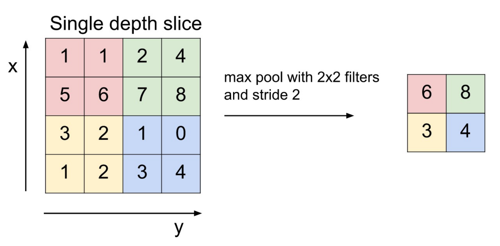
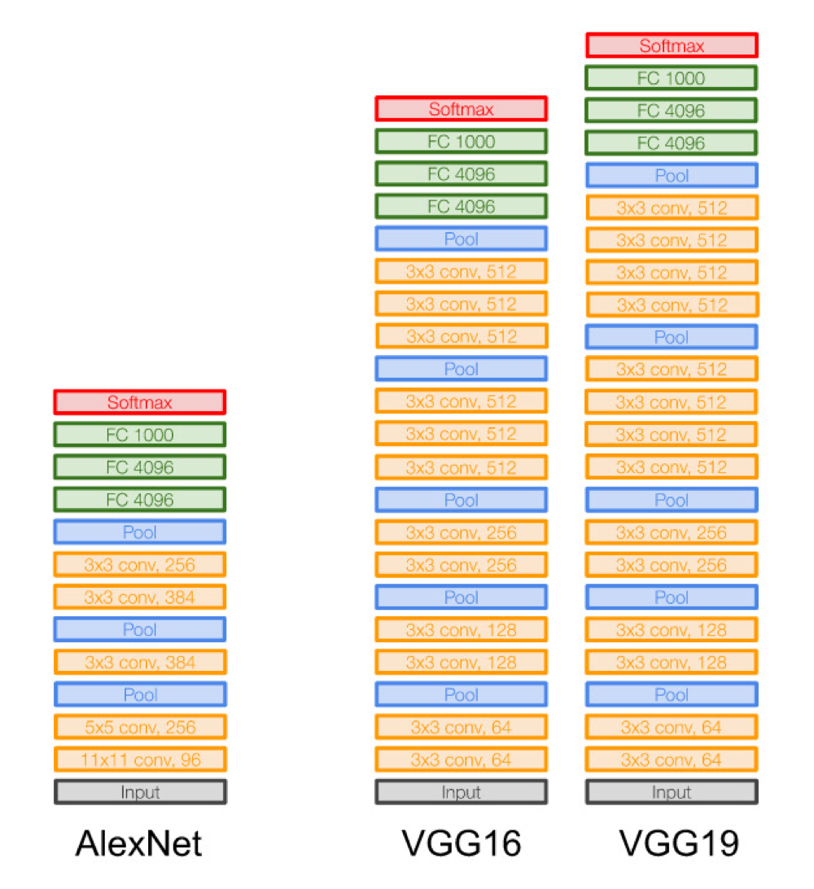
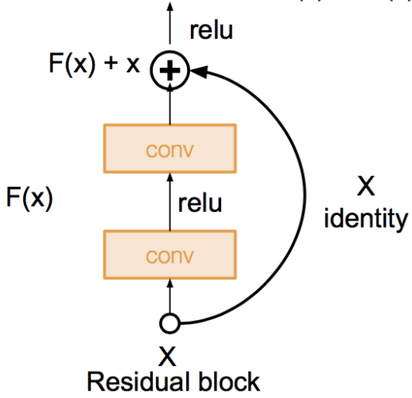

# CNN (Convolutional Neural Network)

## Basic Operations in CNN

### Fully-Connected (FC) Layer

- **Flatten** : `32x32x3` image -> stretch to `3072x1`
    - `32x32x3` image
        - preserve spatial structure

### Convolutional Layer

역할 : Rawdata를 응축시켜서 많은 정보를 담게 하기 위한 목적

#### Padding & Stride

- Padding
    - input 이미지의 바깥에 여백을 두는 것.
    - 만약 `5x5`의 input 이미지에 padding을 **2**로 한다면, 실질적인 이미지의 크기는 `(5+2)x(5+2) = 7x7`가 된다.
- Stride : 
    - Convolution 연산을 몇 칸 단위로 수행할지 정하는 간격.
    

#### Output Size of Convolutional Layer

#### Output Size of Zero Padding

#### Examples (1)

- Input volume : `32x32x3`
- Ten(10) 5x5 filters with stride 1, pad 2
- Output volume size?

Result :

#### Examples (2)

- Input volume : `32x32x3`
- Ten(10) 5x5 filters with stride 1, pad 2
- Number of parameters in this layer?

Result :

#### 1x1 Convolution을 사용하는 이유

가장 근본적인 이유는 채널 수를 조정하기 위함이다.

output 크기에는 변화가 없고 채널의 수를 조정할 수 있는 역할을 하게 된다.

1x1 Conv를 사용함으로써, 차원을 확대하거나 축소할 수 있다.

### Pooling Layer

- down-sampling과 같은 역할
- Parameter를 가지지 않음

#### Max Pooling

overlapping 되지 않기 위해, 보통 filter 크기와 stride를 같도록 해준다.

## [AlexNet](https://proceedings.neurips.cc/paper_files/paper/2012/file/c399862d3b9d6b76c8436e924a68c45b-Paper.pdf)

## [VGGNet](https://arxiv.org/pdf/1409.1556.pdf)

> Small filters, Deeper networks & Fewer parameters

- 특징
    - **`3x3` 크기의 작은 Conv 필터 사용**
    - bottleneck 구조
        - 모델의 메모리 대부분은 초반부 Conv 필터 쪽에 몰려 있음
    - 모델의 파라미터 대부분은 후반부 FC Layer 쪽에 몰려 있음

#### What is the effective receptive field of three `3x3` conv (stride 1) layers?

- `3x3` conv를
    - 한 번 쌓으면 `3x3`의 receptive field를 가진다.
    - 두 번 쌓으면 `5x5`의 receptive field를 가진다.
    - 세 번 쌓으면 `7x7`의 receptive field를 가진다.
- 즉 깊게 쌓으면, receptive field가 유지된다.

 

- Input Size가 `7x7`이며, `3x3`의 Output Size를 도출해내야 한다고 가정하자. 이때 Filter Size가 `3x3`이라면 총 세 차례의 Convolution을 진행해야 한다.
- 반면 `5x5`의 Filter Size로는 단 한 번의 Convolution으로 동일한 사이즈의 Feature Map을 산출한다. `3x3` Filter로 세 차례 Convolution 하는 것은 7x7 Filter로 한 번 Convolution 하는 것과 대응된다.
- 즉, `3x3` Filter 3개는 `7x7` Filter 하나와 동일한 Receptive Field (= Filter가 한 번에 볼 수 있는 입력 이미지의 Spatial Area) 를 가지면서도 더 깊은 레이어를 쌓을 수 있게 하는 것이다.
- 이처럼 Layer 수가 늘어나면 이미지 특성에 비선형성을 더 추가할 수 있기 때문에(Deeper, more non-linearities), Filter를 통해 추출한 Feature가 점점 유용해지는 이점을 얻게 된다.

### VGGNet이 `3x3` 크기의 작은 필터를 사용하는 이유 (Why use smaller filters?)

1. `7x7` 필터 하나를 사용하는 것보다 `3x3` 필터를 세 번 사용하면 activation function을 여러번 서쳐지면서 더 non-linear 해진다.
2. 파라미터 수를 줄이고 Layer를 다층 쌓아서 모델의 전체 Depth를 깊게 만들기 위해서이다.

## GoogLeNet (Inception module)

> Deeper networks, with computational efficiency

- 특징
    - 효율적인 Inception module 사용
    - AlexNet, VGG 보다 훨씬 적은 파라미터 수
    - No FC layers
    - bottleneck 구조로 채널 크기를 줄이면서 연산량을 줄임 (필터가 얇아짐)
    - Global Average Pooling(GAP)로 reshape하면서 feature size를 `1x1xC`로 확 줄임
    - Auxiliary Classifier 사용
        - 중간마다 분기를 만들어서 classify하고, loss를 계산함

### Inception Module

- Key Idea
    - 서로 다른 receptive field를 가진 **여러 사이즈의 Convolutional filter들**과 **Pooling layer**를 병렬적으로 동시에 적용시키는 것
    - Split & Merge
- 단점
    - 채널의 크기가 커짐에 따라, 파라미터의 사이즈가 커져 **Computational Complexity가 높다.** 
- Solution
    - 채널의 크기를 줄이기 위해, **`1x1` conv filter를 "bottleneck" layer로써 사용**

## [ResNet](https://arxiv.org/pdf/1512.03385.pdf)

> Very deep networks using residual connections

- 특징
    - H(x)를 구하기 위해 Residual인 F(x) 만을 학습시킨다.
    - VGG의 장점인 `3x3` conv filter 활용
    - GoogLeNet의 장점인 GAP 활용
        - 마지막 FC Layer를 제외하고, FC가 쓰이지 않음
    - bottleneck 구조를 사용

# References
1. 인공지능 응용 (ICE4104), 인하대학교 정보통신공학과 홍성은 교수님
2. [[DL] 1x1 convolution은 무엇이고 왜 사용할까? | Sociological Imagination](https://euneestella.github.io/research/2021-10-14-why-we-use-1x1-convolution-at-deep-learning/)
3. [합성곱 신경망 기초 5(VGGNet, Very Deep Convolutional Network)](https://jonghae5.github.io/cnn-basic-5)